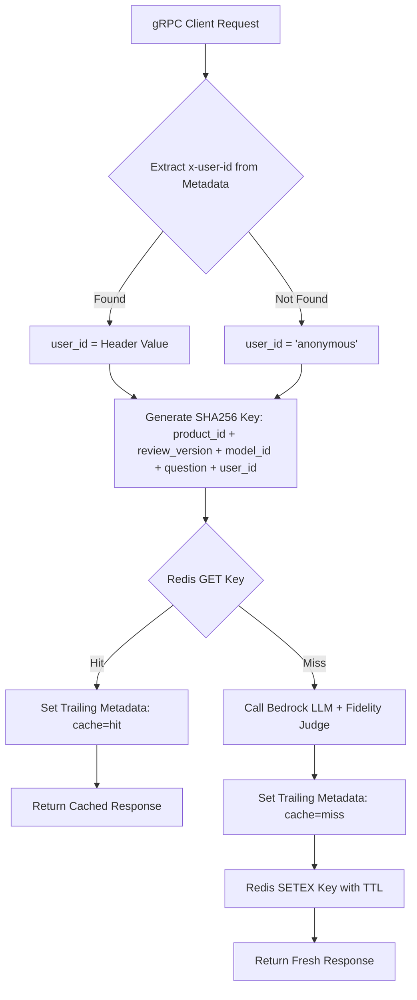
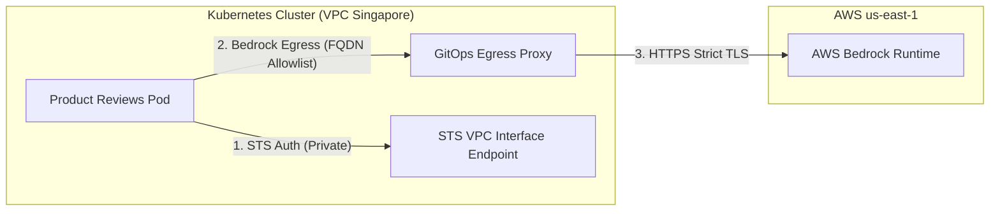

# BỘ CÂU HỎI VẤN ĐÁP ĐÁNH GIÁ MỨC ĐỘ HIỂU SÂU (MENTOR QA HARNESS)
> **Tài liệu phục vụ:** Đánh giá năng lực hiểu kiến trúc, code implementation, bảo mật và nghiệm thu của Fresher/Junior/Learner đối với 3 ticket trọng điểm:
> 1. **Ticket 1 Tuần 4 (T1):** Caching & Ranh giới Người dùng (Mandate #23)
> 2. **Ticket 1 Special (S1):** Tối ưu Kiến trúc Bedrock Egress & Loại bỏ Wildcard `0.0.0.0/0:443`
> 3. **Ticket 5 Special (S5):** Validation & Thu thập Bằng chứng Promotion (Promo Evidence)
>
> **Liên kết tham chiếu:**
> - [JIRA_TODO_WEEK4.md](file:///C:/Users/ASUS/OneDrive/Obsidian%20Vault/XBrain-Phase3/AIO02_TF3_Phase3/AIE1/docs/tasks/JIRA_TODO_WEEK4.md#L19-L43)
> - [JIRA_TODO_SPECIAL.md](file:///C:/Users/ASUS/OneDrive/Obsidian%20Vault/XBrain-Phase3/AIO02_TF3_Phase3/AIE1/docs/tasks/JIRA_TODO_SPECIAL.md#L20-L42)
> - [JIRA_TODO_SPECIAL.md (Ticket S5)](file:///C:/Users/ASUS/OneDrive/Obsidian%20Vault/XBrain-Phase3/AIO02_TF3_Phase3/AIE1/docs/tasks/JIRA_TODO_SPECIAL.md#L98-L119)

---

## 📋 PHẦN 1: TICKET 1 TUẦN 4 (T1) — CACHING & RANH GIỚI NGƯỜI DÙNG (MANDATE #23)

### 1.1 Bộ Câu Hỏi Xoáy Sâu Dành Cho Mentor

#### 🎯 Nhóm 1: Bản chất Bài toán & Quyết định Kiến trúc (Why)
* **Q1.1:** Dịch vụ `product-reviews` là dạng hỏi đáp đơn lượt (Single-Turn Q&A). Tại sao nhóm lại đưa ra quyết định **không triển khai Short-term / Long-term Memory** mà chỉ tập trung vào **Redis Caching**? Việc làm Memory cho Single-turn Q&A có tác hại gì về hiệu năng và chi phí?
* **Q1.2:** Tỷ lệ Cache Hit trong một dịch vụ AI hỏi đáp thường không đạt 100% do câu hỏi của người dùng biến đổi tự nhiên. Mục tiêu tối thiểu của chỉ số `Cache Hit Rate` và `Latency reduction` đối với ticket này là bao nhiêu?

#### 🛠️ Nhóm 2: Chi tiết Triển khai Kỹ thuật (How & Code Implementation)
* **Q1.3:** Em truyền cờ `cache=hit` hoặc `cache=miss` cho gRPC Client qua **Trailing Metadata** như thế nào? Viết lại đoạn code sử dụng `context.set_trailing_metadata()` trong gRPC server Python.
* **Q1.4:** Tại sao lại lựa chọn **Trailing Metadata** mà không gửi cờ cache ở **Initial Metadata (Header)** hay nhúng trực tiếp vào trong cấu trúc Protobuf Response Message (`ProductReviewResponse`)?
* **Q1.5:** Trình bày chính xác thuật toán băm (hashing algorithm) và công thức tạo Key Cache trong Redis. Công thức đó gồm những thành phần nào?
  $$\text{Cache Key} = \text{SHA256}(\text{product\_id} + \text{review\_version} + \text{model\_id} + \text{question} + \text{user\_id})$$

#### 🔒 Nhóm 3: Bảo mật, Edge Cases & Invalidation (Security & Edge Cases)
* **Q1.6 (Bảo mật):** Nếu không có `user_id` trong công thức tạo Key Cache, lỗ hổng **Cache Poisoning** hoặc **Cross-User Data Leakage** có thể xảy ra trong kịch bản nào?
* **Q1.7 (Edge Case):** Nếu gRPC Request gửi lên không chứa header `x-user-id` (khách truy cập ẩn danh), hệ thống xử lý biến `user_id` ra sao để tránh lỗi `NoneType` hoặc crash chuỗi?
* **Q1.8 (Cache Invalidation):** Khi có một review mới được phê duyệt cho sản phẩm $X$, làm thế nào hệ thống nhận biết để **vô hiệu hóa (invalidate)** các bản ghi cache cũ của sản phẩm đó mà không cần flush toàn bộ Redis?

---

### 1.2 Đáp Án, Điểm Chốt Kiến Thức & Từ Khóa Cốt Lõi (Mentor Answer Key & Keywords)

🔑 **TỪ KHÓA CỐT LÕI (CORE KEYWORDS):**
`Single-Turn Q&A`, `Redis Caching`, `gRPC Trailing Metadata`, `context.set_trailing_metadata()`, `SHA256 Key Hashing`, `User Boundary Isolation`, `Cache Poisoning`, `review_version Auto-Invalidation`, `x-user-id`, `Anonymous Fallback`.



* **Lý do bỏ Memory:** Single-turn Q&A nhận câu hỏi độc lập. Triển khai Memory gây tốn bộ nhớ lưu state, tăng độ trễ truy vấn lại context cũ không cần thiết và dễ làm nhiễu prompt Candidate.
  * 🔑 *Từ khóa:* `Single-Turn Q&A`, `Stateless Prompt`, `No Conversation State`.
* **Tại sao dùng Trailing Metadata:** Vì cờ `cache` (hit hay miss) chỉ được xác định *sau khi* logic xử lý kiểm tra Redis/LLM hoàn tất. Trailing metadata cho phép gửi thông tin vận hành (telemetry/status) ở cuối luồng response mà không cần thay đổi gRPC Proto schema.
  * 🔑 *Từ khóa:* `Trailing Metadata`, `gRPC Context`, `Backward Compatibility`, `Proto Schema Unchanged`.
* **Công thức Hash Key & Isolation:** `SHA256(product_id + review_version + model_id + question + user_id)`.
  * 🔑 *Từ khóa:* `User Boundary Isolation`, `SHA256 Hashing`, `Cross-User Data Leakage Prevention`.
* **Vai trò của `review_version`:** Giúp tự động invalidate cache mà không cần viết job dọn dẹp phức tạp. Khi database review thay đổi, `review_version` tăng lên khiến Key SHA256 thay đổi, truy vấn mới tự động rơi vào `cache: miss` và ghi đè dữ liệu mới.
  * 🔑 *Từ khóa:* `review_version`, `Implicit Cache Invalidation`, `TTL Expiry`.
* **Xử lý thiếu `user_id`:** Gán giá trị mặc định là `"anonymous"`, đồng thời kiểm tra nếu câu hỏi chứa dữ liệu nhạy cảm thì tuyệt đối không lưu vào public cache.
  * 🔑 *Từ khóa:* `Anonymous Fallback`, `Default Key Value`, `NoneType Protection`.

---

## 📌 PHẦN 2: TICKET 1 SPECIAL (S1) — BEDROCK EGRESS ARCHITECTURE & SECURITY HARDENING

### 2.1 Bộ Câu Hỏi Xoáy Sâu Dành Cho Mentor

#### 🎯 Nhóm 1: Rủi ro Bảo mật & Nguyên nhân Chặn Bài (Why)
* **Q2.1:** Tại sao bộ phận CDO Audit lại đánh dấu **`promotion-blocked`** đối với dịch vụ `product-reviews` khi phát hiện NetworkPolicy chứa quy tắc egress `0.0.0.0/0:443`?
* **Q2.2:** Quy tắc `0.0.0.0/0:443` tạo ra nguy cơ an ninh mạng (Attack Vectors) cụ thể nào nếu Pod bị attacker chiếm quyền thực thi mã từ xa (RCE)?

#### 🛠️ Nhóm 2: Phương án Giải pháp & So sánh Kiến trúc (How & Architecture)
* **Q2.3:** Nhóm đã thống nhất chọn phương án Egress nào giữa 3 đề xuất của CDO? Phân tích ưu/nhược điểm của việc dùng **GitOps-managed Egress Proxy** so với việc đăng ký ngoại lệ HTTPS NAT tạm thời.
* **Q2.4:** Khi định tuyến luồng AWS Bedrock qua Egress Proxy, làm thế nào để đảm bảo Pod chỉ có thể kết nối tới đúng các FQDN được phép? Viết danh sách allowlist FQDN cần thiết:
  - `*.bedrock-runtime.us-east-1.amazonaws.com`
  - `sts.ap-southeast-1.amazonaws.com`
* **Q2.5:** Đối với luồng xác thực AWS STS, tại sao giải pháp tạo **AWS VPC Interface Endpoint (PrivateLink)** tại `ap-southeast-1` lại tối ưu hơn việc đẩy traffic STS ra Internet?

#### 🔒 Nhóm 3: Cấu hình YAML NetworkPolicy & Độ Chịu Lỗi (YAML & Resilience)
* **Q2.6:** Trong file `32-product-reviews.yaml`, em thay đổi khối `egress` từ `ipBlock: 0.0.0.0/0` sang dạng nào?
* **Q2.7 (Resilience):** Nếu Egress Proxy gặp sự cố quá tải hoặc đứt kết nối cáp quang tới US East 1 (`us-east-1`), làm thế nào dịch vụ `product-reviews` vẫn duy trì khả năng trả lời Read API cho storefront mà không bị treo dây chuyền?

---

### 2.2 Đáp Án, Điểm Chốt Kiến Thức & Từ Khóa Cốt Lõi (Mentor Answer Key & Keywords)

🔑 **TỪ KHÓA CỐT LÕI (CORE KEYWORDS):**
`CDO Audit Block`, `promotion-blocked`, `Wildcard Egress (0.0.0.0/0:443)`, `GitOps Egress Proxy`, `FQDN Allowlist`, `AWS Bedrock Runtime`, `STS VPC Interface Endpoint (PrivateLink)`, `Circuit Breaker`, `Tier 2 DB Fallback`.



* **Lý do CDO chặn:** `0.0.0.0/0:443` cho phép truy cập outbound tới toàn bộ dải IP trên Internet. Nếu Pod bị độc hại, kẻ tấn công có thể dễ dàng exfiltrate (tuồn) data hoặc token IRSA ra ngoài command & control (C2) server.
  * 🔑 *Từ khóa:* `promotion-blocked`, `Unrestricted Egress`, `Data Exfiltration Risk`, `C2 Server Threat`.
* **Egress Proxy FQDN Allowlist:** Chuyển đổi từ lọc theo IP Layer 3/4 (vốn không khả thi với AWS Bedrock do IP thay đổi liên tục) sang lọc theo FQDN Layer 7 tại Egress Proxy.
  * 🔑 *Từ khóa:* `GitOps Egress Proxy`, `Layer 7 FQDN Allowlist`, `Bedrock Runtime Domain`.
* **VPC Interface Endpoint:** Đối với dịch vụ STS, tạo VPC Endpoint ngay tại `ap-southeast-1` để lưu lượng xác thực đi hoàn toàn trong mạng nội bộ AWS (Private AWS Backbone), không đi qua NAT Gateway public.
  * 🔑 *Từ khóa:* `VPC Interface Endpoint`, `AWS PrivateLink`, `STS Authentication`, `Private AWS Backbone`.
* **Độ chịu lỗi (Circuit Breaker & Fallback):** Nếu Bedrock Egress bị gián đoạn, Circuit Breaker ngắt kết nối trong 30 giây, đẩy traffic ngay sang **Tier 2 PostgreSQL Static Summary DB** (< 5ms), cô lập hoàn toàn sự cố Egress khỏi Read Review API.
  * 🔑 *Từ khóa:* `Circuit Breaker (30s Cool-down)`, `Tier 2 PostgreSQL Summary Fallback`, `Thread Isolation`.

---

## 📌 PHẦN 3: TICKET 5 SPECIAL (S5) — VALIDATION & THU THẬP BẰNG CHỨNG PROMOTION (PROMO EVIDENCE)

### 3.1 Bộ Câu Hỏi Xoáy Sâu Dành Cho Mentor

#### 🎯 Nhóm 1: Quy trình & Tiêu chuẩn CDO Promotion (Process)
* **Q3.1:** Để CDO chấp thuận gỡ cờ `promotion-blocked` và cho phép sync NetworkPolicy mới lên Production, em bắt buộc phải thu thập đầy đủ **6 hạng mục bằng chứng (Evidence)** nào?
* **Q3.2:** Sự khác biệt cơ bản giữa việc chạy thử nghiệm trong môi trường Staging (`network-policy-staged/`) và khi đã được Promote lên Production là gì?

#### 🛠️ Nhóm 2: Thực thi Kiểm thử Luồng Traffic (Allowed vs Denied Testing)
* **Q3.3 (Allowed Flows):** Làm thế nào em dùng các câu lệnh CLI (`kubectl exec`, `nc`, `curl`) để thực minh chứng rằng Pod `product-reviews` vẫn kết nối thành công tới:
  - DNS Cluster IP (`53`)
  - `product-catalog:8080`
  - `flagd:8013`
  - `otel-gateway:4317`
  - PostgreSQL RDS (`5432`)
* **Q3.4 (Denied Flows):** Viết câu lệnh CLI kiểm chứng rằng traffic phát ra từ Pod `product-reviews` tới dịch vụ `payment` hoặc tới một IP công cộng (`8.8.8.8:443`) bị **chặn hoàn toàn (Connection Timed Out)**.
* **Q3.5:** Tại sao việc test Denied Flow bắt buộc phải chờ `timeout` thay vì nhận kết quả `Connection Refused`?

#### 🔒 Nhóm 3: Kiểm tra Argo CD, PolicyEndpoint & Soak Window (Operations)
* **Q3.6 (Argo CD):** Trạng thái trên giao diện Argo CD thế nào là đạt yêu cầu? Nếu sau khi promote mà Argo CD báo `OutOfSync` hoặc `Degraded` thì nguyên nhân thường nằm ở đâu?
* **Q3.7 (PolicyEndpoint Verification):** K8s `PolicyEndpoint` (hoặc Cilium Endpoint) đóng vai trò gì trong việc xác nhận NetworkPolicy đã thực sự được nạp vào Kernel/eBPF của Worker Node?
* **Q3.8 (Soak Window & Rollback):** "Soak Window" là gì? Nếu trong thời gian Soak Window xảy ra hiện tượng Latency p99 của Read API tăng đột biến, em thực hiện các bước Rollback khẩn cấp theo thứ tự nào?

---

### 3.2 Đáp Án, Điểm Chốt Kỹ Thuật & Từ Khóa Cốt Lõi (CLI & Evidence Guide)

🔑 **TỪ KHÓA CỐT LÕI (CORE KEYWORDS):**
`6 Promo Evidence Checklist`, `Helm Lint & Template`, `Argo CD Synced & Healthy`, `Allowed Flows vs Denied Flows`, `Connection Timed Out vs Connection Refused`, `PolicyEndpoint / Kernel eBPF`, `Soak Window`, `GitOps Revert Rollback`.

#### 📝 Bảng Tổng Hợp 6 Hạng Mục Bằng Chứng CDO (Promo Evidence Checklist)

| STT | Hạng Mục Bằng Chứng (Evidence) | Tiêu Chí Đạt (Pass Criteria) | Lệnh / File Minh Chứng | 🔑 Từ Khóa Cốt Lõi |
| :---: | :--- | :--- | :--- | :--- |
| **1** | **Helm Validation** | `helm lint` & `helm template` sạch lỗi | `helm lint ./charts/product-reviews` | `Helm Lint`, `Template Dry-run` |
| **2** | **Argo CD & Pod State** | App Status = `Synced` & `Healthy`, 0 Restart | Screenshot Argo CD Dashboard + `kubectl get pods` | `Argo CD Synced`, `Pod Readiness` |
| **3** | **Allowed Flows Test** | Kết nối thành công 100% tới 7 dịch vụ nội bộ/AWS | Exec `nc -zv <target_service> <port>` -> `open` | `Allowed Flows`, `Service Discovery` |
| **4** | **Denied Flows Test** | Chặn 100% kết nối tới `payment` & Public Internet | Exec `nc -w 3 -zv payment:8080` -> `timed out` | `Denied Flows`, `Connection Timed Out` |
| **5** | **PolicyEndpoint Match** | 100% Selector rules trùng khớp với Kernel eBPF | `kubectl get ciliumendpoints` / `policyendpoints` | `PolicyEndpoint`, `Kernel eBPF Rules` |
| **6** | **Soak Window Monitoring** | Không có lỗi regression trong cửa sổ theo dõi | Grafana Dashboard / Prometheus P99 Latency Log | `Soak Window`, `Zero Regression` |

#### 💻 Kịch Bản Lệnh Exec Test Allowed & Denied Flows:
```bash
# 1. Test Allowed Flow (Product Catalog - Must Succeed)
kubectl exec -it deployment/product-reviews -- nc -zv product-catalog.default.svc.cluster.local 8080
# Output kỳ vọng: product-catalog (10.100.15.20:8080) open
# 🔑 Keywords: Allowed Flow, Port 8080 Succeeded

# 2. Test Allowed Flow (RDS PostgreSQL - Must Succeed)
kubectl exec -it deployment/product-reviews -- nc -zv rds-postgres.internal.net 5432
# Output kỳ vọng: rds-postgres (172.20.5.12:5432) open
# 🔑 Keywords: RDS PostgreSQL, Port 5432 Allowed

# 3. Test Denied Flow (Payment Service - MUST BE BLOCKED / TIMEOUT)
kubectl exec -it deployment/product-reviews -- nc -w 3 -zv payment.default.svc.cluster.local 8080
# Output kỳ vọng: nc: connect to payment port 8080 (tcp) timed out
# 🔑 Keywords: Denied Flow, Connection Timed Out (DROP packet by NetworkPolicy)

# 4. Test Denied Flow (Public Unauthorized Internet - MUST BE BLOCKED)
kubectl exec -it deployment/product-reviews -- curl --connect-timeout 3 https://8.8.8.8
# Output kỳ vọng: curl: (28) Connection timed out after 3000 milliseconds
# 🔑 Keywords: Egress Blocked, Public IP Egress Denied
```

* **Phân biệt Timed Out vs Refused:**
  * 🔑 `Connection Timed Out`: Network Policy hoạt động đúng — Drop packet âm thầm ở Kernel Layer.
  * 🔑 `Connection Refused`: Server phản hồi gói RST — Traffic vẫn đi qua được Network Policy nhưng Server đóng port.

---

## 🚀 PHẦN 4: BÍ QUYẾT TRẢ LỜI MENTOR & CÁC BẪY THƯỜNG GẶP (PRO TIPS)

### 💬 Khung Trả Lời Chuẩn STAR (Situation - Task - Action - Result)
Khi trả lời Mentor trong buổi Review / Vấn đáp, hãy áp dụng cấu trúc 4 bước kết hợp **Từ Khóa Cốt Lõi**:

1. **Situation (Bối cảnh):** Nêu bài toán hoặc điểm nghẽn ban đầu.
   * *Ví dụ:* "Ở Ticket S1, dịch vụ bị CDO chặn promote (`promotion-blocked`) do NetworkPolicy cũ dùng quy tắc `Wildcard Egress (0.0.0.0/0:443)` để gọi AWS Bedrock..."
2. **Task (Nhiệm vụ):** Mục tiêu chính cần giải quyết.
   * *Ví dụ:* "Nhiệm vụ của em là gỡ bỏ wildcard này, chuyển luồng egress qua `GitOps Egress Proxy` có `FQDN Allowlist` và thu thập đủ `6 Promo Evidence Checklist`..."
3. **Action (Hành động):** Chi tiết kỹ thuật em đã trực tiếp thực hiện.
   * *Ví dụ:* "Em đã cập nhật `32-product-reviews.yaml`, cấu hình Egress Proxy cho phép `*.bedrock-runtime.us-east-1.amazonaws.com`, đồng thời tích hợp `user_id` vào key `SHA256` cache ở Ticket T1 để đảm bảo `User Boundary Isolation`..."
4. **Result (Kết quả):** Con số định lượng & bằng chứng nghiệm thu.
   * *Ví dụ:* "Kết quả là 100% luồng Denied traffic bị `Connection Timed Out` đúng thiết kế, dịch vụ vượt qua 36/36 ca unit test, được CDO phê duyệt gỡ blocker và `Argo CD Synced/Healthy` lên Production thành công."

---

### ⚠️ Các Bẫy Thường Gặp Cần Tránh (Common Pitfalls)

> [!CAUTION]
> 1. **Bẫy "Chỉ sửa code/yaml mà chưa chạy lệnh Verify":** Mentor rất ghét câu trả lời "Em nghĩ là code chạy đúng rồi". Luôn khẳng định bằng câu lệnh thực thi (`helm lint`, `nc -zv`, log trace ID).
>    * 🔑 *Từ khóa phòng vệ:* `Empirical Verification`, `Helm Lint Validation`, `Live Exec Proof`.
> 2. **Nhầm lẫn giữa Connection Refused và Connection Timed Out:**
>    * `Connection Refused`: Server đích nhận được gói tin SYN nhưng từ chối cổng (Network Policy KHÔNG chặn).
>    * `Connection Timed Out`: Network Policy hoặc Firewall đã lặng lẽ thả (DROP) gói tin làm client không nhận được phản hồi (Network Policy ĐANG CHẶN ĐÚNG).
>    * 🔑 *Từ khóa phòng vệ:* `Packet Drop vs TCP RST`, `Connection Timed Out`.
> 3. **Quên mất yếu tố User Boundary Isolation:** Khi làm Caching cho AI, nếu chỉ hash `question + product_id`, câu trả lời chứa thông tin cá nhân của User A có thể bị trả về cho User B. Bắt buộc phải nhấn mạnh có `user_id` trong hash key.
>    * 🔑 *Từ khóa phòng vệ:* `User Boundary Isolation`, `Cross-User Leakage Prevention`.
