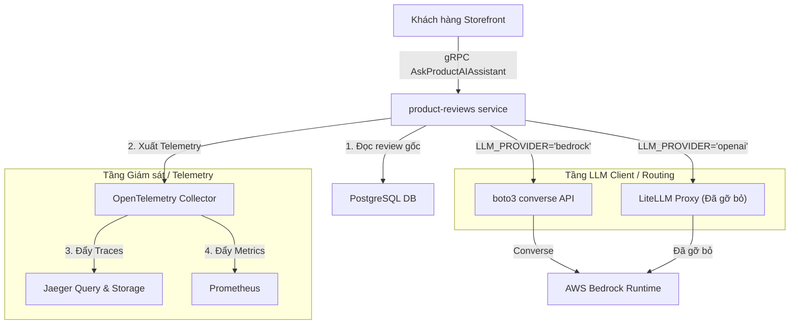

# ADR 0001: Tích hợp mô hình AWS Bedrock Nova Lite qua SDK boto3 trực tiếp làm mô hình LLM chính

> [!NOTE]
> * **Trạng thái:** Đã phê duyệt (Approved)
> * **Tác giả:** Khoa (Leader AIE1)
> * **Ngày tạo:** 2026-07-13
> * **Ngày cập nhật:** 2026-07-16
> * **Dự án:** AIE1 - Tối ưu & Vận hành Tầng AI (Task Force 1)

---

## 1. Bối cảnh
Dịch vụ tóm tắt đánh giá sản phẩm `product-reviews` ban đầu sử dụng **Mock LLM**. Để đưa Shopping Copilot vào vận hành thực tế, hệ thống cần tích hợp với một mô hình ngôn ngữ lớn (LLM) thực tế.

Tuy nhiên, việc tích hợp mô hình thật đối mặt với các ràng buộc nghiêm ngặt về:
* **Ngân sách chi phí token** giới hạn.
* **Độ trễ phản hồi (Latency)** yêu cầu khắt khe.
* **Tỷ lệ lỗi (Error Rate)** phải tối thiểu.

Nhóm Task Force đã tiến hành đo đạc baseline trên nhiều kịch bản, chạy 20 requests liên tục cho mỗi mô hình để lựa chọn phương án tối ưu. 

Đồng thời, khi triển khai trên hạ tầng Kubernetes EKS, việc duy trì một Pod proxy trung gian (như LiteLLM) để dịch chuyển tham số sang Bedrock API sẽ tạo ra một hop mạng không cần thiết, làm tăng độ trễ và tăng điểm có thể gây lỗi hệ thống (single point of failure).

---

## 2. Các phương án xem xét

Dựa trên số liệu đo đạc thực nghiệm chi tiết tại [AI_BASELINE_EVAL.md](file:///C:/Users/ASUS/OneDrive/Obsidian%20Vault/XBrain-Phase3/AIO02_TF3_Phase3/AIE1/AI_BASELINE_EVAL.md):

| Kịch bản | Model | Latency Avg (ms) | Latency p95 (ms) | Tỉ lệ lỗi (%) | Chi phí / 10k reqs | Nhận định kỹ thuật |
| :--- | :--- | :--- | :--- | :--- | :--- | :--- |
| **Real LLM - Gemini** | `gemini-2.5-flash` | 5624.31 | 6829.13 | 60.00% | - | Lỗi cạn kiệt quota tài khoản miễn phí. |
| **Real LLM - Groq 8B** | `llama-3.1-8b-instant` | 594.82 | 773.89 | 30.00% | - | Bị lỗi cú pháp Tool Calling. |
| **Real LLM - Groq 70B** | `llama-3.3-70b-versatile` | 824.67 | 968.81 | 10.00% | ~$5.29 USD | Nhanh, chất lượng tốt nhưng chi phí khá cao. |
| **Real LLM - Bedrock** | `amazon.nova-lite-v1:0` | **1668.41** | **2281.35** | **0.00%** | **~$0.96 USD** | **Độ ổn định tuyệt đối, giá rẻ vượt trội.** |
| **Real LLM - Bedrock** | `amazon.nova-micro-v1:0` | 2073.34 | 2959.01 | 0.00% | ~$0.63 USD | Giá rẻ nhất nhưng độ trễ trung bình cao hơn Nova Lite. |
| **Real LLM - Bedrock** | `meta.llama3-3-70b-instruct`| 7650.01 | 10017.15 | 65.00% | ~$6.27 USD | Bị throttle lỗi gRPC `DeadlineExceeded` liên tục. |

> [!TIP]
> Dữ liệu cho thấy **Amazon Nova Lite** có sự cân bằng hoàn hảo giữa chi phí cực thấp, độ ổn định tuyệt đối (0% lỗi) và độ trễ chấp nhận được (~1.6s).

---

## 3. Quyết định
Chúng tôi quyết định lựa chọn **AWS Bedrock Nova Lite `amazon.nova-lite-v1:0`** làm mô hình chính cho dịch vụ `product-reviews` và áp dụng phương án **Tích hợp trực tiếp qua SDK boto3 Converse API** thay vì sử dụng LiteLLM proxy như phương án ban đầu.



### Các điểm chính trong quyết định:
1. **Chọn mô hình AWS Bedrock Nova Lite:** Đảm bảo độ ổn định tuyệt đối dưới tải benchmark và tối ưu hóa ngân sách vận hành tối đa.
2. **Tích hợp SDK boto3 trực tiếp:** Viết mã nguồn gọi trực tiếp AWS Bedrock thông qua Converse API của AWS SDK, tự động ánh xạ Tool Specification và định dạng tin nhắn của tool mà không cần qua proxy.
3. **Thiết kế Định tuyến Song song (Dual-Engine Routing):** Hỗ trợ cấu hình qua biến môi trường `LLM_PROVIDER` để chuyển đổi linh hoạt:
   * `LLM_PROVIDER="bedrock"`: Gọi trực tiếp SDK `boto3` trên EKS (sử dụng IAM Roles for Service Accounts - IRSA để nhận quyền tự động).
   * `LLM_PROVIDER="openai"`: Giữ lại để kết nối tới các OpenAI-compatible endpoints phục vụ kiểm thử cục bộ hoặc chạy giả lập.

---

## 4. Hệ quả

### Hệ quả tích cực (Benefits)
* **Tối ưu hóa tài nguyên**: Loại bỏ hoàn toàn sự phụ thuộc vào Pod LiteLLM proxy trên Kubernetes EKS, giảm bớt tài nguyên CPU/RAM cần cấp phát và đơn giản hóa Helm chart triển khai.
* **Tối ưu hóa độ trễ**: Giảm thiểu 1 hop mạng trung gian giữa dịch vụ `product-reviews` và AWS Bedrock giúp cải thiện thời gian phản hồi thực tế của trang storefront.

### Hệ quả trung lập (Trade-offs / Risks)
* **Xử lý bất nhất cấu trúc**: Cần duy trì hàm tự động ánh xạ cấu trúc định nghĩa công cụ từ chuẩn OpenAI sang chuẩn Bedrock Tool Spec do sự khác biệt về định dạng giữa hai API.

---

## 5. Quy trình Đo đạc, Công thức Tính toán & Giám sát Telemetry trên Jaeger

Nhằm đảm bảo tính minh bạch, khả năng kiểm chứng và phục vụ công tác tối ưu hóa hệ thống AI theo đúng định hướng tại [onboarding/AI_FEATURE.md](file:///C:/Users/ASUS/OneDrive/Obsidian%20Vault/XBrain-Phase3/AIO02_TF3_Phase3/AIE1/onboarding/AI_FEATURE.md) và [mandates/MANDATE-06-ai-trust-safety.md](file:///C:/Users/ASUS/OneDrive/Obsidian%20Vault/XBrain-Phase3/AIO02_TF3_Phase3/AIE1/mandates/MANDATE-06-ai-trust-safety.md), chúng tôi chuẩn hóa các phương pháp đo đạc, công thức, đơn vị tính và quy trình giám sát như sau:

### 5.1. Các chỉ số đo đạc & Công thức tính toán (Metrics & Formulas)

#### 1. Độ trễ phản hồi (Latency)
* **Phương pháp đo**: Đo đạc thời gian từ thời điểm client storefront bắt đầu gửi request gRPC tới endpoint `AskProductAIAssistant` của service `product-reviews` cho đến khi nhận được kết quả tóm tắt hoặc phản hồi hoàn chỉnh (End-to-End Latency).
* **Đơn vị**: Millisecond (ms).
* **Các chỉ số phân tích**:
  * **Latency Average**: Thời gian phản hồi trung bình của toàn bộ các request trong một lần chạy đánh giá.
  * **Latency p95 (Percentile 95)**: Mức độ trễ mà 95% số request trong tập thử nghiệm hoàn thành nhanh hơn giá trị này (đại diện sát nhất cho trải nghiệm người dùng thực tế).
  * **Latency p99 (Percentile 99)**: Mức độ trễ mà 99% số request hoàn thành nhanh hơn giá trị này (dùng để giám sát các trường hợp phản hồi siêu chậm hoặc có nguy cơ bị timeout).

#### 2. Tỉ lệ lỗi (Error Rate)
* **Phương pháp đo**: Đếm số cuộc gọi bị fail (gRPC exceptions, timeout, hoặc lỗi API 4xx/5xx trả về từ phía Bedrock) chia cho tổng số cuộc gọi.
* **Đơn vị**: Phần trăm (%).
* **Công thức tính**:
  $$\text{Tỉ lệ lỗi (\%)} = \left( \frac{\text{Số cuộc gọi thất bại}}{\text{Tổng số cuộc gọi}} \right) \times 100$$

#### 3. Mức tiêu thụ Token (Token Consumption)
* **Đơn vị**: Token.
* **Các chỉ số đo đạc**:
  * **Input Tokens (Prompt Tokens)**: Số lượng token trong prompt gửi đi (bao gồm System Prompt, thông tin review gốc từ DB và câu hỏi của user).
  * **Output Tokens (Completion Tokens)**: Số lượng token do mô hình sinh ra ở đầu ra.
  * **Tổng số Tokens (Total Tokens)**: Tổng của Input Tokens và Output Tokens.

#### 4. Ước tính Chi Phí Vận Hành (Estimated Operating Cost)
* **Đơn vị**: USD ($) trên mỗi 10,000 requests.
* **Công thức tính**:
  $$\text{Chi phí ước tính / 10k requests} = 10,000 \times \left( \frac{\text{Avg Input Tokens} \times \text{Đơn giá Input / 1M tokens}}{1,000,000} + \frac{\text{Avg Output Tokens} \times \text{Đơn giá Output / 1M tokens}}{1,000,000} \right)$$
* *Ví dụ thực tế cho Bedrock Nova Lite:* 
  * Avg Input Tokens = ~1357 (Đơn giá: \$0.060 / 1M tokens)
  * Avg Output Tokens = ~62 (Đơn giá: \$0.240 / 1M tokens)
  * Áp dụng công thức:
    $$\text{Cost} = 10,000 \times \left( \frac{1357 \times 0.060}{1,000,000} + \frac{62 \times 0.240}{1,000,000} \right) = 10,000 \times (0.00008142 + 0.00001488) \approx \$0.96 \text{ USD}$$

#### 5. Độ trung thực của tóm tắt (Fidelity Evaluation Metrics)
Được đo đạc qua bộ eval lai (hybrid evaluator) trong file [repro/eval_fidelity.py](file:///C:/Users/ASUS/OneDrive/Obsidian%20Vault/XBrain-Phase3/AIO02_TF3_Phase3/AIE1/repro/eval_fidelity.py):
* **`overall_score`**: Điểm số do LLM-as-a-judge chấm cho độ trung thực tổng thể dựa trên review thật từ Postgres (thang điểm 1-5). Ngưỡng đạt yêu cầu: `>= 4`.
* **`unsupported_claims`**: Số lượng thông tin tự bịa không có trong review gốc (hallucination). Ngưỡng đạt yêu cầu: `0`.
* **`contradicted_claims`**: Số lượng thông tin mâu thuẫn trực tiếp với review gốc. Ngưỡng đạt yêu cầu: `0`.
* **`claim_precision`**: Tỉ lệ thông tin đúng trên tổng số thông tin đưa ra. Ngưỡng đạt yêu cầu: `>= 0.8`.
  $$\text{claim\_precision} = \frac{\text{supported\_claims}}{\text{supported\_claims} + \text{unsupported\_claims} + \text{contradicted\_claims}}$$
* **`aspect_coverage`**: Mức độ tóm tắt bao phủ các khía cạnh chính của review thật (thang điểm 0.0 - 1.0). Ngưỡng đạt yêu cầu: `>= 0.6`.
* **`sentiment_alignment`**: Độ đồng điệu cảm xúc tổng thể (1: Khớp, 0: Lệch tông). Ngưỡng đạt yêu cầu: `1`.
* **Heuristics / Rule-based checks**:
  * `average_rating_mismatch`: Độ lệch điểm trung bình trong tóm tắt so với database (`tolerance <= 0.05`).
  * `unsupported_age_claim`: Phát hiện việc tự tiện nhắc tới độ tuổi đề xuất khi review gốc không đề cập.
  * `sentence_count`: Phải `<= 2` (để kiểm soát độ ngắn gọn).
  * `word_count`: Phải `<= 80` (để kiểm soát chi phí token).

#### 6. Tần suất yêu cầu / Số yêu cầu trên giây (Requests Per Second - RPS)
* **Định nghĩa**: Tần suất các request gửi đến các service trong hệ thống microservices được xử lý thành công trong một giây (đại diện cho thông lượng/throughput của hệ thống).
* **Đơn vị**: requests/second (RPS) hoặc req/s.
* **Cách thức mô phỏng tải mặc định (Locust Load Generator)**:
  * Hệ thống sử dụng service `load-generator` chạy kịch bản Locust tại [locustfile.py](file:///C:/Users/ASUS/OneDrive/Obsidian%20Vault/XBrain-Phase3/AIO02_TF3_Phase3/AIE1/techx-corp-platform/src/load-generator/locustfile.py) để sinh tải giả lập hành vi người dùng thật (browse, add to cart, checkout, ask AI assistant).
  * Cấu hình mặc định trong Helm chart [values.yaml](file:///C:/Users/ASUS/OneDrive/Obsidian%20Vault/XBrain-Phase3/AIO02_TF3_Phase3/AIE1/techx-corp-chart/values.yaml):
    * `LOCUST_USERS = 10` (10 người dùng ảo đồng thời).
    * `LOCUST_SPAWN_RATE = 1` (tốc độ sinh 1 user/giây).
  * Trong locustfile, thời gian nghỉ (think time) của mỗi user giữa các tác vụ được thiết lập ngẫu nhiên từ 1 đến 10 giây (`between(1, 10)`), trung bình là **5.5 giây**.
  * Với 10 users mặc định, lưu lượng tải sinh ra đạt khoảng **~2.0 đến 5.0 RPS** trên toàn bộ hệ thống (do một số tác vụ như checkout sẽ kích hoạt chuỗi nhiều cuộc gọi gRPC/HTTP tới các service phía sau).
  * **Stress Test / Load Test**: Để kiểm thử khả năng chịu tải hoặc benchmark hệ thống dưới áp lực lớn, ta có thể tăng `LOCUST_USERS` (ví dụ: lên 100 users sinh ra khoảng ~20 - 30 RPS; lên 500 users sinh ra khoảng ~100+ RPS) thông qua cấu hình Helm values hoặc chỉnh trực tiếp tại giao diện Web UI của Locust.
* **Cách theo dõi RPS thực tế**:
  * **Grafana Dashboard**: Truy cập giao diện Grafana (`/grafana/`) và xem biểu đồ *RPS / Request Rate* của các service trong thời gian thực.
  * **Locust Web UI**: Truy cập giao diện Locust (`/loadgen/`) để xem trực tiếp chỉ số RPS hiện thời đang được sinh ra.

---

### 5.2. Giám sát & Theo dõi Telemetry trên Jaeger (Jaeger Monitoring)

Để phục vụ AIOps và chẩn đoán sự cố trong vận hành thực tế (ví dụ: phát hiện nghẽn mạng, lỗi API key, hoặc lỗi hết hạn mức/quota limit), GenAI Telemetry đã được tích hợp qua OpenTelemetry.

#### 1. Luồng dữ liệu Telemetry (Telemetry Pipeline)
* Mã nguồn Python của service `product-reviews` và lớp gọi LLM được nhúng (instrumented) OpenTelemetry SDK.
* Khi có cuộc gọi gRPC `AskProductAIAssistant`, một trace context được khởi tạo.
* Các spans tương ứng với các tác vụ con (truy vấn Postgres DB, gọi Converse API tới AWS Bedrock) được sinh ra và gửi tập trung về Pod `opentelemetry-collector`.
* Collector sau đó forward traces đến dịch vụ **Jaeger** để lưu trữ và hiển thị.

#### 2. Cách truy cập Jaeger UI trên môi trường EKS
* Để truy cập giao diện Jaeger từ máy local, thực hiện port-forward service Jaeger Query trong namespace tương ứng của Task Force:
  ```bash
  kubectl -n techx-<namespace> port-forward svc/techx-corp-jaeger-query 16686:16686
  ```
* Sau khi chạy lệnh, mở trình duyệt web và truy cập địa chỉ: `http://localhost:16686`.

#### 3. Cách theo dõi, phân tích cuộc gọi AI trên Jaeger UI
* **Tìm kiếm Trace (Find Traces)**:
  * Chọn Service là **`product-reviews`** tại bảng bên trái.
  * Nhấn *Find Traces*. Có thể giới hạn tìm kiếm bằng cách lọc trường *Operation* thành `AskProductAIAssistant` (cuộc gọi gRPC chính) hoặc `Converse` (span gọi trực tiếp sang AWS Bedrock).
* **Phân tích Cây Traces (Trace Gantt Chart)**:
  * Click chọn một trace cụ thể để xem chi tiết. Jaeger sẽ biểu diễn dòng thời gian xử lý dưới dạng Gantt Chart.
  * Giúp phân biệt rõ ràng thời gian tiêu hao ở đâu: ví dụ, nếu tổng thời gian xử lý là `1668.41 ms`, Jaeger sẽ chỉ ra span gọi Bedrock API chiếm khoảng `1580 ms`, còn span truy vấn DB Postgres chỉ chiếm `10 ms`. Đây chính là cách xác định bottleneck độ trễ (latency bottleneck).
* **Kiểm tra Tags chuẩn GenAI trên các Span (Span Tags)**:
  * Click vào span gọi LLM (thường là span Converse/API call) để kiểm tra các thông tin metadata:
    * `gen_ai.system`: Tên nhà cung cấp (vd: `bedrock`).
    * `gen_ai.request.model`: Tên model ID thực tế (vd: `amazon.nova-lite-v1:0`).
    * `gen_ai.usage.prompt_tokens`: Số lượng token prompt đã gửi.
    * `gen_ai.usage.completion_tokens`: Số lượng token completion đã phản hồi.
  * Nếu cuộc gọi bị lỗi (ví dụ: bị từ chối do sai credentials, timeout gRPC `DeadlineExceeded`, hoặc dính lỗi Rate Limit 429), span đó sẽ được đánh dấu màu đỏ (lỗi), tag `error` chuyển thành `true` và phần `Logs` của span sẽ chứa chi tiết traceback hoặc message từ AWS Bedrock SDK (ví dụ: `ThrottlingException: Rate exceeded`). Điều này giúp đội vận hành thực hiện khắc phục sự cố (incident troubleshooting) cực kỳ nhanh chóng.
