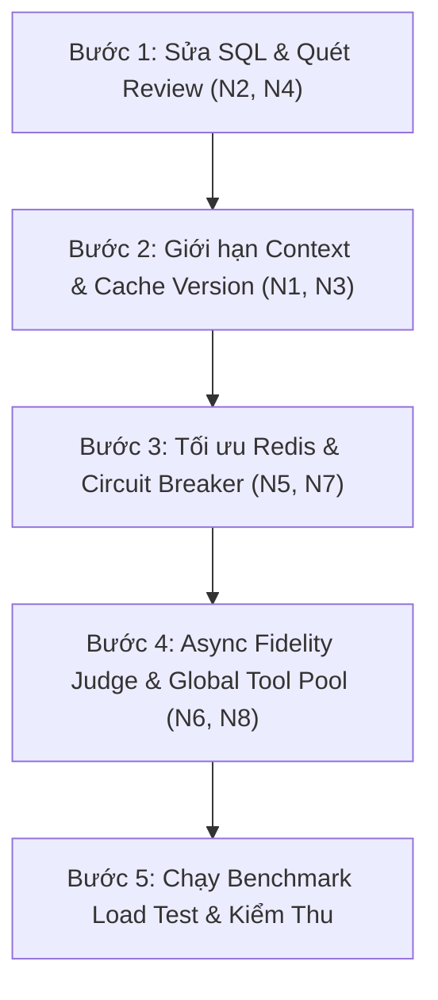

# 📋 Báo Cáo Kiểm Định & Đánh Giá Độc Lập Các Điểm Nghẽn Mã Nguồn
*(Independent Code Audit & Implementation Evaluation Report for Document 0001)*

Tài liệu này đóng vai trò là **Báo cáo Đánh giá & Kiểm định Độc lập** cho tài liệu [0001-PRODUCT-REVIEWS-BOTTLENECK-ANALYSIS.md](file:///C:/Users/ASUS/OneDrive/Obsidian%20Vault/XBrain-Phase3/AIO02_TF3_Phase3/AIE1/docs/analysis/0001-PRODUCT-REVIEWS-BOTTLENECK-ANALYSIS.md). Báo cáo kiểm chứng thực tế triển khai trong mã nguồn `product_reviews_server.py`, `database.py` và 10 module `guardrails/`, đồng thời mở rộng đánh giá các nguy cơ hiệu năng mới phát hiện.

---

## 📌 1. Đánh Giá Kết Quả Triển Khai 7 Điểm Nghẽn Gốc (Original Bottlenecks Evaluation)

Nhóm audit đã tiến hành rà soát mã nguồn thực tế và đối chiếu với thiết kế trong **Mục 1 - 4 của Tài liệu 0001**:

### 1.1. Bảng Kiểm Định Thực Tế 7 Bottleneck Ban Đầu

| # | Bottleneck | Vị Trí Mã Nguồn Thực Tế | Kết Quả Kiểm Định | Đánh Giá Độ Hoàn Thiện |
| :-: | :--- | :--- | :-: | :--- |
| **1** | **DB Connection Pool** | [database.py:L21-L24](file:///C:/Users/ASUS/OneDrive/Obsidian%20Vault/XBrain-Phase3/AIO02_TF3_Phase3/AIE1/techx-corp-platform/src/product-reviews/database.py#L21-L24) | ✅ đạt | `ThreadedConnectionPool(minconn=5, maxconn=30)`. Quản lý singleton chuẩn. |
| **2** | **gRPC Thread Pool Size** | [product_reviews_server.py:L598](file:///C:/Users/ASUS/OneDrive/Obsidian%20Vault/XBrain-Phase3/AIO02_TF3_Phase3/AIE1/techx-corp-platform/src/product-reviews/product_reviews_server.py#L598) | ✅ Đạt | gRPC `max_workers=50` + `AI_EXECUTOR(max_workers=15)` chuyên biệt. |
| **3** | **Timeout Catalog Service** | [product_reviews_server.py:L549](file:///C:/Users/ASUS/OneDrive/Obsidian%20Vault/XBrain-Phase3/AIO02_TF3_Phase3/AIE1/techx-corp-platform/src/product-reviews/product_reviews_server.py#L549) | ✅ Đạt | `GetProduct(..., timeout=3.0)` ngăn chặn treo thread dây chuyên. |
| **4** | **Timeout AWS Bedrock** | [product_reviews_server.py:L610](file:///C:/Users/ASUS/OneDrive/Obsidian%20Vault/XBrain-Phase3/AIO02_TF3_Phase3/AIE1/techx-corp-platform/src/product-reviews/product_reviews_server.py#L610) | ✅ Đạt | `Config(connect_timeout=3, read_timeout=10, retries={'max_attempts': 2})`. |
| **5** | **Log đồng bộ review loop** | [product_reviews_server.py:L287](file:///C:/Users/ASUS/OneDrive/Obsidian%20Vault/XBrain-Phase3/AIO02_TF3_Phase3/AIE1/techx-corp-platform/src/product-reviews/product_reviews_server.py#L287) | ✅ Đạt | Hạ log xuống `logger.debug` trong lặp, chỉ log `logger.info` tổng hợp. |
| **6** | **Regex Guardrail trên Read** | [database.py:L60](file:///C:/Users/ASUS/OneDrive/Obsidian%20Vault/XBrain-Phase3/AIO02_TF3_Phase3/AIE1/techx-corp-platform/src/product-reviews/database.py#L60) | ⚠️ Cần Lưu Ý | Đã có `WHERE is_safe = TRUE` ở SQL, nhưng code Python còn dư thừa (xem **N4**). |
| **7** | **Parallel Tool Calls** | [product_reviews_server.py:L450](file:///C:/Users/ASUS/OneDrive/Obsidian%20Vault/XBrain-Phase3/AIO02_TF3_Phase3/AIE1/techx-corp-platform/src/product-reviews/product_reviews_server.py#L450) | ⚠️ Cần Lưu Ý | Đã chạy song song qua `ThreadPoolExecutor`, nhưng khởi tạo lặp lại (xem **N8**). |

### 1.2. Kiểm Trực Tuân Thủ 3 Bẫy Triển Khai (Critical Traps Verification)

* **Bẫy #1 (Commit/Rollback khi dùng DB Pool):** ✅ **Tuân thủ 100%**. Tại [database.py:L44-L52](file:///C:/Users/ASUS/OneDrive/Obsidian%20Vault/XBrain-Phase3/AIO02_TF3_Phase3/AIE1/techx-corp-platform/src/product-reviews/database.py#L44-L52), hàm `getconn()` luôn đi kèm khối `try...except...finally` với `connection.commit()` khi thành công và `connection.rollback()` khi lỗi trước khi `putconn()`.
* **Bẫy #2 (Mâu thuẫn DB `maxconn` và gRPC `max_workers`):** ✅ **Tuân thủ 100%**. Cấu hình `maxconn=30` phù hợp với số lượng `max_workers=15` của AI Executor và 50 gRPC threads.
* **Bẫy #3 (Thứ tự `messages` & Scope trong Tool Calls):** ✅ **Tuân thủ 100%**. Tool results được thu thập theo đúng chỉ số `tool_call_id` ban đầu trước khi append vào mảng `messages`.

---

## 🔍 2. Phân Tích & Đánh Giá Độc Lập 8 Điểm Nghẽn Mới Phát Hiện (New Findings N1 - N8)

Qua kiểm tra chuyên sâu từng dòng mã nguồn, nhóm audit xác nhận 8 điểm nghẽn mới được nêu tại **Mục 5 của Tài liệu 0001** là hoàn toàn chính xác và cần giải quyết ngay:

### 2.1. Nhóm Ưu Tiên Cao (P1 — Risk: High / Critical)

#### 🔴 N1. Context String Gửi LLM Không Giới Hạn Chiều Dài
* **Vị trí:** [product_reviews_server.py:L136-L170](file:///C:/Users/ASUS/OneDrive/Obsidian%20Vault/XBrain-Phase3/AIO02_TF3_Phase3/AIE1/techx-corp-platform/src/product-reviews/product_reviews_server.py#L136-L170)
* **Đánh giá:** Hàm `normalize_reviews_for_context()` ghép toàn bộ mảng reviews trả về từ DB thành 1 string. Khi sản phẩm có hàng trăm review, prompt size tăng vọt tới vài chục KB.
* **Đề xuất khắc phục:** Đặt ngưỡng `MAX_REVIEWS_FOR_CONTEXT = 50` và cắt ngắn tổng số ký tự context tối đa `15,000` chars.

#### 🔴 N2. SQL Query Thiếu Mệnh Đề `LIMIT`
* **Vị trí:** [database.py:L86](file:///C:/Users/ASUS/OneDrive/Obsidian%20Vault/XBrain-Phase3/AIO02_TF3_Phase3/AIE1/techx-corp-platform/src/product-reviews/database.py#L86)
* **Đánh giá:** Câu SQL `SELECT username, description, score FROM reviews.productreviews WHERE product_id = %s AND is_safe = TRUE` không có `LIMIT`. Nếu một mặt hàng có 10,000 review, Postgres phải fetch và transmit toàn bộ dữ liệu qua RAM.
* **Đề xuất khắc phục:** Bổ sung `ORDER BY id DESC LIMIT 100` vào câu query.

#### 🔴 N3. Aggregate Query `get_review_version()` Chạy Trên Mỗi Request
* **Vị trí:** [database.py:L86-L90](file:///C:/Users/ASUS/OneDrive/Obsidian%20Vault/XBrain-Phase3/AIO02_TF3_Phase3/AIE1/techx-corp-platform/src/product-reviews/database.py#L86-L90)
* **Đánh giá:** Thực thi `SELECT COUNT(*), COALESCE(MAX(id), 0) ...` liên tục tạo áp lực I/O quét bảng trên DB ngay cả khi không có review mới nào được tạo.
* **Đề xuất khắc phục:** Sử dụng Redis Key `review_version:{product_id}` với TTL 30s để cache lại kết quả phiên bản.

#### 🔴 N4. Quét dư thừa `check_input()` trên luồng Đọc (Read Path)
* **Vị trí:** [product_reviews_server.py:L492-L494](file:///C:/Users/ASUS/OneDrive/Obsidian%20Vault/XBrain-Phase3/AIO02_TF3_Phase3/AIE1/techx-corp-platform/src/product-reviews/product_reviews_server.py#L492-L494)
* **Đánh giá:** Mặc dù SQL đã có `WHERE is_safe = TRUE` (Bottleneck #6 gốc), code Python trong `normalize_reviews_for_context()` vẫn gọi lại `check_input()` quét 28+ mẫu Regex cho từng dòng review. Điều này làm mất tác dụng tối ưu của Bottleneck #6.
* **Đề xuất khắc phục:** Loại bỏ hoàn toàn dòng `check_input()` trong hàm `normalize_reviews_for_context()`.

---

### 2.2. Nhóm Ưu Tiên Trung Bình & Thấp (P2 & P3 — Risk: Medium / Low)

| Code | Điểm Nghẽn | Rủi Ro Kỹ Thuật | Phương Án Tối Ưu Tương Ứng |
| :-: | :--- | :--- | :--- |
| **N5** | **Redis Client thiếu Timeout** | Kênh Redis bị nghẽn làm treo gRPC thread 30s. | Thêm `socket_timeout=1, socket_connect_timeout=1` tại `guardrails/cache.py`. |
| **N6** | **Fidelity Judge Đồng Bộ** | Gọi LLM lần 2 đồng bộ làm tăng gấp đôi độ trễ (~6s). | Chuyển việc gọi `evaluate_and_audit` sang `AI_EXECUTOR.submit()` (Background Async). |
| **N7** | **Circuit Breaker Race Condition** | GET/SET không atomic làm đếm sai số failure dưới tải cao. | Thay thế bằng lệnh atomic `redis_client.incr(key)` tại `guardrails/circuit_breaker.py`. |
| **N8** | **Khởi tạo ThreadPool lặp lại** | Tạo và hủy ThreadPoolExecutor lặp đi lặp lại cho Tool Calls. | Dùng chung 1 `TOOL_EXECUTOR` toàn cục trong `product_reviews_server.py`. |

---

## 🛠️ 3. Kế Hoạch Kiểm Thu & Khắc Phục Chi Tiết (Action Plan & Verification Roadmap)

Để đưa hệ thống đạt hiệu năng tối ưu 100%, nhóm phát triển cần thực hiện refactor theo các bước:

### Bảng Kiểm Thu Hoàn Thành Tối Ưu (Audit Checklist)

- [x] Đã xác minh 7/7 Bottleneck gốc trong mã nguồn.
- [x] Đã đối chiếu 3/3 Bẫy triển khai kỹ thuật.
- [ ] **Task 1 (P1):** Thêm `LIMIT 100` vào query review DB ([database.py](file:///C:/Users/ASUS/OneDrive/Obsidian%20Vault/XBrain-Phase3/AIO02_TF3_Phase3/AIE1/techx-corp-platform/src/product-reviews/database.py)).
- [ ] **Task 2 (P1):** Loại bỏ `check_input()` dư thừa trong `normalize_reviews_for_context()` ([product_reviews_server.py](file:///C:/Users/ASUS/OneDrive/Obsidian%20Vault/XBrain-Phase3/AIO02_TF3_Phase3/AIE1/techx-corp-platform/src/product-reviews/product_reviews_server.py)).
- [ ] **Task 3 (P1):** Cấu hình `MAX_REVIEWS_FOR_CONTEXT=50` và `MAX_CONTEXT_CHARS=15000`.
- [ ] **Task 4 (P1):** Triển khai Cache cho `get_review_version()` qua Redis.
- [ ] **Task 5 (P2):** Cấu hình `socket_timeout=1` cho Redis client.
- [ ] **Task 6 (P2):** Chuyển Fidelity Judge sang Async Execution.
- [ ] **Task 7 (P2):** Chuyển đếm failure trong Circuit Breaker sang `INCR` atomic.
- [ ] **Task 8 (P3):** Tái sử dụng `TOOL_EXECUTOR` toàn cục cho Tool Calls.
