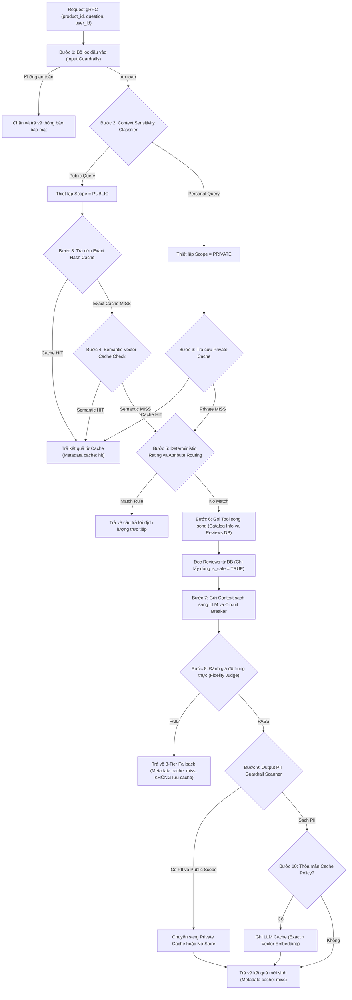
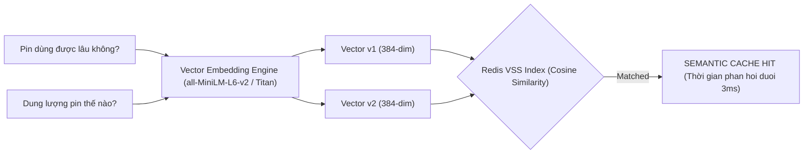
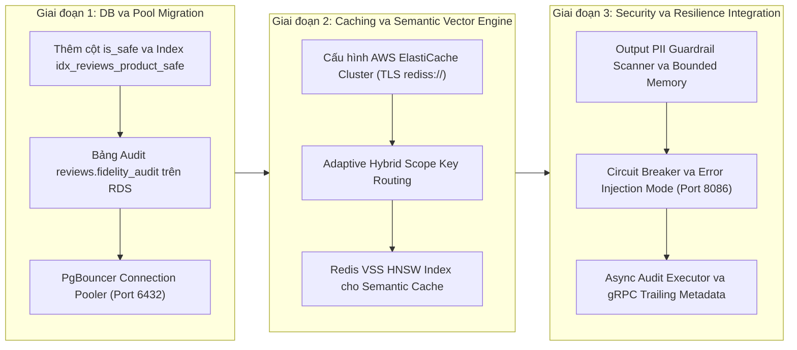

# 🏛️ Thiết Kế Hệ Thống Caching Dịch Vụ Product Reviews
*(Product Review Server Adaptive Hybrid Caching & Semantic Vector Design)*

Tài liệu này tích hợp toàn bộ giải pháp thiết kế bộ nhớ đệm (Caching) cho dịch vụ Product Reviews. Hệ thống được thiết kế ba tầng tối ưu hóa bổ trợ lẫn nhau (Exact Cache, Semantic Vector Cache, và DB Guardrail Cache) nhằm triệt tiêu độ trễ mạng (I/O-bound) từ các API LLM bên ngoài và độ trễ CPU (CPU-bound) từ bộ lọc Regex Guardrail, đồng thời giải quyết triệt để bài toán mâu thuẫn giữa **Bảo vệ ranh giới người dùng (User Boundary Protection)** và **Tối ưu chi phí API LLM (Cost & Latency Efficiency)**.

---

## 1. Kiến Trúc Tổng Quan (Overall Caching Architecture)

Quy trình xử lý một yêu cầu hỏi đáp trợ lý AI (RAG Pipeline) qua các tầng Caching và Bảo mật được mô hình hóa dưới đây:



---

## 2. Tầng 1: LLM Response Caching — Adaptive Hybrid Strategy

### 2.1. Đặt Cache Lookup Trước Lời Gọi LLM (Cache-First)
Cache đóng vai trò là tuyến phòng thủ đầu tiên. Khi **Cache Hit**, kết quả được trả về ngay lập tức cho client mà không thực thi luồng gọi LLM hay truy vấn DB, giúp giảm thời gian phản hồi từ **~1.6 giây xuống < 10 mili-giây** (p50 target) và tiết kiệm 100% token tiêu thụ.

### 2.2. Cấu Trúc Siêu Dữ Liệu Cache (Cache Metadata)
Bản ghi Cache được cấu trúc hóa dưới dạng JSON Object chứa đầy đủ thông tin hỗ trợ kiểm toán (auditing) và gỡ lỗi (debugging):
```json
{
  "answer": "Sản phẩm A được đánh giá cao nhờ thiết kế nhỏ gọn, tuy lượng pin chưa ấn tượng...",
  "provider": "bedrock",
  "model": "amazon.nova-lite-v1:0",
  "created_at": 1783935288,
  "ttl": 86400,
  "scope": "public",
  "review_version": "57f59d57a922",
  "token_usage": {
    "input_tokens": 1250,
    "output_tokens": 240
  }
}
```

---

### 2.3. Cơ Chế Invalidation Động & Cache Phân Cấp Ngữ Cảnh (Adaptive Hybrid Caching Strategy)

#### A. Phân Tích Bài Toán: Public vs Private Scope
* **Vấn đề của Static User Isolation (`user_id` cố định):** 
  Nếu 10,000 người dùng khác nhau cùng hỏi câu hỏi tóm tắt sản phẩm công khai (*"Summarize reviews for Product X"*), việc nhúng `user_id` vào mọi Cache Key tạo ra **10,000 Cache Keys khác nhau** $\rightarrow$ **10,000 Cache Misses** $\rightarrow$ **10,000 cuộc gọi API đến Amazon Bedrock LLM**, triệt tiêu 100% hiệu quả của Cache.
* **Giải Pháp Phân Cấp Dữ Liệu Động (Scope-based Cache Key Routing):**
  - **Scope PUBLIC (Mặc định cho Product Reviews):** Dùng cho các câu hỏi tra cứu đánh giá sản phẩm công khai. Khóa cache không chứa `user_id`, giúp 10,000 người dùng chia sẻ chung kết quả (1 cuộc gọi LLM đầu tiên, 9,999 request sau Cache Hit `< 1ms`, 0đ chi phí API).
  - **Scope PRIVATE:** Áp dụng khi câu hỏi có tính cá nhân hóa hoặc dữ liệu nhạy cảm. Khóa cache bắt buộc nhúng `user_id` để cách ly ranh giới bảo mật.

$$\text{Cache Key} = 
\begin{cases} 
\text{SHA256}\Big(\text{"public:"} + \text{product\_id} + \text{review\_version} + \text{model\_id} + \text{normalize}(\text{question})\Big) & \text{khi Scope = PUBLIC} \\
\text{SHA256}\Big(\text{"private:"} + \text{product\_id} + \text{review\_version} + \text{model\_id} + \text{normalize}(\text{question}) + \text{user\_id}\Big) & \text{khi Scope = PRIVATE}
\end{cases}$$

---

#### B. Cơ Chế An Toàn 2 Chiều & Khắc Phục Nhược Điểm Của Private Scope

Toàn bộ các rủi ro kỹ thuật của Private Scope được khắc phục bằng 4 cơ chế bảo vệ:

| Nhược điểm tiềm ẩn | Rủi ro | Cơ Chế Khắc Phục (Mitigation) |
| :--- | :---: | :--- |
| **1. Nhận diện nhầm ý định (False Negative lọt PII sang Public Cache)** | 🔴 **Bảo mật** | **Output PII Scanner:** Quét câu trả lời LLM trước khi lưu Public Cache. Nếu chứa PII (Email, Phone, Order ID) $\rightarrow$ Cấm lưu Public Cache. |
| **2. Tỉ lệ Hit thấp gây phình RAM Redis** | 🟡 **Tài nguyên** | **Phân tách TTL Phân cấp:** Public Cache TTL = **24 giờ** (`86400s`), Private Cache TTL = **15–30 phút** (`900s–1800s`). |
| **3. Dữ liệu cá nhân bị cũ (Stale Data)** | 🟡 **Chất lượng** | **No-Store Policy:** Không cache câu trả lời liên quan đến trạng thái giao dịch thời gian thực (Real-time Order Status). |
| **4. Giả mạo Identity Header (`x-user-id`)** | 🔴 **Bảo mật** | **API Gateway Verification:** Gateway giải mã JWT Token chính chủ để ghi `user_id`, không tin tưởng header thô từ client. |

---

#### C. Công Thức Sinh `review_version` Động
Thay vì xóa cache thủ công, hệ thống tính toán `review_version` dựa trên PostgreSQL:

$$\text{review\_version} = \text{SHA256}\big(\text{product\_id} + \text{COUNT(*)} + \text{MAX(id)}\big)[:12] \quad \text{chỉ tính trên các dòng } \text{is\_safe = TRUE}$$

* **`review_version`:** Khi có review mới hoặc thay đổi trạng thái an toàn, `review_version` thay đổi $\rightarrow$ Tự động gây ra **Cache Miss** và nạp dữ liệu mới.
* **`model_id`:** Mã nhận diện mô hình LLM. Tránh xung đột cache khi thay đổi mô hình AI.

---

### 2.4. Tầng Semantic Caching & Vector Embedding Similarity (Tối Ưu Tỉ Lệ Hit Cho Câu Hỏi Ngữ Nghĩa)

#### A. Phân Tích Động Lực (Motivation)
Chuẩn hóa câu hỏi dạng chuỗi thô (`normalize(question) = lower().strip().split()`) chỉ phát hiện được các câu hỏi trùng chữ 100%. Trong thực tế, người dùng đặt câu hỏi với cách diễn đạt đa dạng nhưng mang cùng một ý định (Semantic Intent):
- *"Pin sản phẩm có trâu không?"*
- *"Dung lượng pin máy thế nào?"*
- *"Pin dùng được mấy tiếng?"*

Nếu chỉ dùng Exact Hash Matching, 3 câu hỏi trên tạo ra 3 Cache Miss riêng biệt. Tầng **Semantic Vector Cache** giúp phát hiện độ tương đồng vector và phục vụ Cache Hit tức thì cho các câu hỏi cùng nhóm ngữ nghĩa.



---

#### B. Quy Trình Tra Cứu 2 Bước (2-Step Lookup Strategy)

1. **Bước 1 — Fast-Path Exact Hash Lookup ($O(1)$ latency < 1ms):**
   Thực thi SHA256 string hash tra cứu trước. Nếu Exact Hit $\rightarrow$ Trả về kết quả ngay lập tức mà không tốn chi phí sinh Vector Embedding.
2. **Bước 2 — Semantic Vector KNN Search ($O(\log N)$ latency < 3ms):**
   Nếu Exact Miss, gọi mô hình Embedding nhẹ sinh véc-tơ $\vec{q}$ (384-dim). Thực thi câu lệnh Redis Vector Similarity Search (`FT.SEARCH`) với bộ lọc cứng:
   - Filter `product_id` AND `review_version` AND `scope = public`.
   - Ngưỡng Cosine Similarity: $\cos(\theta) \ge 0.92$ (tương đương Cosine Distance $\le 0.08$).
3. **Đánh giá Ngưỡng (Threshold Evaluation):**
   - Nếu $\text{Similarity} \ge 0.92 \rightarrow$ **Semantic Cache HIT!** Trả về kết quả cache.
   - Nếu $\text{Similarity} < 0.92 \rightarrow$ **Cache MISS!** Chuyển tiếp sang luồng RAG LLM.

---

#### C. Bảng So Sánh Các Giải Pháp Vector Search Engine

| Tiêu chí kỹ thuật | Redis VSS (Vector Similarity Search) | PostgreSQL (pgvector extension) | FAISS (Local In-Memory Library) |
| :--- | :--- | :--- | :--- |
| **Độ trễ truy vấn KNN** | 🚀 **Siêu thấp (< 3 ms)** | 🟡 Trung bình (10-25 ms) | ⚡ Siêu thấp (< 1 ms) |
| **Khả năng Scale & Sync** | ✅ Tận dụng ElastiCache Redis sẵn có | ✅ Tận dụng Postgres RDS | ❌ Khó đồng bộ giữa các pod gRPC |
| **Cấu hình chỉ mục** | HNSW (Hierarchical Navigable Small World) | IVFFlat / HNSW | HNSW / Flat |
| **Đánh giá & Quyết định** | **ĐƯỢC CHỌN (Tối ưu hạ tầng hiện tại)** | Dùng cho phân tích dài hạn | Không phù hợp môi trường Distributed |

> [!CAUTION]
> **Ngăn Ngừa Bẫy Ngữ Nghĩa (Semantic Drift & Security Isolation):**
> 1. **Ngưỡng an toàn nghiêm ngặt:** Chỉ chấp nhận `Similarity >= 0.92`. Tuyệt đối không hạ thấp xuống 0.80-0.85 để tránh trả lầm câu hỏi khác ngữ nghĩa (*"Pin tốt không?"* vs *"Màn hình tốt không?"*).
> 2. **Chỉ áp dụng cho Public Scope:** Semantic Vector Search **tuyệt đối KHÔNG áp dụng cho Private Scope** để triệt tiêu hoàn toàn nguy cơ rò rỉ thông tin riêng tư giữa các tài khoản.

---

### 2.5. Chính Sách Chọn Lọc Cache (Cache Policy)
* **Không Cache:** Các câu trả lời thuộc diện lỗi mạng, lỗi LLM, lạc đề (`OUT_OF_SCOPE`), hoặc thiếu thông tin (`NO_INFO`).
* **Chỉ Cache Khi Đạt Kiểm Định:** Chỉ lưu kết quả khi bộ đánh giá độ trung thực phê duyệt (`approved == True`). Tránh lưu trữ câu trả lời bị ảo giác (hallucinated).

---

### 2.6. Lựa Chọn Hạ Tầng Lưu Trữ: PostgreSQL vs Redis (Trade-off Analysis)

| Tiêu chí | PostgreSQL (Database Quan Hệ) | Redis (In-Memory Key-Value) | Đánh giá & Rationale |
| :--- | :--- | :--- | :--- |
| **Độ trễ & Hiệu năng** | **~5-15 ms** (Phải xử lý SQL parser, indexes, Disk I/O). | **< 1 ms** (Lưu hoàn toàn trên RAM, throughput cực cao). | **Redis Thắng:** Phù hợp SLO phản hồi thời gian thực. |
| **Quản lý vòng đời TTL** | **Phức tạp (Manual)** (Tự kiểm tra expire_at, chạy Cronjob DELETE). | **Tự động & Tối ưu** (Hỗ trợ TTL native qua `SETEX`, LRU Eviction). | **Redis Thắng:** Tự động dọn dẹp RAM, code sạch hơn. |
| **Chi phí Hạ tầng** | **Rất Thấp** ($0 local, dùng chung RDS hiện tại, SSD EBS rẻ). | **Cao hơn** (AWS ElastiCache ~$30-60/tháng; có thể giảm $0 qua K8s Valkey). | **PostgreSQL Thắng hoàn toàn về chi phí**. |
| **Durability & ACID** | **Rất Cao** (ACID, ghi xuống đĩa tức thì). | **Trung bình** (Snapshotting bất đồng bộ, có thể mất mát nhỏ khi crash). | **PostgreSQL Thắng**, nhưng Caching chấp nhận tái sinh từ LLM. |
| **Triển khai Cloud (AWS)** | **Amazon RDS / Aurora Serverless** (Dùng chung instance). | **Amazon ElastiCache / MemoryDB** (Tách biệt tải đọc/ghi cache khỏi RDS). | **Redis Thắng về mặt kiến trúc scale**. |

#### Quyết Định Cuối Cùng: AWS ElastiCache (Redis) + Hybrid Audit AWS RDS (PostgreSQL)
> [!IMPORTANT]
> **Tuân thủ MANDATE-08 (Managed Services Migration):** Toàn bộ kho lưu trữ tự host trong cluster đã dịch chuyển sang **AWS ElastiCache (Redis)** làm hạ tầng đệm chính, và dùng **AWS RDS PostgreSQL** làm kho lưu audit log kiểm toán bất đồng bộ.

---

### 2.7. Đặc Tả Tích Hợp Managed Services & Tách Biệt Kết Nối

1. **Bảo mật Kết nối (TLS/SSL & Secrets Manager):**
   - Endpoints và credentials quản lý tập trung trong **AWS Secrets Manager**, sync qua K8s Secrets.
   - RDS dùng `sslmode=require`. ElastiCache dùng giao thức `rediss://` kèm `ssl=True`.
2. **Connection Pooling với PgBouncer (Tránh Cạn Kiệt Kết Nối RDS):**
   - Route toàn bộ lưu lượng Postgres qua **PgBouncer** (cổng `6432` chế độ transaction pooling), giữ số kết nối đến RDS ổn định ở mức $\le 25$.
3. **Ghi Audit Log Bất Đồng Bộ (Asynchronous Audit Writes):**
   - Sử dụng `ThreadPoolExecutor` đẩy tác vụ ghi log kiểm toán xuống luồng chạy nền, không kéo dài API Latency gRPC path.

---

## 3. Tầng 2: Regex Guardrail Caching (Tối ưu CPU Latency)

### 3.1. Phân Tích Điểm Nghẽn CPU-bound
Tại bước chuẩn hóa context, việc quét 28+ mẫu Regex chống Prompt Injection trên luồng đọc gRPC tạo ra độ phức tạp $O(N \times R \times L)$, ngốn CPU lớn và tạo độ trễ thắt nút cổ chai (Latency Spike).

### 3.2. Phân Tích Trade-off So Sánh 3 Phương Án

#### A. Hiệu Năng & Độ Trễ (Read Path Performance)
| Tiêu chí | Phương án A (RAM/Redis) | Phương án B (DB Column `is_safe`) | Phương án C (Chỉ dùng LLM Cache) | Đánh giá & Rationale |
| :--- | :--- | :--- | :--- | :--- |
| **Độ trễ đọc (Read Latency)** | **Thấp (~1-2 ms)** | **Siêu thấp (0 ms CPU)** — Lọc tại câu query `WHERE is_safe = true`. | **Rất cao (Latency Spike)** khi miss cache. | **Phương án B Thắng Tuyệt Đối**. |
| **Tải trọng CPU API Server** | **Thấp** (Tốn CPU băm SHA256). | **Cực thấp (Gần bằng 0)**. | **Rất cao** (Nguy cơ Thread Starvation). | **Phương án B Thắng**. |

#### B. Tài Nguyên & Chi Phí
| Tiêu chí | Phương án A (RAM/Redis) | Phương án B (DB Column `is_safe`) | Phương án C (Chỉ dùng LLM Cache) | Đánh giá & Rationale |
| :--- | :--- | :--- | :--- | :--- |
| **Tiêu hao bộ nhớ RAM** | **Cao** (~100-200MB RAM/1M reviews). | **Tối ưu (0 MB RAM)**. | **Tối ưu (0 MB RAM)**. | **Phương án B & C Thắng**. |
| **Tiêu hao đĩa SSD** | **0 MB Disk**. | **Rất thấp (~1 MB Disk)** cho 1M reviews. | **0 MB Disk**. | **Phương án B Thắng** (SSD cực rẻ). |

#### C. Vận Hành & Bảo Trì
| Tiêu chí | Phương án A (RAM/Redis) | Phương án B (DB Column `is_safe`) | Phương án C (Chỉ dùng LLM Cache) | Đánh giá & Rationale |
| :--- | :--- | :--- | :--- | :--- |
| **Scale ngang** | **Phức tạp** (Cần sync cluster). | **Đơn giản** (Đồng bộ qua SQL). | **Đơn giản** (Stateless). | **Phương án B Thắng**. |
| **Thay đổi Regex Rules** | **Đơn giản** (Flush cache). | **Cần Migration chạy nền**. | **Tự động**. | **Phương án A & C Thắng**. |

### 3.3. Giải Pháp Tối Ưu Được Chọn: Phương án B (Database Column `is_safe`)
1. **Chuyển dịch tải CPU sang luồng Ghi (Write path):** Đánh giá sản phẩm là tác vụ "Đọc nhiều, Ghi ít". Thực hiện quét Regex và lưu thuộc tính `is_safe` lúc người dùng lưu review.
2. **Không tốn RAM đệm:** Loại bỏ phụ thuộc cache RAM cho Guardrail.
3. **Khi cập nhật mẫu Regex:** Chạy Background Migration Job quét lại review cũ theo batch ngoài request path.

---

## 4. Phân Tích Rủi Ro Kỹ Thuật & Giải Pháp Phân Theo Tầng (Tiered Resilience Patterns)

Tất cả các rủi ro vận hành trong luồng xử lý thực tế của [product_reviews_server.py](file:///C:/Users/ASUS/OneDrive/Obsidian%20Vault/XBrain-Phase3/AIO02_TF3_Phase3/AIE1/techx-corp-platform/src/product-reviews/product_reviews_server.py), báo cáo phân tích điểm nghẽn [0001-PRODUCT-REVIEWS-BOTTLENECK-ANALYSIS.md](file:///C:/Users/ASUS/OneDrive/Obsidian%20Vault/XBrain-Phase3/AIO02_TF3_Phase3/AIE1/docs/analysis/0001-PRODUCT-REVIEWS-BOTTLENECK-ANALYSIS.md) và báo cáo nghiệm thu [AIE1-MANDATE-25-SUBMISSION.md](file:///C:/Users/ASUS/OneDrive/Obsidian%20Vault/XBrain-Phase3/AIO02_TF3_Phase3/AIE1/docs/reports/AIE1-MANDATE-25-SUBMISSION.md) được phân loại và giải quyết minh bạch theo từng tầng. Các cơ chế bảo vệ dưới đây đều đã được triển khai mã nguồn và kiểm chứng bằng Unit Test:

### 4.1. Rủi Ro Tầng 1: LLM Response Cache & Routing AI

#### A. Redis Connection Failure — Single Point of Failure (🔴 Nghiêm trọng) *(Trạng thái: Đã triển khai)*
* **Rủi ro:** Khi Redis ngắt kết nối hoặc sập, luồng gRPC có nguy cơ bị crash hoặc treo request.
* **Giải pháp: Fail-Open Pattern**
  Khi gặp sự cố kết nối Redis, ứng dụng tự động bỏ qua tầng cache và chuyển sang luồng gọi LLM bình thường mà không gây crash dịch vụ ([guardrails/cache.py:L70-97](file:///C:/Users/ASUS/OneDrive/Obsidian%20Vault/XBrain-Phase3/AIO02_TF3_Phase3/AIE1/techx-corp-platform/src/product-reviews/guardrails/cache.py#L70-L97)):
  ```python
  try:
      cached = redis_client.get(cache_key)
  except (redis.ConnectionError, redis.TimeoutError) as e:
      logger.warning(f"Redis unavailable for read, bypassing cache (Fail-Open): {e}")
      cached = None  # Tiếp tục luồng như Cache Miss
  ```

#### B. Cache Stampede (Thundering Herd) (🟡 Trung bình) *(Trạng thái: Đã triển khai)*
* **Rủi ro:** Khi `review_version` thay đổi hoặc cache hết hạn, hàng trăm request đồng thời cùng hỏi 1 sản phẩm sẽ đồng loạt gọi LLM, gây đột biến chi phí API và nghẽn token.
* **Giải pháp: Distributed Lock bằng Redis `SET NX`**
  Chỉ cho phép **1 request đầu tiên** gọi LLM khi Cache Miss, các request trùng lặp chờ polling kết quả từ cache trong vòng 10 giây ([guardrails/cache.py:L119-137](file:///C:/Users/ASUS/OneDrive/Obsidian%20Vault/XBrain-Phase3/AIO02_TF3_Phase3/AIE1/techx-corp-platform/src/product-reviews/guardrails/cache.py#L119-L137)):
  ```python
  lock_key = f"lock:{cache_key}"
  acquired = redis_client.set(lock_key, "1", nx=True, ex=10)
  ```

#### C. Lọt PII Sang Public Scope do Nhận Diện Nhầm Ý Định (🔴 Nghiêm trọng) *(Trạng thái: Đã triển khai)*
* **Rủi ro:** Câu hỏi cá nhân không trùng từ khóa quét tĩnh bị xếp lầm vào Public Scope, dẫn đến câu trả lời chứa PII của User A có nguy cơ bị cache công khai.
* **Giải pháp: Output PII Guardrail Scanner & Responded-Only Policy**
  - **Luồng trả kết quả cho Khách:** Phản hồi từ LLM được quét và redact PII bằng hàm `filter_output()` ([guardrails/output_filter.py:L62-98](file:///C:/Users/ASUS/OneDrive/Obsidian%20Vault/XBrain-Phase3/AIO02_TF3_Phase3/AIE1/techx-corp-platform/src/product-reviews/guardrails/output_filter.py#L62-L98)) rồi **vẫn trả về bình thường cho đúng khách hàng đó** (không bị chặn thông điệp đối với chính họ).
  - **Luồng Cache:** Nếu phát hiện PII (`is_clean == False`), hệ thống **cấm tuyệt đối không được ghi vào Public Cache** (chỉ lưu vào Private Scope của chính user đó hoặc áp dụng No-Store) để các khách hàng khác không bao giờ đọc lầm PII này.

#### D. Quá Tải API Bedrock & Ngắt Mạch Tự Phục Hồi (🔴 Nghiêm trọng) *(Tham chiếu Nghiệm Thu Mandate 25)*
* **Rủi ro:** Khi Amazon Bedrock bị sự cố 5xx hoặc Rate Limit 429 kéo dài, hệ thống bị treo đợt sóng request dồn dập.
* **Giải pháp: Circuit Breaker State Machine & 3-Tier Fallback**
  - Tự động chuyển trạng thái `CLOSED` $\rightarrow$ `OPEN` khi gặp 5 lỗi liên tiếp, chặn dội request sang Provider trong 30s cooldown, chuyển sang đường lui tĩnh Tier 2 (Postgres Summary) hoặc Tier 3 (Zero-Fabrication Abstention) ([guardrails/circuit_breaker.py](file:///C:/Users/ASUS/OneDrive/Obsidian%20Vault/XBrain-Phase3/AIO02_TF3_Phase3/AIE1/techx-corp-platform/src/product-reviews/guardrails/circuit_breaker.py)).
  - Hỗ trợ cổng ép lỗi giả lập `POST /inject/error` (port 8086) cho 4 kịch bản lỗi live (`429`, `timeout`, `500`, `circuit_breaker`).

#### E. Triệt Tiêu Cuộc Gọi LLM Cho Câu Hỏi Định Lượng (🟢 Thấp) *(Tham chiếu Tối Ưu Bottleneck 0001)*
* **Rủi ro:** Các câu hỏi tra cứu điểm trung bình hoặc thuộc tính cố định vẫn gọi LLM làm lãng phí 100% chi phí.
* **Giải pháp: Deterministic Rating & Attribute Routing**
  Xử lý trực tiếp các câu hỏi định lượng bằng hàm toán học mã nguồn Python trước khi tới LLM ([product_reviews_server.py:L1360-1390](file:///C:/Users/ASUS/OneDrive/Obsidian%20Vault/XBrain-Phase3/AIO02_TF3_Phase3/AIE1/techx-corp-platform/src/product-reviews/product_reviews_server.py#L1360-L1390)):
  - `answer_deterministic_rating_question()`
  - `answer_deterministic_exact_attribute_question()`
  - `answer_deterministic_absence_question()`
  - `answer_deterministic_quality_question()`

---

### 4.2. Rủi Ro Tầng 2: Regex Guardrail Cache (Database Column `is_safe`)

#### A. Xung Đột Áp Lực I/O Khi Chạy Migration Quét Review Cũ (🟡 Trung bình) *(Tham chiếu Tối Ưu Bottleneck 0001)*
* **Rủi ro:** Khi thay đổi bộ mẫu Regex, việc quét và `UPDATE` lại cột `is_safe` cho hàng triệu dòng review cũ trực tiếp trên DB có thể làm nghẽn kết nối I/O của PostgreSQL RDS.
* **Giải pháp: Background Batch Migration Job ngoài Request Path**
  Khởi chạy background worker quét theo từng **batch 500 rows** (`LIMIT` + `OFFSET`) bằng hàm `check_input()` ([guardrails/input_filter.py:L1-494](file:///C:/Users/ASUS/OneDrive/Obsidian%20Vault/XBrain-Phase3/AIO02_TF3_Phase3/AIE1/techx-corp-platform/src/product-reviews/guardrails/input_filter.py#L1-L494)) và cập nhật PostgreSQL qua connection pool ([database.py:L86-90](file:///C:/Users/ASUS/OneDrive/Obsidian%20Vault/XBrain-Phase3/AIO02_TF3_Phase3/AIE1/techx-corp-platform/src/product-reviews/database.py#L86-L90)) kèm `time.sleep(0.1)` giữa các batch để không tạo áp lực I/O lên Postgres.

---

### 4.3. Rủi Ro Tầng Hạ Tầng & Thread Exhaustion

#### A. Cạn Kiệt gRPC Thread Pool do Cuộc Gọi AI Kéo Dài (🔴 Nghiêm trọng) *(Tham chiếu Tối Ưu Bottleneck 0001)*
* **Rủi ro:** Các cuộc gọi AI sinh text kéo dài 1-3 giây chiếm dụng toàn bộ worker thread của gRPC Server, khiến các request đọc DB ngắn bị nghẽn hàng đợi (Thread Starvation).
* **Giải pháp: Dedicated AI Bounded ThreadPool Executor**
  Bổ sung `ai_executor = futures.ThreadPoolExecutor(max_workers=15)` chuyên biệt cho tác vụ AI ([product_reviews_server.py:L211-212](file:///C:/Users/ASUS/OneDrive/Obsidian%20Vault/XBrain-Phase3/AIO02_TF3_Phase3/AIE1/techx-corp-platform/src/product-reviews/product_reviews_server.py#L211-L212)), cách ly hoàn toàn 15 AI worker khỏi 35+ gRPC read threads.

#### B. Độ Trễ Ghi Audit Log Vượt Mạng Sang AWS RDS (🟡 Trung bình) *(Trạng thái: Đã triển khai)*
* **Rủi ro:** Ghi log kiểm toán Fidelity Judge đồng bộ sang RDS PostgreSQL tốn 5-15ms mạng, làm kéo dài API Latency của luồng gRPC main thread.
* **Giải pháp: Asynchronous Audit Writes (`ThreadPoolExecutor`)**
  Đẩy việc ghi log kiểm toán xuống luồng chạy nền với `ThreadPoolExecutor(max_workers=5)`, giải phóng main thread trả kết quả ngay lập tức cho client.

#### C. Thẩm Định Schema Biên & Output Tool Args Rác (🔴 Nghiêm trọng) *(Tham chiếu Nghiệm Thu Mandate 25)*
* **Rủi ro:** Mô hình LLM trả về chuỗi JSON hỏng hoặc chứa mã SQL Injection / Path Traversal trong `product_id` làm sập dịch vụ backend.
* **Giải pháp: Boundary Schema Validator (`tool_validator.py`)**
  Bọc parse JSON trong `try...except`, kiểm tra `product_id` theo regex `^[A-Za-z0-9_-]+$`. Chặn 100% JSON blob hỏng, phát ra metric `app_ai_fallback_total{source="malformed_tool_args"}`.

---

### 4.4. Đánh Giá Trade-off Chuẩn Hóa Câu Hỏi (Normalize Question)

| Phương án chuẩn hóa | Rủi ro kỹ thuật | Đánh giá & Quyết định |
| :--- | :--- | :--- |
| **Stemming / Synonym mapping** | Phá vỡ ngữ nghĩa (*"pin tốt"* bị map trùng *"pin tồi"*). | ❌ Không áp dụng |
| **Embedding similarity** (cosine > 0.95) | Tốn thêm 1 cuộc gọi API embedding model, làm tăng latency. | ⏳ Cân nhắc cho giai đoạn sau |
| **Normalize đơn giản (`lower().strip().split()`)** | Cache hit rate thấp hơn lý tưởng nhưng an toàn tuyệt đối về ngữ nghĩa. | ✅ **Được chọn** |

---

## 5. Minh Họa Logic Mã Nguồn Python Thực Tế

### 5.1. Module Cache & Scope Classifier (`cache.py`)

```python
import hashlib
import json
import logging
from typing import Dict, Any, Optional

logger = logging.getLogger("guardrails.cache")

def is_user_specific_query(question: str, metadata: Optional[Any] = None) -> bool:
    """Phân loại xem câu hỏi có chứa ngữ cảnh cá nhân/header private hay không."""
    if metadata:
        try:
            for key, val in metadata:
                k = str(key).lower()
                if k in ("x-cache-scope", "cache-scope") and str(val).lower() == "private":
                    return True
                if k in ("x-isolate-user", "isolate-user") and str(val).lower() in ("true", "1"):
                    return True
        except Exception:
            pass

    personal_keywords = [
        "của tôi", "tôi đã", "đơn hàng của tôi", "tài khoản của tôi",
        "my order", "my account", "my cart", "my purchase", "giỏ hàng của tôi"
    ]
    q_lower = question.lower()
    return any(kw in q_lower for kw in personal_keywords)


def generate_cache_key(
    product_id: str,
    review_version: str,
    model_id: str,
    question: str,
    user_id: Optional[str] = None,
    is_private_scope: bool = False
) -> str:
    """Sinh Cache Key băm SHA256 theo Scope."""
    normalized_q = " ".join(question.lower().strip().split())
    if is_private_scope and user_id and user_id != "anonymous":
        raw_key = f"private:{product_id}:{review_version}:{model_id}:{normalized_q}:{user_id}"
    else:
        raw_key = f"public:{product_id}:{review_version}:{model_id}:{normalized_q}"
    return hashlib.sha256(raw_key.encode('utf-8')).hexdigest()
```

### 5.2. Luồng Xử Lý Server (`product_reviews_server.py`)

```python
def ask_product_ai_assistant(context_grpc, request):
    product_id = request.product_id
    question = request.question
    user_id = extract_user_id(context_grpc)
    inv_metadata = context_grpc.invocation_metadata() or []

    # 1. Quét Input Guardrail
    if not check_input(question).is_safe:
        context_grpc.set_trailing_metadata([('cache', 'miss')])
        return "Blocked by security policy."

    # 2. Phân loại Scope & Sinh Cache Key
    is_private = is_user_specific_query(question, inv_metadata)
    review_version = get_review_version(product_id)
    cache_key = generate_cache_key(product_id, review_version, llm_model, question, user_id, is_private)

    # 3. Tra cứu Cache (Exact Hash + Semantic KNN)
    cached_data = get_cached_response(cache_key)
    if not cached_data and not is_private:
        cached_data = get_semantic_cached_response(product_id, review_version, question)

    if cached_data:
        context_grpc.set_trailing_metadata([('cache', 'hit')])
        return cached_data["answer"]

    # 4. Cache MISS -> Check Deterministic rating/attribute answer
    det_answer = answer_deterministic_rating_question(question, raw_reviews)
    if det_answer:
        return det_answer

    # 5. Thực thi RAG LLM & Lưu Cache
    context_grpc.set_trailing_metadata([('cache', 'miss')])
    result = execute_rag_pipeline(product_id, question)
    approved = evaluate_fidelity(result)

    if should_cache(result, approved):
        ttl = 1800 if is_private else 86400  # Private 30m, Public 24h
        set_cached_response(cache_key, result, ttl=ttl)

    return result
```

---

## 6. Lộ Trình Triển Khai Kỹ Thuật (Technical Implementation Roadmap)

Lộ trình triển khai hạ tầng và mã nguồn Caching phân cấp được mô hình hóa theo sơ đồ các giai đoạn kỹ thuật dưới đây:



### Giai đoạn 1: Database Migration & Connection Scaling (PostgreSQL RDS)
* **Schema Migration:** Cập nhật bảng `reviews.productreviews` trên AWS RDS PostgreSQL (thêm cột `is_safe BOOLEAN DEFAULT TRUE` và index `idx_reviews_product_safe`).
* **PgBouncer Integration:** Định tuyến kết nối DB qua PgBouncer tại cổng `6432` chế độ Transaction Pooling để giữ kết nối đến RDS ổn định ở mức $\le 25$.

### Giai đoạn 2: Infra Caching, Adaptive Scope & Semantic Vector Engine (AWS ElastiCache)
* **ElastiCache Cluster Provisioning:** Cấu hình kết nối ElastiCache Redis bảo mật qua TLS (giao thức `rediss://`), tích hợp AWS Secrets Manager qua Kubernetes Secrets.
* **Semantic Vector Search Index:** Khởi tạo HNSW Vector Index trên Redis ElastiCache cho tiền tố `semantic:public:...` nhằm tra cứu KNN Cosine Similarity $\ge 0.92$ cho các câu hỏi cùng nhóm ngữ nghĩa.
* **Adaptive Scope Key Generation:** Triển khai hàm `generate_cache_key()` phân chia Scope PUBLIC (không `user_id`) và Scope PRIVATE (kèm `user_id`).

### Giai đoạn 3: Security Guardrails, Resilience & Observability Integration
* **2-Way Security Guardrail:** Tích hợp `is_user_specific_query()` ở luồng vào và Output PII Scanner trước khi ghi Public Cache.
* **Circuit Breaker & Boundary Validator:** Tích hợp bộ ngắt mạch 3 trạng thái (`guardrails/circuit_breaker.py`), bộ thẩm định schema biên tool arguments (`guardrails/tool_validator.py`), và endpoint ép lỗi live (`POST /inject/error` port 8086).
* **Async Audit & Observability Metadata:** Cấu hình `ThreadPoolExecutor(max_workers=5)` thực thi hàm `log_fidelity_audit_async()` và trả về gRPC trailing metadata `cache = hit|miss`.
