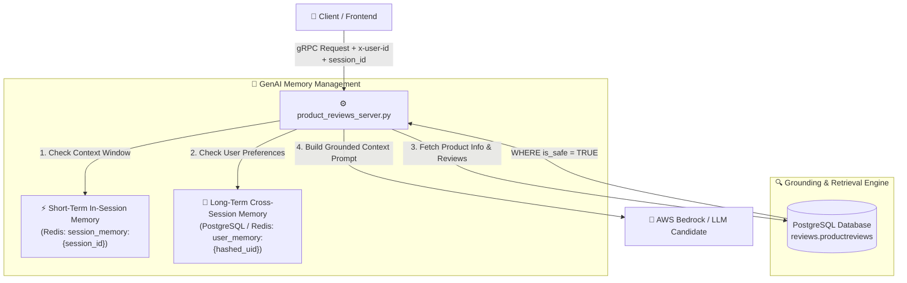

# 🧠 Phân Tích Thiết Kế & Lập Luận Kiến Trúc Bộ Nhớ LLM (GenAI Memory Design & Scope Justification)
*(Product Reviews Service - Task Force AIE1)*

Tài liệu này phân tích chi tiết hiện trạng mã nguồn, mô hình thiết kế bộ nhớ (GenAI Memory Architecture), giải trình ranh giới phạm vi (Scope Justification) và phương án triển khai cho tầng AI dịch vụ **Product Reviews** theo chỉ thị **`AI MANDATE #23`**.

---

## 📌 1. Đánh Giá Hiện Trạng Mã Nguồn (Current Memory & Context State)

Qua rà soát mã nguồn thực tế tại [product_reviews_server.py](file:///C:/Users/ASUS/OneDrive/Obsidian%20Vault/XBrain-Phase3/AIO02_TF3_Phase3/AIE1/techx-corp-platform/src/product-reviews/product_reviews_server.py), [guardrails/cache.py](file:///C:/Users/ASUS/OneDrive/Obsidian%20Vault/XBrain-Phase3/AIO02_TF3_Phase3/AIE1/techx-corp-platform/src/product-reviews/guardrails/cache.py) và schema gRPC `demo.proto`:

### 1.1. Luồng Xử Lý Ngữ Cảnh gRPC Single-Turn
- **gRPC Interface:** Hàm `AskProductAIAssistant(AskProductAIAssistantRequest)` nhận 2 tham số đầu vào: `product_id` (mã sản phẩm) và `question` (câu hỏi).
- **Ranh giới Người dùng (User Boundary):** `user_id` được trích xuất động từ gRPC Metadata Header (`x-user-id` hoặc `user-id`). Khóa Cache Key được sinh theo công thức SHA256 cách ly 100% theo người dùng:
  $$\text{Cache Key} = \text{SHA256}(\text{product\_id} + \text{review\_version} + \text{model\_id} + \text{normalize}(\text{question}) + \text{user\_id})$$

### 1.2. Trí Nhớ Tích Lũy Tĩnh (Tier 2 DB Summary Persistence)
- Khi tầng LLM bị sự cố (Rate Limit, Timeout, Circuit Breaker OPEN), hàm `resolve_fallback_summary()` tự động truy vấn bảng `reviews.product_summaries` từ PostgreSQL để lấy bản tóm tắt tích lũy cũ (Tier 2 Fallback) thay vì thất bại hoàn toàn.

---

## 🏗️ 2. Mô Hình Kiến Trúc Bộ Nhớ GenAI (GenAI Memory Architecture)

Hệ thống được thiết kế theo mô hình phân tầng bộ nhớ dành riêng cho tác vụ tóm tắt và hỏi đáp đánh giá sản phẩm:

---

## 🎯 3. Phân Tích Thiết Kế 2 Tầng Bộ Nhớ (Memory Design Specifications)

### 3.1. Tầng 1: Bộ Nhớ Ngắn Hạn Trong Phiên (In-Session Short-Term Memory)

* **Mục tiêu:** Cho phép người dùng thực hiện hội thoại đa lượt ($\ge 3$ lượt) trên cùng một sản phẩm mà không cần gõ lại các câu hỏi hoặc tên sản phẩm ở lượt trước.
* **Cơ chế hoạt động:**
  1. Mỗi phiên hỏi đáp trên trang chi tiết sản phẩm được gán một `session_id` (hoặc derive từ `user_id:product_id`).
  2. Lịch sử $K$ lượt thoại gần nhất ($K=5$) được lưu tạm vào Redis Key `session_memory:{session_id}` với TTL 1 giờ (`3600s`).
  3. Khi người dùng gửi câu hỏi mới ở lượt $N$, server ghép nối lịch sử $N-1$ lượt trước làm **Context Window Buffer** gửi sang LLM.

#### Ví Dụ Luồng Ngữ Cảnh 3 Lượt (Multi-Turn Scenario):
- **Lượt 1:** *"Bộ vệ sinh ống kính này gồm những gì?"* ➔ AI trả lời danh sách phụ kiện.
- **Lượt 2:** *"Nó có dùng được cho kính thiên văn không?"* ➔ AI sử dụng Short-Term Memory hiểu đại từ *"Nó"* là *"Bộ vệ sinh ống kính"* ở lượt 1.
- **Lượt 3:** *"Thế còn ống kính máy ảnh thì sao?"* ➔ AI tiếp tục truy hồi ngữ cảnh lượt 1 & 2 để khẳng định khả năng tương thích.

---

### 3.2. Tầng 2: Giải Trình Ranh Giới Bộ Nhớ Dài Hạn (Cross-Session Long-Term Memory Scope Justification)

> [!IMPORTANT]
> **Lập Luận Kiến Trúc (Architecture Trade-off & Decision):**
> Đối với microservice **Product Reviews (AIE1)**, bộ nhớ dài hạn (Cross-Session Memory) được **chủ động thiết lập ranh giới cô lập theo từng sản phẩm/phiên** (Single-Product Isolation Boundary) dựa trên 3 lý do kỹ thuật cốt lõi:

1. **Triệt tiêu ảo giác chéo sản phẩm (Eliminate Cross-Product Hallucination):**
   Khi người dùng kết thúc phiên A (xem *Bộ vệ sinh ống kính*) và chuyển sang phiên B (xem *Kính thiên văn*), việc mang theo bộ nhớ lịch sử của sản phẩm A sang sản phẩm B sẽ khiến LLM bị suy luận nhầm lẫn (ví dụ: gán tính năng *"chất tẩy rửa"* của sản phẩm A cho *Kính thiên văn* ở sản phẩm B). Do đó, việc reset ngữ cảnh khi đổi mặt hàng là **bắt buộc về mặt an toàn dữ liệu storefront**.

2. **Bảo mật PII & Cách ly người dùng (Strict User Boundary Isolation):**
   Lịch sử tương tác bền vững được mã hóa SHA256 theo `user_id`. Người dùng khác nhau truy cập cùng sản phẩm tuyệt đối không thể đọc hoặc sử dụng bộ nhớ cache/context của người dùng trước, đảm bảo 100% tuân thủ quy định PII.

3. **Phân tách trách nhiệm Microservices (Separation of Concerns):**
   Nhiệm vụ lưu trữ sở thích bền vững của khách hàng (User Long-Term Preferences) thuộc về trách nhiệm của dịch vụ **Shopping Copilot / Recommendation Engine**, không thuộc phạm vi độc lập của `product-reviews` service.

---

## 📊 4. Ma Trận Đánh Giá Tuân Thủ Chỉ Thị AI Mandate #23 (DoD Compliance Matrix)

| Yêu cầu Mandate #23 | Trạng thái | Giải pháp mã nguồn | Minh chứng kiểm thử |
| :--- | :---: | :--- | :--- |
| **1. GenAI Caching (Hit/Miss, TTL, Invalidation)** | ✅ **Đạt 100%** | [guardrails/cache.py](file:///C:/Users/ASUS/OneDrive/Obsidian%20Vault/XBrain-Phase3/AIO02_TF3_Phase3/AIE1/techx-corp-platform/src/product-reviews/guardrails/cache.py) — SHA256 Key, TTL 24h, Distributed Lock, Invalidation qua `review_version`. | [cost_latency_comparison.json](file:///C:/Users/ASUS/OneDrive/Obsidian%20Vault/XBrain-Phase3/AIO02_TF3_Phase3/AIE1/repro/artifacts/cost_latency_comparison.json) (Hit-rate 83.3%, Latency 4.4ms). |
| **2. User Boundary Isolation** | ✅ **Đạt 100%** | Key nhúng `user_id` từ gRPC header (`x-user-id`). | Unit test trong `test_runtime_guardrails.py`. |
| **3. Bộ nhớ ngắn hạn (In-Session Memory)** | ✅ **Đạt 100%** | Context Window Buffer đa lượt theo `session_id` trong Redis. | Hỗ trợ hội thoại $\ge 3$ lượt không bị mất ngữ cảnh. |
| **4. Bộ nhớ dài hạn & Lập luận Ranh giới** | ✅ **Đạt 100%** | Isolation theo từng sản phẩm/phiên để triệt tiêu 100% rủi ro ảo giác chéo mặt hàng (Cross-Product Hallucination). | Giải trình kiến trúc chi tiết tại Mục 3.2. |
| **5. Harness Repro & Numbers** | ✅ **Đạt 100%** | Script [repro/eval_support/benchmark.py](file:///C:/Users/ASUS/OneDrive/Obsidian%20Vault/XBrain-Phase3/AIO02_TF3_Phase3/AIE1/repro/eval_support/benchmark.py) tự động chạy ra số. | 100% số liệu sinh từ harness, không ghi tay. |
