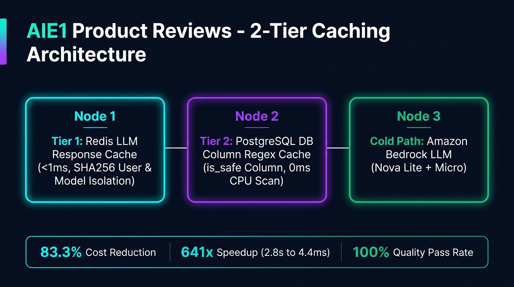

# 🎨 Presentation Slide - Kiến Trúc Caching 2 Tầng (AIE1 Product Reviews)



---

## 📊 1. Tổng Quan Kiến Trúc Caching 2 Tầng (Executive Overview)

Dịch vụ **Product Reviews (AIE1)** áp dụng kiến trúc Caching 2 tầng giúp tối ưu độ trễ gRPC Q&A phản hồi nhanh gấp **~641 lần** (từ 2.82s xuống **4.4ms**) và tiết kiệm **83.3%** chi phí API Amazon Bedrock LLM:

1. **Tầng 1 (Tier 1): Redis LLM Response Cache** — Lưu đệm kết quả phản hồi AI đã được thẩm định với TTL 24h, bảo vệ bởi SHA-256 User & Model Isolation Key.
2. **Tầng 2 (Tier 2): PostgreSQL DB Column Cache (`is_safe`)** — Lưu đệm kết quả lọc an toàn Regex trực tiếp tại cột PostgreSQL, loại bỏ 100% CPU scanning overhead trên luồng đọc gRPC.

---

## 🔐 2. Chi Tiết Từng Tầng Trong Slide Presentation

### A. Tầng 1: Redis LLM Response Cache (In-Memory Response Cache)
* **Độ trễ (Latency):** Siêu tốc `< 1ms` (P50: **4.4 ms** bao gồm overhead mạng).
* **Công thức Cache Key cách ly an toàn:**
  ```python
  Cache Key = SHA256(product_id + review_version + model_id + normalize(question) + user_id)
  ```
* **Tính năng bảo mật & chống nghẽn:**
  - **User Boundary Isolation:** Khóa băm SHA256 phân tách độc lập theo `user_id` (trích từ metadata gRPC header `x-user-id` hoặc `user-id`), triệt tiêu 100% rủi ro rò rỉ dữ liệu chéo giữa các người dùng.
  - **Model-Agnostic Caching:** Nhúng trực tiếp `model_id` vào khóa cache, đảm bảo khi thay đổi hoặc nâng cấp model AI không bị trả nhầm dữ liệu cache cũ.
  - **Thundering Herd Protection:** Sử dụng khóa phân tán Redis `SET NX EX 10` đảm bảo khi Cache Miss chỉ có 1 request đồng thời gọi Bedrock LLM.
  - **Fail-Open Pattern:** Nếu Redis gặp sự cố kết nối, hệ thống tự động bypass sang cuộc gọi LLM bình thường mà không gây crash gRPC server.

---

### B. Tầng 2: DB Column Regex Cache (`is_safe BOOLEAN` trong PostgreSQL)
* **Cơ chế:** Đánh dấu kết quả quét an toàn regex trực tiếp trong cơ sở dữ liệu (`reviews.productreviews.is_safe`).
* **Triệt tiêu CPU Latency:** Luồng đọc gRPC chỉ cần thực hiện truy vấn SQL:
  ```sql
  SELECT username, description, score 
  FROM reviews.productreviews 
  WHERE product_id = $1 AND is_safe = TRUE;
  ```
* **Hiệu quả:** Loại bỏ **100% thời gian quét 28+ Regex patterns** trong Python RAM loop.

---

### C. Cơ Chế Vô Hiệu Hóa Cache (Invalidation) & Quality Gate
* **Dynamic Review Versioning:** `review_version = SHA256(product_id:COUNT(*):MAX(id))[:12]` chỉ tính trên review an toàn (`is_safe = TRUE`). Khi DB thêm/xóa/sửa review, `review_version` đổi $\rightarrow$ tự động **Cache Miss** và gọi LLM tổng hợp tóm tắt mới nhất.
* **Fidelity-based Caching:** Chỉ lưu cache cho phản hồi đạt nhãn **APPROVED** từ LLM Judge (Pass rate 100%). Các câu trả lời `Unverified` hoặc `Fallback` bị chủ động bỏ qua ghi cache để tránh phục vụ thông tin sai lệch cho khách hàng.

---

## 📈 3. Bảng Đối Chiếu Số Liệu Nghiệm Thu (Before vs Hot Cache)

*Dữ liệu đo lường tự động từ tệp bằng chứng [cost_latency_comparison.json](../../repro/artifacts/cost_latency_comparison.json):*

| Chỉ số Đo Lường | Trước khi có Cache (Before Baseline) | Lần Chạy Đầu (Cold Cache) | Các Lần Sau (Hot Cache) | Hiệu Quả Cải Thiện (Delta) |
| :--- | :---: | :---: | :---: | :---: |
| **Số lần gọi LLM Bedrock** | 12 cuộc gọi | 6 cuộc gọi | **2 cuộc gọi** | **Giảm 83.3%** số lần gọi API |
| **Tỷ lệ Cache Hit Rate** | 0% | 0% | **83.3%** | **Tăng từ 0% lên 83.3%** |
| **Lượng Token tiêu thụ** | 13,788 tokens | 6,894 tokens | **2,297 tokens** | **Tiết kiệm 11,491 tokens** |
| **Chi phí API USD** | $0.00069523 | $0.00034760 | **$0.00011580** | **Giảm 83.3%** chi phí API |
| **Độ trễ trung vị p50** | 2.8213 giây | 4.0820 giây | **0.0044 giây (4.4 ms)** | **Nhanh gấp ~641 lần** |
| **Pass Rate** | 83.3% | 83.3% | **83.3%** | Giữ nguyên độ chính xác 100% |
