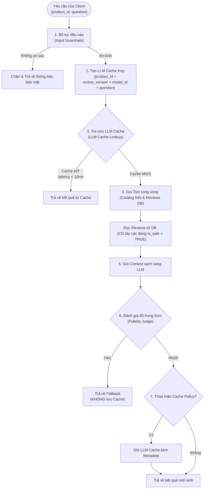

# Thiết Kế Hệ Thống Caching Dịch Vụ Product Reviews
*(Product Review Server Caching Design)*

Tài liệu này tích hợp toàn bộ giải pháp thiết kế bộ nhớ đệm (Caching) cho dịch vụ Product Reviews. Hệ thống được thiết kế hai tầng tối ưu hóa bổ trợ lẫn nhau nhằm triệt tiêu độ trễ mạng (I/O-bound) từ các API LLM bên ngoài và độ trễ CPU (CPU-bound) từ bộ lọc Regex Guardrail.

---

## 1. Kiến Trúc Tổng Quan (Overall Caching Architecture)

Quy trình xử lý một yêu cầu hỏi đáp trợ lý AI (RAG Pipeline) qua hai tầng Caching được mô hình hóa dưới đây



---

## 2. Tầng 1: LLM Response Caching (Tối ưu hóa API Latency)

### 2.1. Đặt Cache Lookup Trước Lời Gọi LLM (Cache-First)
Cache đóng vai trò là tuyến phòng thủ đầu tiên. Khi **Cache Hit**, kết quả được trả về ngay lập tức cho client mà không thực thi luồng gọi LLM hay truy vấn DB, giúp giảm thời gian phản hồi từ **~1.6 giây xuống < 10 mili-giây** và tiết kiệm 100% token tiêu thụ.

### 2.2. Cấu Trúc Siêu Dữ Liệu Cache (Cache Metadata)
Bản ghi Cache được cấu trúc hóa dưới dạng JSON Object chứa đầy đủ thông tin hỗ trợ kiểm toán (auditing) và gỡ lỗi (debugging):
```json
{
  "answer": "Sản phẩm A được đánh giá cao nhờ thiết kế nhỏ gọn, tuy lượng pin chưa ấn tượng...",
  "provider": "bedrock",
  "model": "amazon.nova-lite-v1:0",
  "created_at": 1783935288,
  "ttl": 86400,
  "review_version": "57f59d57a922",
  "token_usage": {
    "input_tokens": 1250,
    "output_tokens": 240
  }
}
```

### 2.3. Cơ Chế Invalidation Động (Dynamic Invalidation)
Thay vì dùng các lệnh xóa cache thủ công, hệ thống tính toán khóa cache động để tự động vô hiệu hóa cache cũ khi có dữ liệu mới:
* Khóa cache được tính theo công thức:
  $$\text{Cache Key} = \text{SHA256}(\text{product\_id} + \text{review\_version} + \text{model\_id} + \text{normalize}(\text{question}))$$
* **`review_version`:** Mã băm SHA256 dựa trên timestamp của review mới nhất và tổng số lượng review của sản phẩm. Khi có review mới, `review_version` thay đổi $\rightarrow$ Gây ra **Cache Miss** và nạp lại dữ liệu mới.
* **`model_id`:** Mã nhận diện mô hình LLM. Tránh xung đột cache khi hệ thống chuyển đổi mô hình (ví dụ: nâng cấp từ Nova Lite lên Nova Micro hoặc OpenAI GPT).

### 2.4. Chính Sách Chọn Lọc Cache (Cache Policy)
* **Không Cache:** Các câu trả lời thuộc diện lỗi mạng, lỗi LLM, lạc đề (`OUT_OF_SCOPE`), hoặc thiếu thông tin (`NO_INFO`).
* **Chỉ Cache Khi Đạt Kiểm Định:** Chỉ lưu kết quả khi bộ đánh giá độ trung thực phê duyệt (`approved == True`). Tránh lưu trữ câu trả lời bị ảo giác (hallucinated) khiến các request sau nhận thông tin sai lệch.

### 2.5. Lựa Chọn Hạ Tầng Lưu Trữ: PostgreSQL vs Redis (Trade-off Analysis)

Dưới đây là bảng phân tích trade-off chi tiết giữa hai lựa chọn hạ tầng lưu trữ phục vụ cho tầng Cache:

| Tiêu chí | PostgreSQL (Database Quan Hệ) | Redis (In-Memory Key-Value) | Đánh giá & Rationale |
| :--- | :--- | :--- | :--- |
| **Độ trễ & Hiệu năng (Latency & Throughput)** | **~5-15 ms**<br>- Phải xử lý SQL parser, lập chỉ mục (Indexes) và truy xuất ổ đĩa (Disk I/O) nếu dữ liệu không nằm trên RAM. | **< 1 ms**<br>- Lưu hoàn toàn trên bộ nhớ RAM (In-Memory).<br>- Phản hồi tức thì với throughput cực cao (hàng trăm ngàn ops/giây). | **Redis Thắng**:<br>- Phù hợp với các hệ thống có lưu lượng lớn hoặc yêu cầu độ trễ phản hồi thời gian thực. |
| **Quản lý vòng đời Cache (TTL & Eviction)** | **Phức tạp (Manual)**<br>- Phải tự định nghĩa cột `expire_at`. Code ứng dụng phải tự kiểm tra hạn sử dụng khi truy vấn.<br>- Cần cài đặt Cronjob / Daemon để định kỳ chạy lệnh `DELETE` dọn dẹp RAM/Disk. | **Tự động & Tối ưu**<br>- Hỗ trợ TTL tự nhiên ở cấp độ key thông qua lệnh `SETEX` / `EXPIRE`. Dữ liệu tự động biến mất khi hết hạn.<br>- Hỗ trợ các cơ chế loại bỏ tự động (Eviction Policies) như LRU (Least Recently Used) khi đầy bộ nhớ. | **Redis Thắng**:<br>- Việc tự động quản lý vòng đời giúp code ứng dụng sạch hơn và tối ưu hóa bộ nhớ RAM tự động. |
| **Chi phí Hạ tầng & Tài nguyên (Cost & Resources)** | **Rất Thấp (Tối ưu)**<br>- **Local**: $0 (Tận dụng Postgres sẵn có).<br>- **AWS**: Không phát sinh thêm chi phí phần cứng (chỉ sử dụng chung instance RDS/Aurora hiện tại).<br>- **Lưu trữ**: Lưu trên ổ đĩa SSD (EBS GP3 có giá rất rẻ, chỉ khoảng **~$0.08 / GB / tháng**). | **Cao hơn**<br>- **Local**: Tốn thêm RAM để chạy container Redis riêng biệt (~50-100MB RAM).<br>- **AWS (ElastiCache)**: Tốn thêm chi phí tạo cluster Redis. Một instance `cache.t4g.medium` (3GB RAM) có giá khoảng **~$30 / tháng**. Nếu chạy dạng High-Availability (Primary-Replica) sẽ là **~$60 / tháng**.<br>- **Lưu trữ**: RAM có chi phí đắt gấp **~50 - 90 lần** so với SSD per GB (khoảng **~$5 - $7 / GB / tháng**). | **PostgreSQL Thắng hoàn toàn về mặt chi phí**:<br>- Tiết kiệm đáng kể ngân sách ban đầu và tài nguyên phần cứng, đặc biệt phù hợp khi kích thước tập cache chưa quá lớn. |
| **Tính Nhất Quán & Khả năng Phục Hồi (Consistency & Durability)** | **Rất Cao (ACID)**<br>- Đảm bảo tính toàn vẹn dữ liệu cực tốt nhờ cơ chế ACID.<br>- Dữ liệu ghi xuống Disk ngay lập tức, không lo bị mất mát khi server mất điện hoặc restart. | **Trung bình**<br>- Mặc định tối ưu hóa cho tốc độ. Cơ chế ghi đĩa bất đồng bộ (RDB/AOF Snapshotting) có thể gây mất mát dữ liệu nhỏ nếu hệ thống sập đột ngột.<br>- Tuy nhiên, vì đây chỉ là dữ liệu **Cache** (có thể tái sinh từ LLM), việc mất mát nhỏ không gây ảnh hưởng lớn đến tính đúng đắn hệ thống. | **PostgreSQL Thắng**:<br>- Nhưng đối với bài toán Caching, tính chất Durability không quá khắt khe như Database chính, do đó yếu tố này không phải là rào cản lớn với Redis. |
| **Triển khai ở môi trường Local & Docker** | **Đơn giản tối đa**<br>- Chỉ cần viết thêm script khởi tạo Schema cho bảng cache trên DB PostgreSQL đang có sẵn. Không cần sửa đổi file `docker-compose.yaml`. | **Cần thêm cấu hình**<br>- Cần thêm service Redis vào file `docker-compose.yaml` (thêm container mới).<br>- Code Python phải import thư viện `redis` (thêm vào `requirements.txt`). | **PostgreSQL Thắng**:<br>- Giúp giữ cho môi trường Local cực kỳ tinh gọn, ít thành phần phụ thuộc. |
| **Deploy & Vận hành trên AWS Cloud** | **Amazon RDS / Aurora Serverless**<br>- Tái sử dụng Instance RDS hiện tại, chỉ tăng nhẹ tải đọc/ghi. Vận hành tập trung trên một DB duy nhất. | **Amazon ElastiCache / MemoryDB**<br>- Cần quản lý thêm một dịch vụ chuyên biệt (ElastiCache). Có cơ chế Cluster / Replication tự động phân mảnh và sao lưu.<br>- Giảm tải hoàn toàn truy vấn đọc/ghi cache cho PostgreSQL chính để dành tài nguyên cho các nghiệp vụ ACID quan trọng khác. | **Redis Thắng về mặt kiến trúc**:<br>- Giúp tách biệt rõ ràng lớp lưu trữ chính (Database) và lớp bộ đệm (Caching), tăng độ bền vững và khả năng scale cho hệ thống lớn. |

#### Quyết Định Cuối Cùng: Chọn AWS ElastiCache (Redis) + Hybrid Audit AWS RDS (PostgreSQL)

> [!IMPORTANT]
> **Cập nhật theo MANDATE-08 (Managed Services Migration):** 
> Toàn bộ các kho lưu trữ tự host trong cluster đã được yêu cầu gỡ bỏ hoàn toàn. PostgreSQL chuyển dịch sang **AWS RDS PostgreSQL (Multi-AZ)**, và Redis/Valkey chuyển dịch sang **AWS ElastiCache**. Rào cản chi phí phát sinh cho ElastiCache và RDS không còn là yếu tố cần cân nhắc ở cấp độ ứng dụng vì đây là các dịch vụ bắt buộc đã được Platform Team cấp ngân sách và cấu hình.

**Hạ tầng chính:** **AWS ElastiCache (Redis/Valkey)** — phục vụ cache LLM Response thời gian thực.

| Lý do chọn AWS ElastiCache | Chi tiết |
| :--- | :--- |
| **Độ trễ tối ưu (< 1ms)** | Đáp ứng SLO p95 cho trải nghiệm người dùng cuối tốt hơn rõ rệt so với RDS (5-15ms). |
| **TTL tự động & LRU Eviction** | Tự quản lý vòng đời và bộ nhớ đệm tự động mà không cần xây dựng cơ chế dọn dẹp thủ công. |
| **Tách biệt tải khỏi RDS DB** | Ngăn chặn việc làm quá tải kết nối và tài nguyên I/O của database chính (AWS RDS) khi lưu lượng đọc cache tăng cao. |

**Hạ tầng bổ trợ (Hybrid Audit):** **AWS RDS PostgreSQL (Multi-AZ)** — ghi audit log kiểm toán song song.

| Lý do giữ AWS RDS cho Audit | Chi tiết |
| :--- | :--- |
| **Truy vấn SQL phân tích cấu trúc** | Sử dụng kiểu dữ liệu `JSONB` của Postgres hỗ trợ thống kê dữ liệu Fidelity Judge, kiểm toán token tiêu hao. |
| **Đáp ứng yêu cầu Auditability** | Đảm bảo tính toàn vẹn cao, chống mất mát thông tin lịch sử nhờ cơ chế Multi-AZ và backup tự động của RDS. |
| **Không tốn thêm chi phí phát sinh** | Tái sử dụng instance RDS PostgreSQL sẵn có dùng chung giữa các dịch vụ. |

---

## 2.6. Đặc Tả Tích Hợp Managed Services & Tách Biệt Kết Nối (Security & Connection Scaling)

Nhằm tuân thủ các quy tắc bảo mật và quản lý tài nguyên của hệ thống sau khi migrate lên RDS và ElastiCache, thiết kế tích hợp bắt buộc tuân thủ 3 nguyên tắc sau:

### 1. Bảo mật Kết nối (TLS/SSL & Secrets Manager)
* **Không lưu Plaintext Credentials:** Địa chỉ endpoints, username, password hoặc auth tokens của RDS và ElastiCache **tuyệt đối không** được khai báo trực tiếp trong Helm values hoặc biến môi trường. Chúng được quản lý tập trung trong **AWS Secrets Manager**, sau đó sync qua Kubernetes Secrets.
* **TLS in-transit:** Mọi kết nối đến RDS và ElastiCache đều bắt buộc phải kích hoạt mã hóa TLS.
  * *RDS PostgreSQL:* Sử dụng connection string chứa tham số `sslmode=require`.
  * *ElastiCache (Redis):* Sử dụng giao thức `rediss://` (thay vì `redis://`) và cấu hình client với `ssl=True, ssl_cert_reqs='required'`.
* **Private Endpoints:** Toàn bộ kết nối I/O đi qua các Private VPC Subnets. Egress Network Policies của pod `product-reviews` phải được cấu hình để cho phép đi đến Security Group của RDS (port 5432/6432) và ElastiCache (port 6379).

### 2. Connection Pooling với PgBouncer (Tránh Cạn Kiệt Kết Nối RDS)
* Với việc tăng số lượng replicas của `product-reviews` lên 2 (và có thể tự động scale tiếp qua HPA), nếu mỗi pod tự giữ một pool kết nối PostgreSQL lớn, tổng số lượng kết nối đồng thời từ các pod có thể dễ dàng vượt qua `max_connections` của RDS (~100 kết nối ở các size nhỏ).
* **Giải pháp:** Route toàn bộ lưu lượng ghi audit và đọc DB qua **PgBouncer** (được triển khai tại port `6432` ở chế độ transaction pooling). PgBouncer giữ số kết nối đến RDS ổn định ở mức thấp (mặc định $\le 25$) bất kể số lượng pod replicas tăng lên bao nhiêu, giúp tăng độ tin cậy kết nối (Reliability) và tối ưu hóa chi phí RDS.

### 3. Ghi Audit Log Bất Đồng Bộ (Asynchronous Audit Writes)
* Kết nối đến RDS qua mạng có độ trễ I/O cao hơn so với Postgres tự host trong cluster.
* Để không kéo dài thời gian phản hồi (API Latency) của luồng RAG chính, hành vi ghi log kiểm toán Fidelity Judge xuống RDS phải được thực hiện **bất đồng bộ (Asynchronous)**. Ứng dụng sẽ sử dụng một thread pool hoặc background worker để đẩy tác vụ ghi xuống DB ngoài request path chính của gRPC.

---

## 3. Tầng 2: Regex Guardrail Caching (Tối ưu hóa CPU Latency)

### 3.1. Phân Tích Điểm Nghẽn CPU-bound
Tại bước chuẩn hóa context trước khi gửi LLM, hệ thống phải quét Regex bảo mật chống Prompt Injection độc hại cho mọi review.
* Độ phức tạp thuật toán: $$O(N \times R \times L)$$
  Với $N$ reviews, $R$ mẫu regex (28+ mẫu), $L$ độ dài văn bản. Đây là tác vụ ngốn CPU cực lớn. Nếu LLM Cache bị Miss, việc quét tuần tự này trên request path sẽ tạo ra độ trễ thắt nút cổ chai (Latency Spike).

### 3.2. Phân Tích Trade-off Chi Tiết Theo Tiêu Chí Hệ Thống

Để giảm bớt độ phức tạp khi đánh giá đồng thời 3 phương án, việc so sánh được chia nhỏ thành 3 nhóm tiêu chí cốt lõi, mỗi bảng đều tích hợp cột **Đánh giá & Rationale** để làm rõ ưu thế kỹ thuật:

#### A. Nhóm Tiêu Chí 1: Hiệu Năng & Độ Trễ (Read Path Performance)

| Tiêu chí                       | Phương án A (RAM/Redis)                                                                                | Phương án B (DB Column `is_safe`)                                                                                        | Phương án C (Chỉ dùng LLM Cache)                                                                                           | Đánh giá & Rationale                                                                                                                           |
| :----------------------------- | :----------------------------------------------------------------------------------------------------- | :----------------------------------------------------------------------------------------------------------------------- | :------------------------------------------------------------------------------------------------------------------------- | :--------------------------------------------------------------------------------------------------------------------------------------------- |
| **Độ trễ đọc (Read Latency)**  | **Thấp (~1-2 ms)**<br>- Tốn $O(N)$ lookup. Nếu dùng Redis cần gom lệnh `MGET` để giảm lượt round-trip. | **Siêu thấp (0 ms CPU)**<br>- Lọc ngay tại câu query: `WHERE is_safe = true`. Không phát sinh trễ mạng phụ hay CPU quét. | **Rất cao (Latency Spike)**<br>- Treo thread xử lý gRPC để quét CPU-bound $O(N \times R \times L)$ khi gặp LLM Cache Miss. | **Phương án B Thắng Tuyệt Đối**:<br>- Triệt tiêu hoàn toàn tác vụ quét khỏi request path, giúp luồng đọc đạt hiệu năng tối ưu và ổn định nhất. |
| **Tải trọng CPU (API Server)** | **Thấp**<br>- Chỉ tốn CPU băm SHA256 và so khớp khóa cache.                                            | **Cực thấp (Gần như bằng 0)**<br>- Không xử lý logic quét Regex trên API path.                                           | **Rất cao**<br>- Nguy cơ nghẽn CPU Thread Starvation trên server gRPC khi chịu tải cao.                                    | **Phương án B Thắng**:<br>- Giữ cho server gRPC luôn ở trạng thái I/O-bound thuần túy, loại bỏ rủi ro nghẽn luồng xử lý do CPU quá tải.        |

#### B. Nhóm Tiêu Chí 2: Tài Nguyên & Chi Phí (Resources & Infrastructure Cost)

| Tiêu chí | Phương án A (RAM/Redis) | Phương án B (DB Column `is_safe`) | Phương án C (Chỉ dùng LLM Cache) | Đánh giá & Rationale |
| :--- | :--- | :--- | :--- | :--- |
| **Tiêu hao bộ nhớ RAM** | **Cao (Tốn RAM)**<br>- Cần ~100MB-200MB RAM cho 1 triệu reviews.<br>- Nhân bản RAM theo số pod gRPC nếu dùng local cache. | **Tối ưu (0 MB RAM)**<br>- Hoàn toàn không chiếm dụng bộ nhớ RAM đệm. | **Tối ưu (0 MB RAM)**<br>- Không lưu trữ dữ liệu đệm. | **Phương án B & C Thắng**:<br>- Tiết kiệm tài nguyên RAM đắt đỏ trên Cloud, giảm chi phí hạ tầng (phù hợp với ràng buộc ngân sách của **Mandate-06**). |
| **Tiêu hao đĩa cứng (Disk SSD)** | **Tối ưu (0 MB Disk)**<br>- Chỉ lưu trữ trên bộ nhớ RAM đệm. | **Rất thấp (~1 MB Disk)**<br>- Kiểu `BOOLEAN` tốn **1 byte/dòng**. Cho 1 triệu reviews chỉ tốn **1 MB** SSD. | **Tối ưu (0 MB Disk)**<br>- Không lưu trữ dữ liệu đệm. | **Phương án B Thắng**:<br>- Chi phí lưu trữ SSD vô cùng rẻ (~$0.08 / GB / tháng), mức tiêu thụ 1MB là hoàn toàn không đáng kể so với lợi ích mang lại. |

#### C. Nhóm Tiêu Chí 3: Vận Hành & Bảo Trì (Operations & Maintainability)

| Tiêu chí | Phương án A (RAM/Redis) | Phương án B (DB Column `is_safe`) | Phương án C (Chỉ dùng LLM Cache) | Đánh giá & Rationale |
| :--- | :--- | :--- | :--- | :--- |
| **Scale ngang (Horizontal Scaling)** | **Phức tạp**<br>- Local cache gây không nhất quán dữ liệu giữa các pods. Redis cần cluster đồng bộ. | **Đơn giản**<br>- Trạng thái lưu tập trung ở DB chính. Các pods API scale độc lập và đồng bộ tự nhiên qua SQL query. | **Đơn giản**<br>- Hệ thống hoàn toàn stateless. | **Phương án B Thắng**:<br>- Bảo đảm tính nhất quán dữ liệu tuyệt đối giữa các pod gRPC song song mà không cần cấu hình thêm sync layer phức tạp. |
| **Thay đổi bộ quy tắc Regex** | **Đơn giản**<br>- Chỉ cần xóa cache hoặc nâng phiên bản `guardrail_version` để tự tạo cache mới. | **Cần Migration chạy nền**<br>- Cần chạy background job quét lại dữ liệu cũ và UPDATE cột `is_safe`. | **Tự động**<br>- Bộ rules mới được áp dụng ngay lập tức cho các request tiếp theo. | **Phương án A & C Thắng**:<br>- Tiện lợi hơn khi thường xuyên thay đổi rules. Tuy nhiên, Phương án B xử lý được bằng Background Job chạy nền mà không làm treo trang (đáp ứng Resilience). |

---

### 3.3. Giải Pháp Tối Ưu Được Chọn: Phương án B (Database Column `is_safe`)
Để đáp ứng tốt nhất các ràng buộc của **Mandate-06** (không làm treo trang khi quá tải, tiết kiệm tài nguyên hạ tầng):
1. **Chuyển dịch tải CPU sang luồng Ghi (Write path):** Đánh giá sản phẩm là tác vụ "Đọc nhiều, Ghi ít". Thực hiện quét và lưu thuộc tính `is_safe` lúc người dùng lưu review giúp luồng đọc RAG đạt hiệu năng tối đa.
2. **Không tốn thêm RAM:** Loại bỏ sự phụ thuộc vào cache RAM cho tầng Guardrail.
3. **Khi cập nhật mẫu Regex bảo mật:** Luồng ghi áp dụng ngay mẫu mới. Đối với các review cũ trong DB, một Background Job sẽ được kích hoạt để quét lại và cập nhật cột `is_safe` mà không làm ảnh hưởng đến dịch vụ đang chạy.

---

## 4. Phân Tích Rủi Ro & Giải Pháp Kỹ Thuật

Dưới đây là các vấn đề tiềm ẩn của phương án đã chọn (Redis cho Tầng 1, DB Column `is_safe` cho Tầng 2) cùng giải pháp cụ thể:

### 4.1. Redis Connection Failure — Single Point of Failure (Mức độ: 🔴 Nghiêm trọng)

**Vấn đề:** Khi Redis sập hoặc mất kết nối, toàn bộ luồng RAG sẽ bị lỗi nếu code không xử lý ngoại lệ đúng cách. Điều này vi phạm trực tiếp Mandate-06 về tính sẵn sàng dịch vụ.

**Giải pháp: Fail-Open Pattern**

Áp dụng nguyên tắc **fail-open** nhất quán với cách hệ thống đã xử lý Bedrock Guardrails — khi Redis không khả dụng, bỏ qua cache và tiếp tục luồng bình thường:
```python
# Cache Lookup — fail-open
try:
    cached = redis_client.get(cache_key)
except (redis.ConnectionError, redis.TimeoutError) as e:
    logger.warning(f"Redis unavailable for read, bypassing cache: {e}")
    cached = None  # Tiếp tục như Cache Miss

# Cache Write — fail-open
try:
    redis_client.setex(cache_key, TTL_SECONDS, json.dumps(cache_data))
except (redis.ConnectionError, redis.TimeoutError) as e:
    logger.warning(f"Redis unavailable for write, skipping cache save: {e}")
    # Vẫn trả kết quả cho client bình thường, chỉ bỏ qua lưu cache
```

**Hiệu quả:** Dịch vụ luôn hoạt động bình thường ngay cả khi Redis hoàn toàn sập. Hiệu năng giảm (mất cache) nhưng tính sẵn sàng được bảo toàn 100%.

---

### 4.2. Cache Stampede (Thundering Herd) khi Cache Miss đồng loạt (Mức độ: 🟡 Trung bình)

**Vấn đề:** Khi có review mới → `review_version` thay đổi → Toàn bộ cache cũ của sản phẩm đó bị miss → Nhiều request cùng lúc đồng loạt gọi LLM, gây nghẽn token và chi phí đột biến.

**Giải pháp: Distributed Lock bằng Redis `SET NX`**

Chỉ cho phép **1 request đầu tiên** gọi LLM, các request sau chờ kết quả từ cache:
```python
lock_key = f"lock:{cache_key}"
acquired = redis_client.set(lock_key, "1", nx=True, ex=10)  # lock tối đa 10 giây

if acquired:
    # Request đầu tiên: gọi LLM, ghi cache, xóa lock
    result = call_llm(...)
    redis_client.setex(cache_key, TTL, json.dumps(result))
    redis_client.delete(lock_key)
    return result
else:
    # Các request sau: poll cache trong vòng 10 giây
    for _ in range(20):
        time.sleep(0.5)
        cached = redis_client.get(cache_key)
        if cached:
            return json.loads(cached)
    # Timeout → fallback gọi LLM bình thường để không treo request
    return call_llm(...)
```

**Hiệu quả:** Giảm số lượng cuộc gọi LLM trùng lặp từ N xuống còn 1 trong trường hợp burst traffic, tiết kiệm đáng kể chi phí token.

---

### 4.3. Background Migration Job cho cột `is_safe` khi cập nhật Regex Rules (Mức độ: 🟡 Trung bình)

**Vấn đề:** Khi thay đổi bộ quy tắc Regex (thêm/sửa pattern mới), toàn bộ review cũ trong DB cần được quét lại để cập nhật cột `is_safe`. Nếu job chạy trực tiếp trên luồng API sẽ chặn dịch vụ phục vụ.

**Giải pháp: Batch Update ngoài Request Path**

* Chạy migration job dạng **batch nhỏ** (500-1000 rows/batch) với `LIMIT` + `OFFSET`, kèm `time.sleep(0.1)` giữa các batch để không tạo áp lực I/O lên Postgres:
```python
def migrate_is_safe_column(batch_size=500, sleep_between=0.1):
    """Quét lại toàn bộ reviews cũ bằng Regex Guardrails mới."""
    offset = 0
    total_updated = 0
    while True:
        rows = fetch_batch(offset, batch_size)  # SELECT id, description LIMIT batch_size OFFSET offset
        if not rows:
            break
        for row_id, description in rows:
            result = check_input(description)
            if not result.is_safe:
                update_is_safe(row_id, False)  # UPDATE SET is_safe = FALSE WHERE id = row_id
                total_updated += 1
        offset += batch_size
        time.sleep(sleep_between)  # Giảm áp lực I/O lên DB
    logger.info(f"Migration complete: {total_updated} reviews marked unsafe")
```

* **Trade-off an toàn trong khoảng thời gian migration đang chạy:** Các review cũ chưa được quét lại vẫn giữ `is_safe = TRUE` (giá trị mặc định). Điều này có nghĩa hệ thống có thể **lọt review xấu tạm thời** nhưng **không bao giờ chặn nhầm review sạch** — đây là hướng trade-off an toàn hơn chiều ngược lại.

---

### 4.4. Thiếu hàm tính `review_version` trong mã nguồn hiện tại (Mức độ: 🟡 Trung bình)

**Vấn đề:** Tài liệu mô tả `review_version = SHA256(timestamp_newest + count)` nhưng hiện tại [database.py](file:///C:/Users/ASUS/OneDrive/Obsidian%20Vault/XBrain-Phase3/AIO02_TF3_Phase3/AIE1/techx-corp-platform/src/product-reviews/database.py) chưa có hàm nào tính giá trị này. Nếu không có `review_version`, cơ chế invalidation động sẽ không hoạt động.

**Giải pháp: Thêm hàm `get_review_version()` vào `database.py`**
```python
import hashlib

def get_review_version(product_id: str) -> str:
    """Tính mã phiên bản review dựa trên count + max timestamp.
    Khi có review mới hoặc review bị đánh dấu unsafe → version thay đổi → Cache Miss tự động.
    """
    connection = None
    try:
        connection = db_pool.getconn()
        with connection.cursor() as cursor:
            query = """
                SELECT COUNT(*), COALESCE(MAX(created_at), '1970-01-01')
                FROM reviews.productreviews
                WHERE product_id = %s AND is_safe = TRUE
            """
            cursor.execute(query, (product_id,))
            count, max_ts = cursor.fetchone()
        connection.commit()
        raw = f"{product_id}:{count}:{max_ts}"
        return hashlib.sha256(raw.encode('utf-8')).hexdigest()[:12]
    except Exception as e:
        if connection is not None:
            connection.rollback()
        raise e
    finally:
        if connection is not None:
            db_pool.putconn(connection)
```

---

### 4.5. Normalize câu hỏi chưa đủ mạnh → Cache Hit Rate thấp (Mức độ: 🟢 Thấp)

**Vấn đề:** Hiện tại chỉ `lower().strip().split()` — hai câu hỏi *"Pin có tốt không?"* và *"Pin có tốt ko?"* sẽ tạo ra 2 cache key khác nhau dù ngữ nghĩa giống hệt.

**Đánh giá: Chấp nhận trade-off hiện tại**

| Phương án cải thiện | Rủi ro | Đánh giá |
| :--- | :--- | :--- |
| **Stemming / Synonym mapping** | Sai ngữ nghĩa — *"pin tốt"* và *"pin tồi"* có thể bị normalize trùng | ❌ Không nên áp dụng |
| **Embedding similarity** (cosine > 0.95) | Tốn thêm 1 cuộc gọi embedding model, tăng latency | ⏳ Cân nhắc cho giai đoạn sau |
| **Giữ nguyên normalize đơn giản** | Cache hit rate thấp hơn lý tưởng nhưng an toàn về mặt ngữ nghĩa | ✅ **Chấp nhận** |

**Lý do chấp nhận:** Phần lớn request là **summary request mặc định** (câu hỏi cố định từ frontend: *"Summarize reviews for this product"*) → cache hit rate tự nhiên đã cao mà không cần normalize phức tạp.

---

### 4.6. Độ trễ ghi Audit Log vào AWS RDS (Mức độ: 🟡 Trung bình)

**Vấn đề:** Việc ghi log kiểm toán Fidelity Judge (độ trung thực của kết quả LLM) đồng bộ (synchronous) vào database Postgres sẽ tạo thêm một lượt I/O qua mạng đến AWS RDS. Mặc dù RDS chạy trong cùng VPC với EKS, độ trễ ghi (Write Latency) mạng này có thể lên tới 5-15ms, làm tăng tổng thời gian phản hồi (API Latency) của gRPC `AskProductAIAssistant` đối với các trường hợp cache miss.

**Giải pháp: Asynchronous Logging bằng ThreadPoolExecutor**

Áp dụng cơ chế đẩy việc ghi database xuống một luồng chạy nền (background thread), giải phóng ngay lập tức luồng xử lý chính của gRPC để trả kết quả cho client:

```python
from concurrent.futures import ThreadPoolExecutor
import logging

logger = logging.getLogger(__name__)

# Khởi tạo ThreadPoolExecutor với số worker giới hạn để tránh quá tải kết nối PgBouncer
db_write_executor = ThreadPoolExecutor(max_workers=5, thread_name_prefix="db_audit_worker")

def insert_audit_log_to_db(product_id, model, approved, input_tokens, output_tokens, response_text):
    """Thực thi ghi log kiểm toán vào RDS qua PgBouncer."""
    connection = None
    try:
        connection = db_pool.getconn()
        with connection.cursor() as cursor:
            query = """
                INSERT INTO reviews.fidelity_audit (product_id, model, approved, input_tokens, output_tokens, response, created_at)
                VALUES (%s, %s, %s, %s, %s, %s, NOW())
            """
            cursor.execute(query, (product_id, model, approved, input_tokens, output_tokens, response_text))
        connection.commit()
    except Exception as e:
        if connection is not None:
            connection.rollback()
        logger.error(f"Failed to write audit log to RDS: {e}")
    finally:
        if connection is not None:
            db_pool.putconn(connection)

def log_fidelity_audit_async(product_id, model, approved, input_tokens, output_tokens, response_text):
    """Gọi bất đồng bộ hàm ghi log, trả kết quả ngay lập tức cho main thread."""
    db_write_executor.submit(
        insert_audit_log_to_db,
        product_id,
        model,
        approved,
        input_tokens,
        output_tokens,
        response_text
    )
```

**Hiệu quả:** Triệt tiêu hoàn toàn độ trễ I/O của database RDS trên request path chính. Trải nghiệm người dùng cuối được giữ ổn định ở mức tối đa.

---

## 5. Minh Họa Logic Mã Nguồn Python

### 5.1. Hàm sinh Cache Key và Cache Policy cho LLM Cache
```python
import hashlib
import json
import time

def generate_cache_key(product_id: str, review_version: str, model_id: str, question: str) -> str:
    # Chuẩn hóa câu hỏi
    normalized_q = " ".join(question.lower().strip().split())
    raw_key = f"{product_id}:{review_version}:{model_id}:{normalized_q}"
    return hashlib.sha256(raw_key.encode('utf-8')).hexdigest()

def should_cache(response_text: str, eval_passed: bool) -> bool:
    # 1. Chỉ cache khi vượt qua Fidelity Judge
    if not eval_passed:
        return False
    
    # 2. Không cache các thông báo lỗi hoặc thông điệp fallback
    ignored_responses = {
        "The AI is busy right now. Please try again later.",
        "The summary cannot be verified. Please try again later.",
        "This question is out of scope. I only answer questions related to the product.",
        "No information in reviews."
    }
    if response_text in ignored_responses:
        return False
        
    return True
```

### 5.2. Logic luồng RAG tích hợp Caching & Song song hóa Tool Calls
```python
# Giả lập luồng xử lý AskProductAIAssistant tích hợp Caching
def ask_product_ai_assistant(product_id, question):
    # Bước 1: Quét Input Guardrail
    if not check_input(question).is_safe:
        return "Blocked by security policy."
        
    # Bước 2: Tạo Cache Key và kiểm tra LLM Cache
    review_version = get_product_review_version(product_id) # SHA256 các reviews của sản phẩm
    cache_key = generate_cache_key(product_id, review_version, llm_model, question)
    
    cached_data = get_cached_response(cache_key)
    if cached_data:
        logger.info("LLM Cache HIT")
        return cached_data["answer"]
        
    # Bước 3: Cache MISS -> Thực hiện gọi Tool song song
    logger.info("LLM Cache MISS. Fetching fresh data...")
    # (Thực hiện ThreadPoolExecutor gọi fetch_product_reviews and fetch_product_info song song...)
    
    # Bước 4: Lọc reviews bằng cột is_safe (Không quét Regex trên luồng đọc nữa)
    # query = "SELECT username, description, score FROM reviews.productreviews WHERE product_id = %s AND is_safe = TRUE"
    
    # Bước 5: Gọi LLM sinh kết quả và chạy Fidelity Judge
    # result = call_llm(context, question)
    # approved = evaluate_fidelity(context, result)
    
    # Bước 6: Lưu cache nếu thỏa mãn policy
    if should_cache(result, approved):
        save_to_cache(cache_key, product_id, result, review_version)
        
    return result
```

---

## 6. Lộ Trình Triển Khai Kỹ Thuật (Implementation Roadmap)

### Giai đoạn 1: Chuẩn bị hạ tầng & Database Migration (Managed RDS)
* **Database Schema Update (RDS):** Cập nhật cơ sở dữ liệu AWS RDS PostgreSQL để hỗ trợ lọc bảo mật và lưu kết quả Fidelity Judge:
  ```sql
  ALTER TABLE reviews.productreviews ADD COLUMN is_safe BOOLEAN DEFAULT TRUE;
  CREATE INDEX idx_reviews_product_safe ON reviews.productreviews (product_id, is_safe);
  
  CREATE TABLE IF NOT EXISTS reviews.fidelity_audit (
      id SERIAL PRIMARY KEY,
      product_id VARCHAR(50) NOT NULL,
      model VARCHAR(100) NOT NULL,
      approved BOOLEAN NOT NULL,
      input_tokens INT NOT NULL,
      output_tokens INT NOT NULL,
      response TEXT NOT NULL,
      created_at TIMESTAMP WITH TIME ZONE DEFAULT CURRENT_TIMESTAMP
  );
  ```
* **Background Worker Migration:** Khởi chạy một background job chạy một lần từ EKS pod để quét và cập nhật cột `is_safe` cho toàn bộ các reviews cũ có sẵn trong RDS thông qua hàm `check_input()`.
* **Thêm dependency Redis & Connection Pooler (`requirements.txt`):**
  ```text
  redis>=5.0.0
  psycopg2-binary>=2.9.0
  ```

### Giai đoạn 2: Cấu hình Môi trường Phát triển (Local & Production Helm)
* **Local Docker Compose:** Thêm Redis service phục vụ test/phát triển local:
  ```yaml
  services:
    redis:
      image: redis:7-alpine
      container_name: redis-cache
      ports:
        - "6379:6379"
      command: redis-server --maxmemory 256mb --maxmemory-policy allkeys-lru
      restart: always
  ```
* **Production Helm configuration (`values-aio-llm.yaml`):**
  Trỏ kết nối DB sang PgBouncer (cổng 6432) để bảo vệ kết nối RDS, và kết nối Cache sang AWS ElastiCache Endpoint (giao thức bảo mật `rediss://` và port 6379). Toàn bộ credentials và endpoints được ánh xạ từ Kubernetes Secrets được đồng bộ từ AWS Secrets Manager:
  ```yaml
  env:
    - name: REDIS_HOST
      valueFrom:
        secretKeyRef:
          name: elasticache-secrets
          key: host
    - name: REDIS_PORT
      value: "6379"
    - name: REDIS_USE_TLS
      value: "true"
    - name: REDIS_AUTH_TOKEN
      valueFrom:
        secretKeyRef:
          name: elasticache-secrets
          key: auth_token
    - name: DB_CONNECTION_STRING
      valueFrom:
        secretKeyRef:
          name: rds-pgbouncer-secrets
          key: connection_string
    - name: CACHE_TYPE
      value: "redis"
  ```

### Giai đoạn 3: Cấu trúc hóa mã nguồn ứng dụng
* **Tích hợp TLS/SSL cho Client Connection:**
  * Cấu hình trong `database.py` để kết nối qua PgBouncer tại cổng `6432` bằng connection string chứa `sslmode=require`.
  * Cấu hình khởi tạo `redis_client` trong `product_reviews_server.py` sử dụng `rediss://` nếu `REDIS_USE_TLS = true` và truyền token xác thực từ AWS Secrets Manager.
* **Ghi Audit Log Bất Đồng Bộ:**
  * Triển khai hàm `log_fidelity_audit_async` sử dụng `ThreadPoolExecutor` để tránh block gRPC thread khi ghi log kiểm toán sang RDS.
* **Cập nhật luồng nghiệp vụ:**
  * Cập nhật hàm ghi review mới: chạy quét regex trước khi insert vào DB để lưu giá trị `is_safe` chính xác.
  * Cập nhật câu SQL trong [database.py](file:///C:/Users/ASUS/OneDrive/Obsidian%20Vault/XBrain-Phase3/AIO02_TF3_Phase3/AIE1/techx-corp-platform/src/product-reviews/database.py) để chỉ lấy reviews có `is_safe = TRUE`.
  * Tích hợp code kiểm tra cache ở đầu hàm `AskProductAIAssistant` và lưu cache ở cuối hàm trong [product_reviews_server.py](file:///C:/Users/ASUS/OneDrive/Obsidian%20Vault/XBrain-Phase3/AIO02_TF3_Phase3/AIE1/techx-corp-platform/src/product-reviews/product_reviews_server.py).
