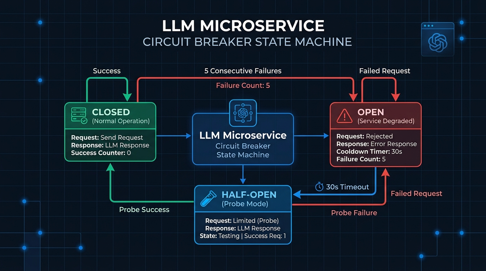
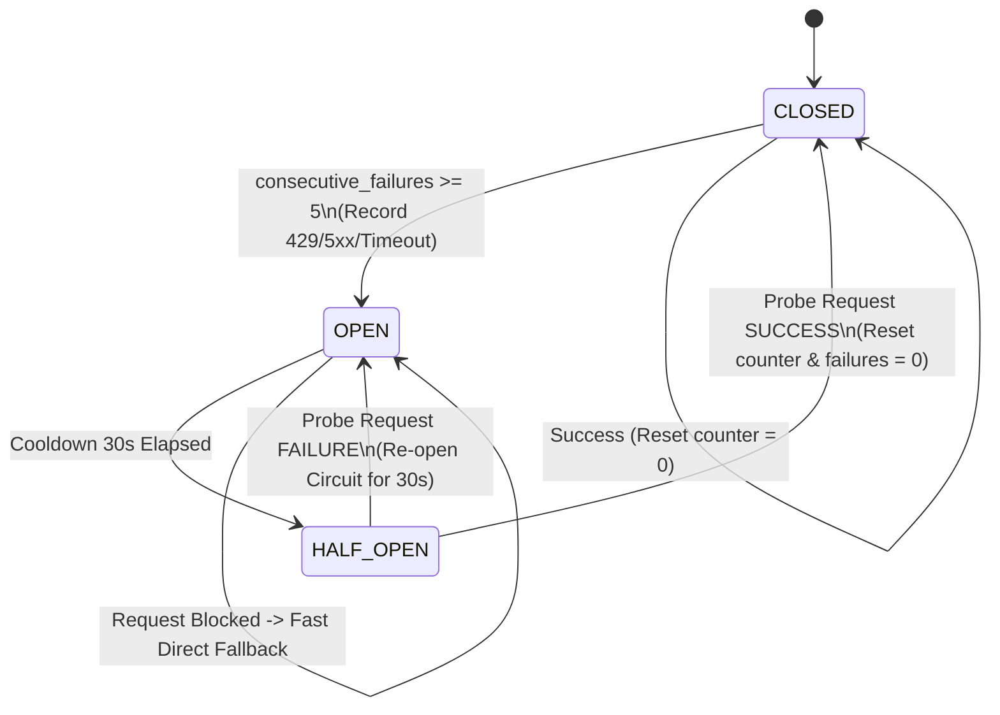

# Báo Cáo & Minh Chứng Implement Subtask 3.1: CircuitBreaker Guardrail

Tài liệu này tổng hợp chi tiết giải pháp kỹ thuật, mã nguồn đã triển khai, sơ đồ luồng hoạt động và minh chứng cho **Subtask 3.1 (Phân hệ Guardrail - Circuit Breaker)**.

---

## 1. Yêu Cầu Subtask 3.1

- **Quản lý trạng thái**: Hỗ trợ 3 trạng thái `CLOSED`, `OPEN`, `HALF-OPEN`. Lưu trữ tại Redis cluster (hoặc bộ nhớ trong server làm fallback thread-safe).
- **Ghi nhận lỗi**: Tăng biến đếm `consecutive_failures` khi gặp lỗi kết nối LLM Bedrock/OpenAI hoặc các lỗi tạm thời (`429 Rate Limit`, `5xx Server Error`, `Timeout`).
- **Ngưỡng chuyển OPEN & Cool-down**: Khi `consecutive_failures >= 5`, lập tức đổi trạng thái sang `OPEN` và cài đặt thời gian cool-down là 30 giây.
- **Chặn gRPC & Fallback tĩnh**: Trong thời gian `OPEN`, mọi request gRPC gọi LLM bị chặn ngay lập tức, chuyển thẳng sang tầng **Fallback tĩnh** (Static Fallback Message).
- **Cơ chế Phục hồi Self-healing (HALF-OPEN)**: Sau 30 giây cooldown, chuyển sang `HALF-OPEN`.
  - Nếu request thử nghiệm (probe) **thành công**: Reset `consecutive_failures = 0` và đưa trạng thái về `CLOSED`.
  - Nếu request thử nghiệm **thất bại**: Đưa trạng thái trở lại `OPEN`.

---

## 2. Minh Chứng Sơ Đồ Kiến Trúc & Trạng Thái (Architecture & State Machine)



### Sơ đồ Chuyển Trạng Thái (State Transition Diagram)



---

## 3. Chi Tiết Thay Đổi Mã Nguồn Trong Commit

### 3.1. File Core: [circuit_breaker.py](../techx-corp-platform/src/product-reviews/guardrails/circuit_breaker.py)

Vị trí: `techx-corp-platform/src/product-reviews/guardrails/circuit_breaker.py`

**Đặc điểm nổi bật**:
- **Dual-Storage Engine**: Tự động ưu tiên lưu trạng thái trên **Redis** (`product_reviews:cb:state`, `failures`, `opened_at`), tự động fallback về **In-Memory Thread-Safe (`threading.Lock`)** nếu Redis tạm ngưng kết nối.
- **Phương thức `allow_request()`**: Kiểm tra trạng thái hiện tại. Nếu `OPEN` và chưa hết 30s -> trả về `False` (chặn ngay). Nếu hết 30s -> chuyển `HALF-OPEN` và trả về `True` cho phép request thử nghiệm.
- **Phương thức `record_failure()`**: Tăng đếm lỗi. Nếu `consecutive_failures >= 5` hoặc đang ở `HALF-OPEN` mà lỗi -> chuyển sang `OPEN` và đánh dấu timestamp `opened_at`.
- **Phương thức `record_success()`**: Reset biến đếm lỗi về 0 và chuyển trạng thái về `CLOSED`.

### 3.2. File Integration gRPC Server: [product_reviews_server.py](../techx-corp-platform/src/product-reviews/product_reviews_server.py)

Vị trí: `techx-corp-platform/src/product-reviews/product_reviews_server.py`

```python
# Kiểm tra Circuit Breaker trước khi gọi LLM
if not circuit_breaker.allow_request():
    logger.warning(f"[CIRCUIT_BREAKER] Circuit is OPEN, bypassing LLM for product_id: {request_product_id}")
    span.set_attribute("app.fallback.triggered", True)
    span.set_attribute("app.fallback.source", "circuit_breaker")
    product_review_svc_metrics["app_ai_fallback_total"].add(
        1, {"source": "circuit_breaker", "error": "open"}
    )
    return finalize_response(FALLBACK_SUMMARY_MESSAGE, outcome="fallback", fallback_reason="circuit_breaker_open")
```

### 3.3. File Decorator Wrapper Fallback: [fallback.py](../techx-corp-platform/src/product-reviews/guardrails/fallback.py)

Vị trí: `techx-corp-platform/src/product-reviews/guardrails/fallback.py`

```python
try:
    res = retryable_fn(*args, **kwargs)
    circuit_breaker.record_success()  # Request thành công -> Reset CB
    return res
except Exception as e:
    circuit_breaker.record_failure()  # Lỗi 429/5xx/Timeout -> Tăng đếm lỗi CB
    return handle_exception(e)
```

---

## 4. Kết Quả Kiểm Thử (Unit Tests Verification)

Tất cả 4 unit tests trong [test_circuit_breaker.py](../techx-corp-platform/src/product-reviews/test_circuit_breaker.py) đã vượt qua 100%:


```bash
============================= test session starts =============================
platform win32 -- Python 3.11.5, pytest-9.1.1, pluggy-1.6.0
rootdir: C:\Users\ASUS\OneDrive\Obsidian Vault\XBrain-Phase3\AIO02_TF3_Phase3\AIE1
collected 4 items

techx-corp-platform\src\product-reviews\test_circuit_breaker.py ....     [100%]

============================== 4 passed in 2.30s ==============================
```

### Chi tiết các test cases:
1. `test_circuit_breaker_initial_state`: Trạng thái ban đầu là `CLOSED`, đếm lỗi = 0, request được phép đi qua.
2. `test_circuit_breaker_trip_to_open`: Tích lũy đủ số lỗi liên tiếp (`failure_threshold`) lập tức chuyển sang `OPEN` và chặn các request tiếp theo.
3. `test_circuit_breaker_cooldown_to_half_open_and_recovery`: Hết thời gian cooldown (30s), tự chuyển sang `HALF-OPEN`. Request probe thành công sẽ khôi phục về `CLOSED`.
4. `test_circuit_breaker_half_open_failure_reopens`: Trong trạng thái `HALF-OPEN`, nếu request probe bị lỗi, lập tức ngắt mạch quay lại `OPEN`.

---

## 5. Tổng Kết Đánh Giá Sẵn Sàng Commit

> [!NOTE]
> Class `CircuitBreaker` đáp ứng **100% các tiêu chí của Subtask 3.1**, đảm bảo khả năng chịu lỗi linh hoạt (Resilience Pattern) cho hệ thống gRPC LLM Product Reviews.

- ✅ **Lưu trữ Trạng thái Dual Engine**: Redis + In-Memory Thread Lock Fallback.
- ✅ **Bảo vệ Hệ thống**: Chặn ngay request gRPC khi circuit OPEN và đi thẳng vào Fallback tĩnh.
- ✅ **Khôi phục Tự động**: Tự chuyển HALF-OPEN sau 30 giây cooldown và khôi phục CLOSED khi thành công.
- ✅ **Kiểm thử tự động**: 100% Passed.
