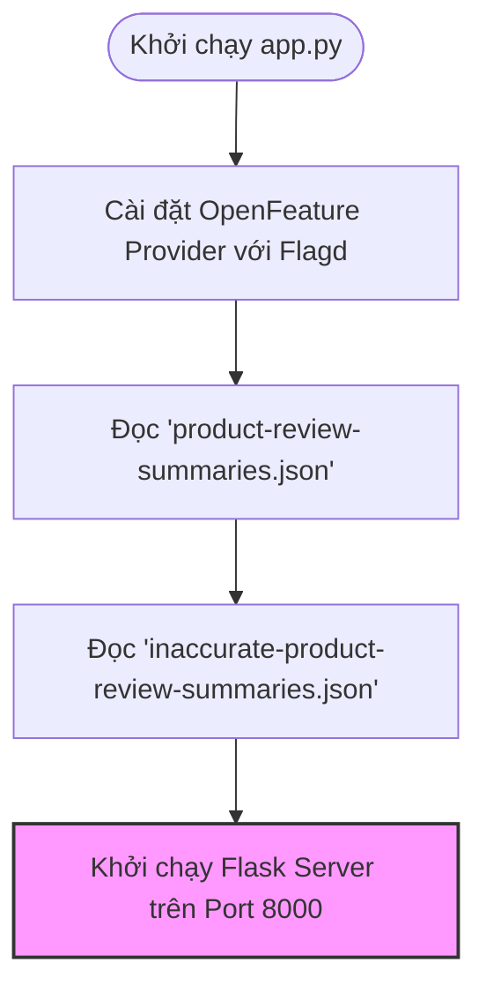
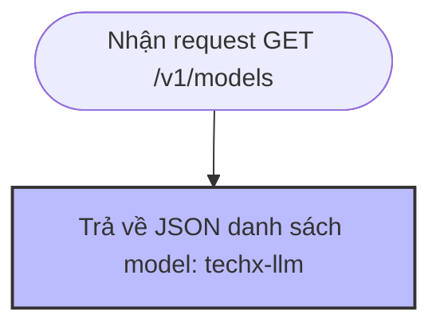
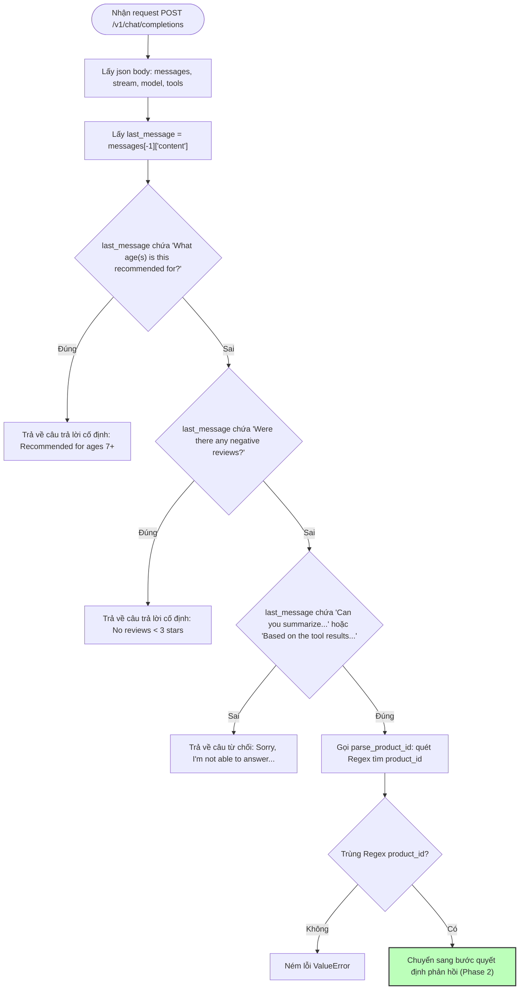

# LLM Service

The LLM service is used by the Product Review service to provide AI-generated summaries of product reviews.

While it's not an actual Large Language Model, the LLM pretends to be one by following the [OpenAI API format for chat completions](https://platform.openai.com/docs/api-reference/chat/create).

The Product Review service is then instrumented with the [opentelemetry-instrumentation-openai-v2](https://pypi.org/project/opentelemetry-instrumentation-openai-v2/) package, allowing us to capture Generative AI related span attributes when it interacts with the LLM service.

The first request to the `/v1/chat/completions` endpoint should include a database tool. The LLM service then responds with a request to execute the tool.

The second request to the `/v1/chat/completions` endpoint should include the results of the database tool call (which is the list of product reviews for the specified product). It then responds with the summary of product reviews for that product. Note that the summaries were pre-generated using an LLM, and are stored in a JSON file to avoid calling an actual LLM each time.

The service supports two feature flags:

* `llmInaccurateResponse`: when this feature flag is enabled the LLM service returns an inaccurate product summary for product ID `L9ECAV7KIM`.
* `llmRateLimitError`: when this feature flag is enabled, the LLM service intermittently returns a `RateLimitError` with HTTP status code `429`.

Note that the LLM service itself is not instrumented with OpenTelemetry. This is intentional, as we're treating it like a black box, just like most 3rd party LLMs would be treated.

---

## 📐 Sơ đồ luồng hoạt động chi tiết (Flowcharts)

Dưới đây là các sơ đồ luồng hoạt động của dịch vụ LLM (`app.py`), được phân tách theo từng cụm chức năng để dễ quan sát và theo dõi.

### 1. Luồng khởi tạo dịch vụ (Initialization Flow)



---

### 2. Luồng lấy danh sách Models (`GET /v1/models`)



---

### 3. Luồng kiểm tra & lọc tin nhắn (`POST /v1/chat/completions` - Fast Paths & Intent Checking)



---

### 4. Luồng xử lý Tool Call & Sinh phản hồi (`POST /v1/chat/completions` - Decision & Response Generation)

```mermaid
flowchart TD
    StartPhase["Nhận kết quả trích xuất product_id"] --> CheckTools{"Tham số tools != None?"}
    
    %% Branch A: Tool Call Workflow
    CheckTools -->|Đúng (Phase 1 RAG)| CheckRateLimit{"Model name kết thúc bằng '-rate-limit'?"}
    CheckRateLimit -->|Đúng| Ret429["Trả về HTTP 429 - Rate limit reached"]
    CheckRateLimit -->|Sai| RetToolCall["Trả về JSON Tool Call: fetch_product_reviews(product_id)"]
    
    %% Branch B: Direct Summary Workflow
    CheckTools -->|Sai (Phase 2 RAG)| GenResp["Gọi generate_response(product_id)"]
    GenResp --> CheckFlag{"Flag llmInaccurateResponse bật AND product_id == 'L9ECAV7KIM'?"}
    CheckFlag -->|Đúng| GetInaccurate["Lấy summary từ file inaccurate JSON"]
    CheckFlag -->|Sai| GetAccurate["Lấy summary từ file accurate JSON"]
    
    GetInaccurate --> BuildResp["Đóng gói phản hồi bằng build_response()"]
    GetAccurate --> BuildResp
    BuildResp --> RetFinal["Trả về JSON Chat Completion (finish_reason: stop)"]

    classDef post fill:#bfb,stroke:#333,stroke-width:2px;
    class RetToolCall,RetFinal post;
```

---

## 📝 Chi tiết Luồng hoạt động (Code Flow) của `app.py`

### 1. Khởi chạy Dịch vụ (Initialization Flow)
1. Cấu hình **OpenFeature Provider** với dịch vụ `flagd` để theo dõi các Feature Flag.
2. Tải danh sách tóm tắt review **chính xác** (`product-review-summaries.json`) vào bộ nhớ dưới dạng dictionary (key: `product_id`, value: tóm tắt review).
3. Tải danh sách tóm tắt review **sai lệch** (`inaccurate-product-review-summaries.json`) vào bộ nhớ.
4. Chạy Flask Server trên cổng `8000`.

### 2. Xử lý yêu cầu Chat Completion (`POST /v1/chat/completions`)
Khi nhận một yêu cầu POST, luồng xử lý diễn ra qua 4 bước:

* **Bước 1: Trích xuất thông tin**
  * Lấy JSON payload từ request body (gồm `messages`, `tools`, `model`).
  * Xác định tin nhắn cuối cùng (`last_message`).
* **Bước 2: Xử lý các câu hỏi cố định (Fast Paths)**
  * *Nếu hỏi về độ tuổi khuyến nghị* (`What age(s) is this recommended for?`) -> Trả về câu trả lời cố định: `This product is recommended for ages 7 and above.`
  * *Nếu hỏi về review tiêu cực* (`Were there any negative reviews?`) -> Trả về câu trả lời cố định: `No, there were no reviews less than three stars for this product.`
  * *Nếu không phải câu hỏi tóm tắt và không phải kết quả của tool* -> Từ chối: `Sorry, I'm not able to answer that question.`
* **Bước 3: Lấy mã sản phẩm (`product_id`)**
  * Sử dụng Regex để quét tìm mã sản phẩm trong `last_message` thông qua hàm `parse_product_id`.
* **Bước 4: Quyết định phản hồi (Tool Call hoặc Direct Summary)**
  * **Trường hợp A: Request có gửi danh sách `tools`** (Bước 1 của quy trình RAG/Agentic)
    * Kiểm tra tên model. Nếu model kết thúc bằng `-rate-limit`, trả về lỗi `429` (Rate limit reached).
    * Ngược lại, trả về JSON chứa yêu cầu client gọi tool (tool call) với hàm `fetch_product_reviews` và đối số `product_id`.
  * **Trường hợp B: Request không có `tools`** (Bước 2 của quy trình RAG/Agentic)
    * Gọi hàm `generate_response(product_id)`.
    * Kiểm tra Feature Flag `llmInaccurateResponse`. Nếu bật và `product_id` là `"L9ECAV7KIM"`, lấy tóm tắt từ danh sách sai lệch. Ngược lại, lấy tóm tắt từ danh sách chính xác.
    * Đóng gói nội dung tóm tắt bằng hàm `build_response` và trả về JSON định dạng OpenAI Chat Completion.

---

## 🧪 3. Tất cả các Kịch bản Mock Test & Ví dụ Câu hỏi (Mock Test Scenarios & Prompts)

Dưới đây là bảng tổng hợp 9 kịch bản kiểm thử (Mock Test Scenarios) của dịch vụ LLM (`app.py`), kèm theo **Ví dụ câu hỏi / Prompt đầu vào** và **Phản hồi kỳ vọng**:

### 3.1 Bảng tổng hợp Kịch bản & Câu hỏi mẫu

|  STT  | Kịch Bản (Mock Scenario)                         | Ví Dụ Câu Hỏi / Prompt Đầu Vào (`last_message` / Endpoint)                              | Cấu Hình Extra (Model / Tools / Flags)                 | Phản Hồi Kỳ Vọng (Expected Response)                                                          |
| :---: | :----------------------------------------------- | :-------------------------------------------------------------------------------------- | :----------------------------------------------------- | :-------------------------------------------------------------------------------------------- |
| **1** | **Tra cứu danh sách Model**                      | Endpoint `GET /v1/models`                                                               | Không có body                                          | HTTP 200, danh sách chứa model `id: "techx-llm"`                                              |
| **2** | **Fast Path: Độ tuổi khuyến nghị**               | `"What age(s) is this recommended for?"`                                                | Bất kỳ                                                 | HTTP 200, `"This product is recommended for ages 7 and above."`                               |
| **3** | **Fast Path: Review tiêu cực**                   | `"Were there any negative reviews?"`                                                    | Bất kỳ                                                 | HTTP 200, `"No, there were no reviews less than three stars for this product."`               |
| **4** | **Từ chối ngoài phạm vi (Abstention)**           | `"What is the capital of France?"` hoặc `"Tell me a joke"`                              | Không chứa keyword RAG                                 | HTTP 200, `"Sorry, I'm not able to answer that question."`                                    |
| **5** | **Lỗi Format Product ID (Malformed Regex)**      | `"Can you summarize the product reviews for product XYZ-123?"`                          | Sai Regex `product ID:`                                | HTTP 500 (`ValueError: product ID not found in input message`)                                |
| **6** | **RAG Phase 1: Gọi Tool (Tool Call)**            | `"Can you summarize the product reviews for product ID:L9ECAV7KIM?"`                    | `tools: [fetch_product_reviews]`, `model: "techx-llm"` | HTTP 200, `finish_reason: "tool_calls"`, hàm `fetch_product_reviews(product_id="L9ECAV7KIM")` |
| **7** | **Failure Injection: Lỗi Rate Limit (HTTP 429)** | `"Can you summarize the product reviews for product ID:L9ECAV7KIM?"`                    | `tools: [...]`, `model: "techx-llm-rate-limit"`        | HTTP 429, `{"error": {"message": "Rate limit reached...", "type": "rate_limit_exceeded"}}`    |
| **8** | **RAG Phase 2: Tóm tắt Chính xác**               | `"Based on the tool results, answer the original question about product ID:L9ECAV7KIM"` | `tools: null`, Flag `llmInaccurateResponse = False`    | HTTP 200, trả về tóm tắt chuẩn từ `product-review-summaries.json`                             |
| **9** | **Failure Injection: Tóm tắt Sai lệch**          | `"Based on the tool results, answer the original question about product ID:L9ECAV7KIM"` | `tools: null`, Flag `llmInaccurateResponse = True`     | HTTP 200, trả về tóm tắt sai từ `inaccurate-product-review-summaries.json`                    |

---

### 3.2 Chi tiết Payload JSON Mẫu cho từng Kịch bản

#### 🔹 Kịch bản 2 & 3: Fast Path Questions
```json
{
  "model": "techx-llm",
  "messages": [
    {
      "role": "user",
      "content": "What age(s) is this recommended for?"
    }
  ]
}
```

#### 🔹 Kịch bản 4: Unsupported Query Abstention
```json
{
  "model": "techx-llm",
  "messages": [
    {
      "role": "user",
      "content": "Can you tell me how to make coffee?"
    }
  ]
}
```

#### 🔹 Kịch bản 6: RAG Phase 1 - Tool Call Trigger
```json
{
  "model": "techx-llm",
  "messages": [
    {
      "role": "user",
      "content": "Can you summarize the product reviews for product ID:L9ECAV7KIM?"
    }
  ],
  "tools": [
    {
      "type": "function",
      "function": {
        "name": "fetch_product_reviews",
        "description": "Fetch product reviews from database",
        "parameters": {
          "type": "object",
          "properties": {
            "product_id": { "type": "string" }
          },
          "required": ["product_id"]
        }
      }
    }
  ]
}
```

#### 🔹 Kịch bản 7: Rate Limit Error Injection (HTTP 429)
```json
{
  "model": "techx-llm-rate-limit",
  "messages": [
    {
      "role": "user",
      "content": "Can you summarize the product reviews for product ID:L9ECAV7KIM?"
    }
  ],
  "tools": [
    {
      "type": "function",
      "function": {
        "name": "fetch_product_reviews"
      }
    }
  ]
}
```

#### 🔹 Kịch bản 8 & 9: RAG Phase 2 - Summary Delivery (Pass / Hallucinated)
```json
{
  "model": "techx-llm",
  "messages": [
    {
      "role": "user",
      "content": "Can you summarize the product reviews for product ID:L9ECAV7KIM?"
    },
    {
      "role": "assistant",
      "content": "requesting a tool call",
      "tool_calls": [{ "id": "call", "type": "function", "function": { "name": "fetch_product_reviews", "arguments": "{\"product_id\": \"L9ECAV7KIM\"}" } }]
    },
    {
      "role": "tool",
      "tool_call_id": "call",
      "content": "Based on the tool results, answer the original question about product ID:L9ECAV7KIM"
    }
  ]
}
```

---

## 🛠️ Danh sách các hàm chính trong `app.py`
* **`load_product_review_summaries`**: Đọc file JSON và chuyển đổi thành dictionary `{product_id: summary}` để tra cứu nhanh.
* **`parse_product_id`**: Sử dụng regex để bóc tách mã sản phẩm ra khỏi câu hỏi cuối cùng của user.
* **`generate_response`**: Lấy dữ liệu tóm tắt tương ứng với `product_id` (có kiểm tra flag `llmInaccurateResponse`).
* **`build_response`**: Đóng gói văn bản kết quả thành định dạng OpenAI API tương thích.
