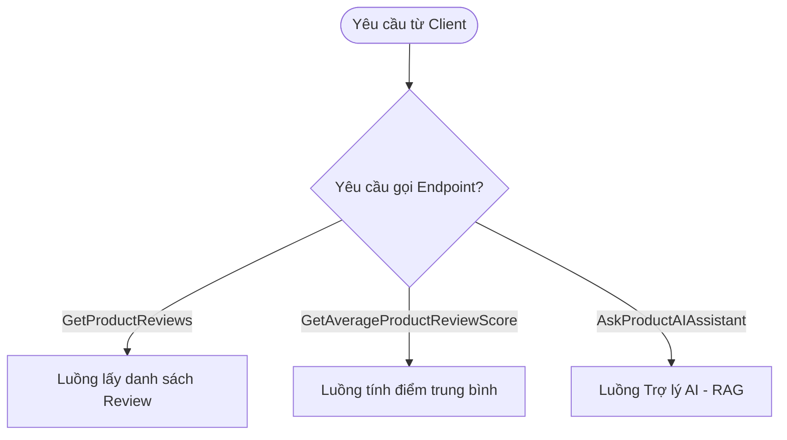
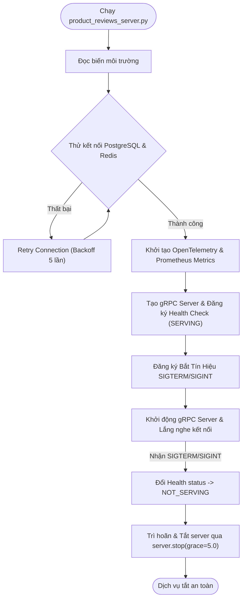
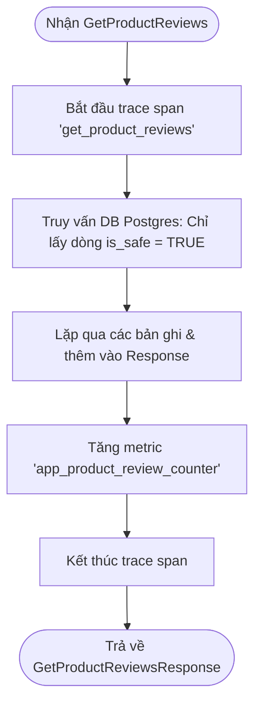
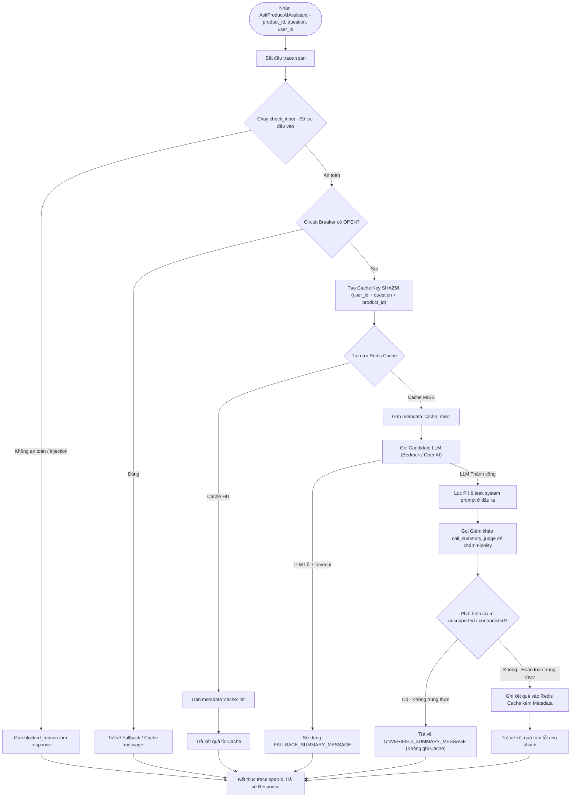

# Product Reviews Service

Dịch vụ Product Reviews cung cấp thông tin đánh giá sản phẩm và trả về bản tóm tắt tự động sử dụng Trợ lý AI (RAG Pipeline) kèm theo các cơ chế Caching, Resilience, và Observability được tích hợp sẵn.

---

## 1. Hướng dẫn Dựng & Chạy local

### Build Protobuf
Chạy từ thư mục gốc của project:
```sh
make docker-generate-protobuf
```

### Docker Build
Chạy từ thư mục gốc của project:
```sh
docker compose build product-reviews
```

### Chạy Replay Simulation (Kiểm thử Closed-loop)
Chạy trực tiếp từ thư mục này để giả lập kịch bản dập lỗi của AIOps:
```sh
python aiops_replay_sim.py
```

---

## 2. Kiến trúc & Các Điểm Cải Tiến Cốt Lõi (Tuần 3)

Dịch vụ đã được nâng cấp toàn diện để đáp ứng các tiêu chuẩn vận hành an toàn:
1. **Caching 2 Tầng (LLM & Database):**
   * **Tầng 1 (Redis Cache):** Tra cứu trước khi gọi LLM. Cache key băm SHA256 phân tách theo `user_id` để tránh rò rỉ chéo thông tin. Trả cờ `cache: hit` hoặc `cache: miss` qua gRPC trailing metadata.
   * **Tầng 2 (PostgreSQL Filter):** Chỉ truy vấn và sử dụng các review có cột `is_safe = TRUE` làm context sạch gửi cho LLM.
2. **Circuit Breaker (Bộ ngắt mạch an toàn):**
   * Giám sát tỷ lệ lỗi kết nối LLM qua Redis. Tự động chuyển trạng thái `OPEN` (chuyển sang PostgreSQL cache hoặc trả về fallback) sau 5 lỗi liên tiếp trong 30 giây để bảo vệ hệ thống khỏi nghẽn luồng.
3. **Graceful Shutdown & Auto-Reconnection:**
   * Lắng nghe tín hiệu `SIGTERM` / `SIGINT`.
   * Khi tắt, chuyển trạng thái gRPC Health Check thành `NOT_SERVING` và trì hoãn ngắt kết nối `server.stop(grace=5.0)` để hoàn thành các request đang dở dang.
   * Tự động thử lại kết nối PostgreSQL (5 lần exponential backoff) và Redis khi startup để tránh crash pod nếu dependencies khởi động chậm hơn service.
4. **OTel Telemetry Sidecar Server (Port 8086):**
   * Cung cấp cổng phụ HTTP hỗ trợ giám sát và tiêm lỗi:
     * `POST /replay`: Chạy kịch bản dập lỗi closed-loop.
     * `GET /trace/<trace_id>`: Lấy vết telemetry đã được che PII lưu trên Redis.
     * `POST /inject`: Giả lập lỗi 429/timeout để test khả năng chống chịu của server.

---

## 3. Sơ đồ luồng hoạt động chi tiết (Detailed Code Flowcharts)

### 3.1. Tổng quan các Endpoint gRPC (Service Endpoints Overview)


### 3.2. Luồng Khởi tạo Dịch vụ & Graceful Shutdown


### 3.3. Luồng Database Queries


### 3.4. Luồng xử lý AskProductAIAssistant (RAG Pipeline)


---

## 4. Cấu hình Biến Môi trường (Environment Variables)

Các tham số cấu hình chính trong file `.env` hoặc `.env.override`:

| Biến môi trường | Giá trị mặc định | Giải thích |
| :--- | :--- | :--- |
| `CACHE_TYPE` | `redis` | Loại cache sử dụng (`redis` hoặc `none`). |
| `REDIS_HOST` | `localhost` | Endpoint máy chủ Redis Cache. |
| `REDIS_PORT` | `6379` | Cổng kết nối Redis. |
| `DB_CONNECTION_STRING` | *Postgres URI* | Connection string kết nối PostgreSQL. |
| `LLM_BASE_URL` | *AWS / OpenAI Endpoint* | Đường dẫn gọi API của LLM. |
| `LLM_MODEL` | `techx-llm` | Tên mô hình Candidate. |
