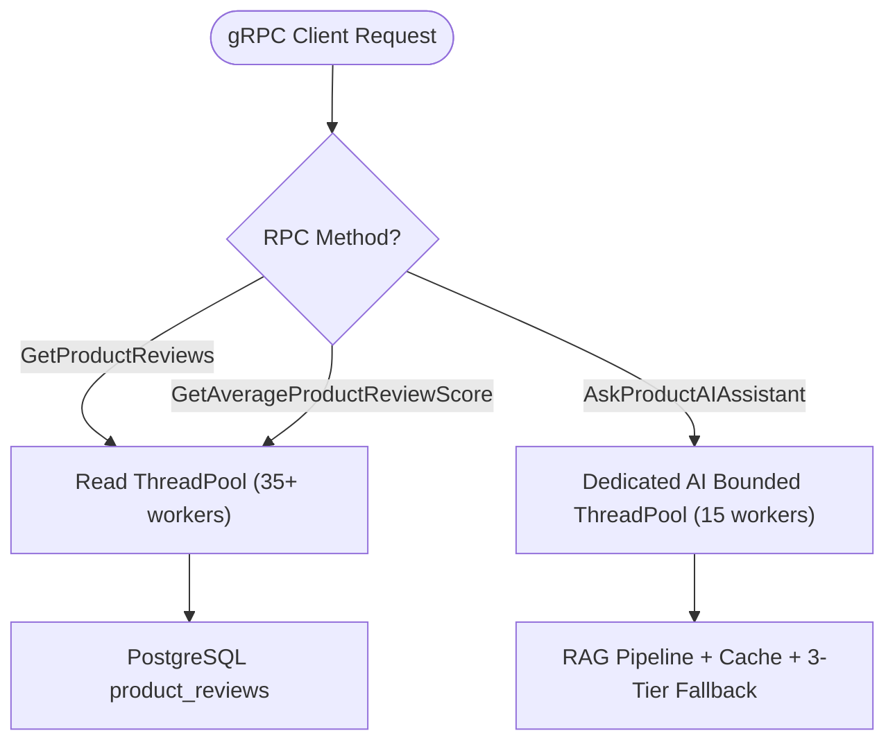
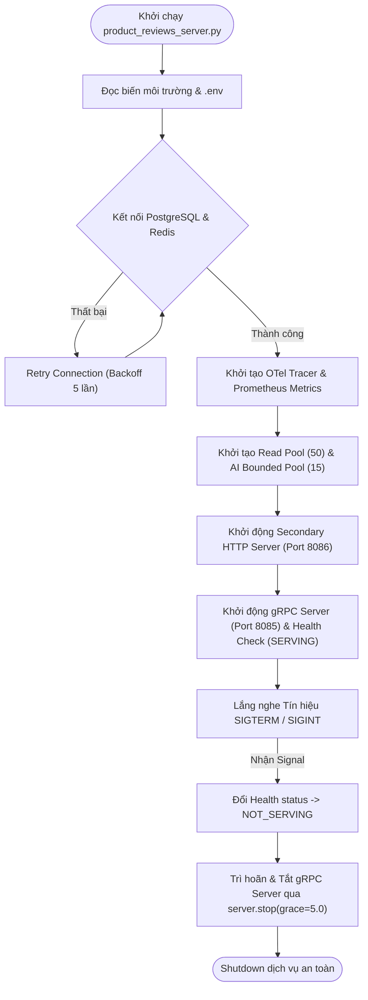
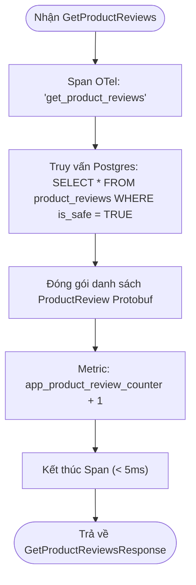
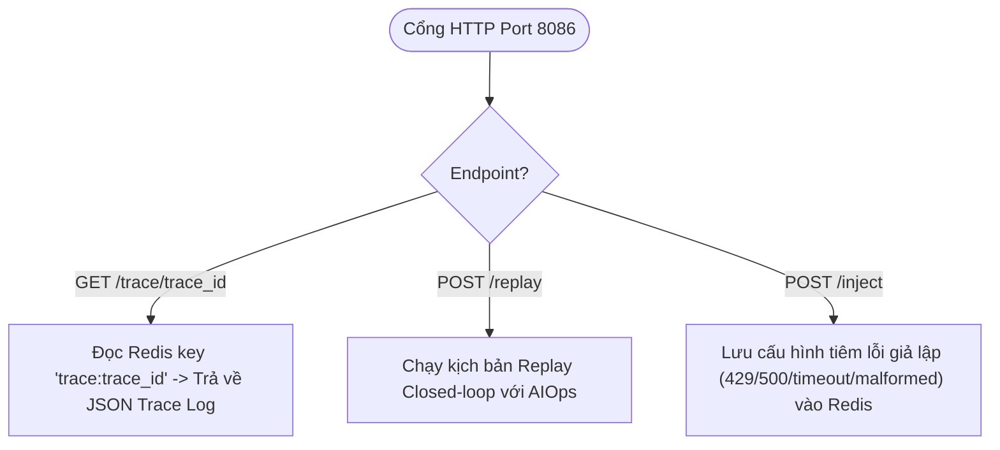

# Product Reviews Service (`product-reviews`)

Dịch vụ `product-reviews` quản lý thông tin đánh giá sản phẩm, điểm số trung bình và tích hợp Trợ lý Trích xuất/Tóm tắt AI (RAG Pipeline). Dịch vụ được thiết kế theo tiêu chuẩn Enterprise với đầy đủ các cơ chế **Thread Isolation**, **Caching 2 Tầng**, **Fallback 3 Tầng**, **Circuit Breaker tự phục hồi**, và **LLM Observability Black-box**.

---

## 🚀 1. Hướng dẫn Dựng & Chạy Local

### 1.1 Cài đặt Thư viện & Sinh Protobuf
Chạy từ thư mục gốc của dự án (`AIE1`):
```sh
# Sinh mã gRPC Protobuf
make docker-generate-protobuf
```

### 1.2 Docker Build & Run
Chạy từ thư mục gốc dự án:
```sh
# Build image product-reviews
docker compose build product-reviews

# Khởi chạy dịch vụ kèm PostgreSQL & Redis
docker compose up product-reviews
```

### 1.3 Chạy Bộ Ca Kiểm Thử Tự Động (Test Suite)
Chạy trực tiếp từ thư mục `techx-corp-platform/src/product-reviews`:
```sh
# Chạy toàn bộ 36+ Unit/Integration Tests
pytest test_circuit_breaker.py test_error_injection.py test_fallback_tier2.py test_tool_validator.py test_summary_persistence.py test_runtime_guardrails.py test_database_summary.py -v

# Chạy giả lập dập lỗi Closed-loop với AIOps
python aiops_replay_sim.py
```

---

## 🏛️ 2. Các Trụ Cột Kiến Trúc & Nâng Cấp Cốt Lõi

### 2.1 Cô lập Thread Pool (Thread Isolation - Ticket S6)
* **Main gRPC ThreadPool (`max_workers=50`):** Bảo lưu ít nhất 35+ worker threads phục vụ riêng cho các RPC đọc nhanh (`GetProductReviews` ~5ms, `GetAverageProductReviewScore`).
* **Dedicated AI Bounded ThreadPool (`ai_executor = 15` workers, prefix `ai_worker`):** Cô lập hoàn toàn các tác vụ AI chậm (`AskProductAIAssistant` ~1.5s - 5s). Khi AI pool quá tải hoặc timeout (15s), hệ thống tự động chuyển sang Fallback Tầng 2 mà không bao giờ gây nghẽn `DEADLINE_EXCEEDED` cho Read API.

### 2.2 Kiến trúc Fallback 3 Tầng (3-Tier Resilience Fallback - Mandate #22 & #25)
* **Tầng 1 (Live LLM Candidate + Judge Evaluator):** Gọi Bedrock Candidate (`amazon.nova-lite-v1:0`) và Judge (`amazon.nova-micro-v1:0`). Khi thành công và được Judge duyệt Pass, kết quả được trả về đồng thời ghi/ghi đè vào **Redis Cache** và bảng PostgreSQL `product_summaries`.
* **Tầng 2 (PostgreSQL Static DB Summary):** Khi gọi LLM gặp lỗi (timeout/rate-limit/mạng) hoặc Circuit Breaker đang ở trạng thái `OPEN`, trước khi trả tin nhắn lỗi tĩnh, dịch vụ chủ động truy vấn bảng `product_summaries` từ PostgreSQL. Nếu tìm thấy tóm tắt cũ của sản phẩm đó -> Trả về kết quả Tầng 2 trong **< 5ms** (`app.fallback.tier = 2`).
* **Tầng 3 (Generic Abstention Message):** Nếu Tầng 2 không tìm thấy tóm tắt trong DB -> Trả về thông báo lỗi tĩnh an toàn (`FALLBACK_SUMMARY_MESSAGE: "The AI is busy right now. Please try again later."`, `app.fallback.tier = 3`).

### 2.3 GenAI Caching & User Boundary Isolation (Mandate #23 & Ticket 1 Tuần 4)
* **Cờ Trailing Metadata:** Trả cờ `cache: hit` hoặc `cache: miss` thông qua gRPC **Trailing Metadata** (`context.set_trailing_metadata([('cache', 'hit|miss')])`).
* **Công thức Hash Key SHA256:** `SHA256(product_id + review_version + model_id + question + user_id)`.
* **Cách ly Người dùng:** Trích xuất header `x-user-id` từ metadata để phân tách ranh giới dữ liệu giữa các user, tránh rò rỉ dữ liệu cá nhân (Cache Poisoning). Mặc định dùng `"anonymous"` nếu không có `x-user-id`.
* **Tự động Invalidate:** Tự động hủy cache khi `review_version` của sản phẩm thay đổi.

### 2.4 Circuit Breaker & Biên Validation (Mandate #25 & Ticket 3 Tuần 4)
* **Circuit Breaker 3 Trạng thái:** Quản lý trạng thái (`CLOSED`, `OPEN`, `HALF-OPEN`) lưu trên Redis. Ngắt mạcha (`OPEN`) sau 5 lỗi liên tiếp trong thời gian cool-down 30 giây.
* **Schema Validation & Bọc Lỗi Tool Call:** Bọc khối `json.loads(tool_args)` bằng try-except `json.JSONDecodeError` và validate kiểu dữ liệu biên của `product_id`, chặn đứng arguments rác làm crash gRPC server.

### 2.5 LLM Observability & Cổng HTTP Telemetry Port 8086 (Mandate #24 & Ticket 2 Tuần 4)
* **OpenTelemetry Trace ID Trailing Header:** Trích xuất OTel trace ID dưới dạng chuỗi hexa 32 ký tự và trả về qua gRPC trailing metadata `trace-id`.
* **Ghi Vết Black-box vào Redis:** Lưu bản ghi JSON trace chi tiết (token, cost, latency, outcome, masked prompt) xuống Redis dưới khóa `trace:{trace_id}` với TTL 24 giờ.
* **Cổng HTTP Server Phụ (Port 8086):**
  * `POST /replay`: Chạy kịch bản dập lỗi closed-loop.
  * `GET /trace/<trace_id>`: Truy vấn chi tiết vết trace log từ Redis.
  * `POST /inject`: Tiêm lỗi giả lập (`timeout`, `429`, `500`, `inject_malformed_tool_args`) để kiểm thử resilience.

---

## 📐 3. Sơ đồ Luồng Hoạt động Chi tiết (Detailed Flowcharts)

### 3.1 Sơ đồ Tổng quan các RPC Endpoints

```mermaid
flowchart TD
    Client([gRPC Client Request]) --> Router{RPC Method?}
    Router -->|GetProductReviews| ReadPool["Read ThreadPool (35+ workers)"]
    Router -->|GetAverageProductReviewScore| ReadPool
    Router -->|AskProductAIAssistant| AIPool["Dedicated AI Bounded ThreadPool (15 workers)"]

    ReadPool --> DB_Read["PostgreSQL product_reviews"]
    AIPool --> RAG_Pipeline["RAG Pipeline + Cache + 3-Tier Fallback"]
```

### 3.2 Sơ đồ Luồng Khởi tạo & Graceful Shutdown

```mermaid
flowchart TD
    Start(["Khởi chạy product_reviews_server.py"]) --> Env["Đọc biến môi trường & .env"]
    Env --> DBConnect{"Kết nối PostgreSQL & Redis"}
    DBConnect -->|Thất bại| Retry["Retry Connection (Backoff 5 lần)"]
    Retry --> DBConnect
    DBConnect -->|Thành công| InitMetrics["Khởi tạo OTel Tracer & Prometheus Metrics"]
    InitMetrics --> InitPools["Khởi tạo Read Pool (50) & AI Bounded Pool (15)"]
    InitPools --> StartHTTP["Khởi động Secondary HTTP Server (Port 8086)"]
    StartHTTP --> StartGRPC["Khởi động gRPC Server (Port 8085) & Health Check (SERVING)"]
    StartGRPC --> ListenSignal["Lắng nghe Tín hiệu SIGTERM / SIGINT"]

    ListenSignal -->|Nhận Signal| HealthNotServing["Đổi Health status -> NOT_SERVING"]
    HealthNotServing --> WaitGrace["Trì hoãn & Tắt gRPC Server qua server.stop(grace=5.0)"]
    WaitGrace --> EndService(["Shutdown dịch vụ an toàn"])
```

### 3.3 Sơ đồ Luồng Read Review API (`GetProductReviews`)

```mermaid
flowchart TD
    ReqReviews(["Nhận GetProductReviews"]) --> StartSpan["Span OTel: 'get_product_reviews'"]
    StartSpan --> DBQuery["Truy vấn Postgres: SELECT * FROM product_reviews WHERE is_safe = TRUE"]
    DBQuery --> MapResponse["Đóng gói danh sách ProductReview Protobuf"]
    MapResponse --> IncMetric["Metric: app_product_review_counter + 1"]
    IncMetric --> EndSpan["Kết thúc Span (< 5ms)"]
    EndSpan --> RetReviews(["Trả về GetProductReviewsResponse"])
```

### 3.4 Sơ đồ Luồng AI Assistant RAG Pipeline (`AskProductAIAssistant`)
```mermaid
flowchart TD
    ReqAI(["Nhận AskProductAIAssistant"]) --> ExtractMeta["Trích xuất x-user-id & Trace ID"]
    ExtractMeta --> GuardCheck{"Check Input Guardrail"}
    GuardCheck -->|Unsafe / Prompt Injection| RetBlocked["Trả về error message tĩnh"]

    GuardCheck -->|Safe| CheckCB{"Circuit Breaker đang OPEN?"}
    CheckCB -->|Đúng (OPEN)| TriggerFallback["Kích hoạt Fallback 3 Tầng"]

    CheckCB -->|Sai (CLOSED)| GenKey["Tạo SHA256 Key: product_id + review_version + model_id + question + user_id"]
    GenKey --> CacheCheck{"Tra cứu Redis Cache"}

    CacheCheck -->|Cache HIT| MetaHit["Set trailing metadata: cache=hit, trace-id"] --> RetCache["Trả về kết quả từ Cache"]

    CacheCheck -->|Cache MISS| MetaMiss["Set trailing metadata: cache=miss, trace-id"] --> CallLLM["Gọi Candidate LLM Bedrock (Nova Lite)"]

    CallLLM -->|LLM Fail / Timeout / 429| RecordCB["Tăng consecutive_failures CB"] --> TriggerFallback
    CallLLM -->|LLM Pass| ToolVal{"Validate Tool Call Schema & JSON Arguments"}

    ToolVal -->|Arguments Rác / JSON Fail| TriggerFallback
    ToolVal -->|Valid| CallJudge["Gọi Judge Evaluator (Nova Micro)"]

    CallJudge --> JudgeCheck{"Judge Evaluation Pass?"}
    JudgeCheck -->|Fail / Unsupported Claim| RetUnverified["Trả về UNVERIFIED_SUMMARY_MESSAGE"]
    JudgeCheck -->|Pass| SaveDB["Ghi đè PostgreSQL product_summaries (Tier 2 DB)"]
    SaveDB --> SaveRedis["Lưu Redis Cache với TTL"]
    SaveRedis --> RetSuccess["Trả về tóm tắt AI cho Client"]

    TriggerFallback --> Tier2Check{"Tìm trong Postgres product_summaries?"}
    Tier2Check -->|Có dữ liệu| RetTier2["Trả về Tier 2 DB Summary (< 5ms)"]
    Tier2Check -->|Không có| RetTier3["Trả về Tier 3 Generic Fallback Message"]

    classDef hit fill:#bbf,stroke:#333,stroke-width:2px;
    classDef miss fill:#bfb,stroke:#333,stroke-width:2px;
    classDef fallback fill:#f9f,stroke:#333,stroke-width:2px;
    class RetCache hit;
    class RetSuccess miss;
    class RetTier2,RetTier3 fallback;
```

### 3.5 Sơ đồ Secondary Telemetry & Injection Server (Port 8086)

```mermaid
flowchart TD
    HTTPReq(["Cổng HTTP Port 8086"]) --> RouteHTTP{Endpoint?}
    RouteHTTP -->|GET /trace/trace_id| FetchTrace["Đọc Redis key 'trace:trace_id' -> Trả về JSON Trace Log"]
    RouteHTTP -->|POST /replay| RunReplay["Chạy kịch bản Replay Closed-loop với AIOps"]
    RouteHTTP -->|POST /inject| SetInjectConfig["Lưu cấu hình tiêm lỗi giả lập (429/500/timeout/malformed) vào Redis"]
```

---

## ⚙️ 4. Cấu hình Biến Môi Trường (Environment Variables Reference)

Danh sách tham số cấu hình chính trong `.env` / `.env.example`:

| Biến môi trường | Giá trị mặc định | Giải thích / Mục đích |
| :--- | :--- | :--- |
| `PRODUCT_REVIEWS_PORT` | `8085` | Cổng gRPC Server chính. |
| `TELEMETRY_HTTP_PORT` | `8086` | Cổng Secondary HTTP Server (Trace, Replay & Error Injection). |
| `AI_EXECUTOR_MAX_WORKERS` | `15` | Số worker threads tối đa cho Bounded AI ThreadPool. |
| `DB_CONNECTION_STRING` | *Postgres URI* | Connection string kết nối PostgreSQL database `otel`. |
| `REDIS_HOST` / `REDIS_PORT` | `localhost:6379` | Endpoint Redis Cache & Circuit Breaker Store. |
| `LLM_PROVIDER` | `bedrock` | Provider cho Candidate LLM (`bedrock` hoặc `openai`). |
| `LLM_MODEL` | `amazon.nova-lite-v1:0` | Mô hình Candidate LLM dùng sinh câu trả lời tóm tắt. |
| `JUDGE_PROVIDER` | `bedrock` | Provider cho mô hình Giám khảo Evaluator. |
| `JUDGE_MODEL` | `amazon.nova-micro-v1:0` | Mô hình Judge dùng kiểm tra Fidelity và câu trả lời. |
| `JUDGE_TIMEOUT_SECONDS` | `3.0` | Thời gian chờ tối đa cho mô hình Judge trước khi timeout. |
| `AWS_REGION` | `us-east-1` | AWS Region gọi dịch vụ Bedrock Runtime. |
| `FLAGD_HOST` / `FLAGD_PORT` | `localhost:50326` | Endpoint dịch vụ quản lý cờ tính năng `flagd`. |

---

## 🧪 5. Danh Sách Các File Test Harness (`pytest`)

Dịch vụ đi kèm bộ kiểm thử tự động gồm **36/36 ca unit/integration tests** thành công:

1. **`test_circuit_breaker.py`**: Kiểm thử chuyển đổi 3 trạng thái (`CLOSED` -> `OPEN` -> `HALF-OPEN`) của Circuit Breaker.
2. **`test_error_injection.py`**: Kiểm thử khả năng chịu lỗi khi tiêm các ngoại lệ 429, 500, timeout và malformed tool call arguments qua cổng 8086.
3. **`test_fallback_tier2.py`**: Kiểm thử cơ chế Fallback Tầng 2 (đọc static DB summary từ PostgreSQL trong < 5ms).
4. **`test_tool_validator.py`**: Kiểm thử bộ thấu kính thầm định JSON schema đối số ở biên tool calls.
5. **`test_summary_persistence.py`**: Kiểm thử logic tự động ghi đè bản tóm tắt mới vào PostgreSQL `product_summaries` khi Candidate & Judge Pass.
6. **`test_runtime_guardrails.py`**: Kiểm thử bộ lọc an toàn đầu vào (Prompt Injection) và đầu ra (PII masking).
7. **`test_database_summary.py`**: Kiểm thử các hàm tương tác database CRUD cho bảng `product_summaries`.
8. **`aiops_replay_sim.py`**: Script kịch bản kiểm thử tích hợp vòng lặp khép kín (Closed-loop Simulation) với hệ thống AIOps.
