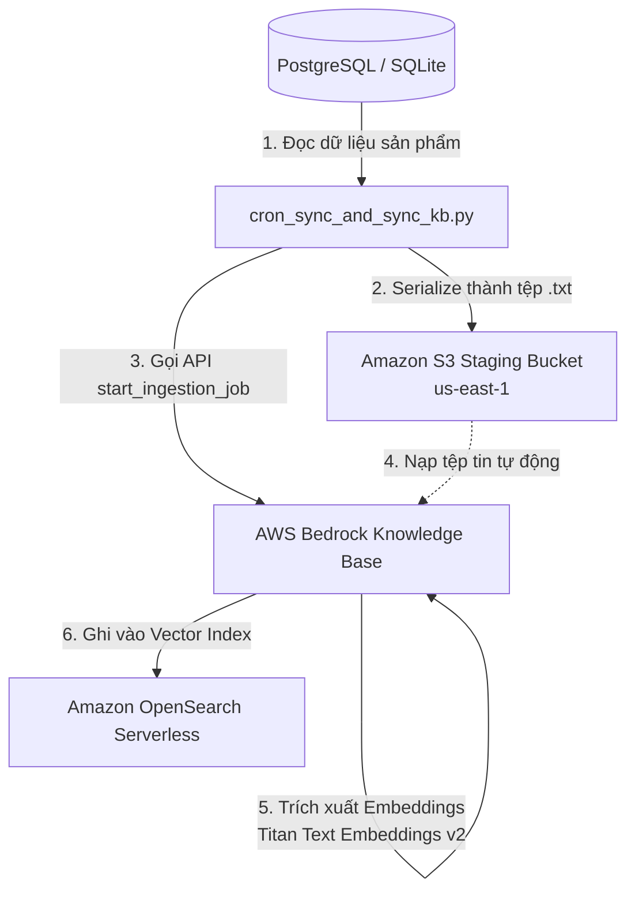
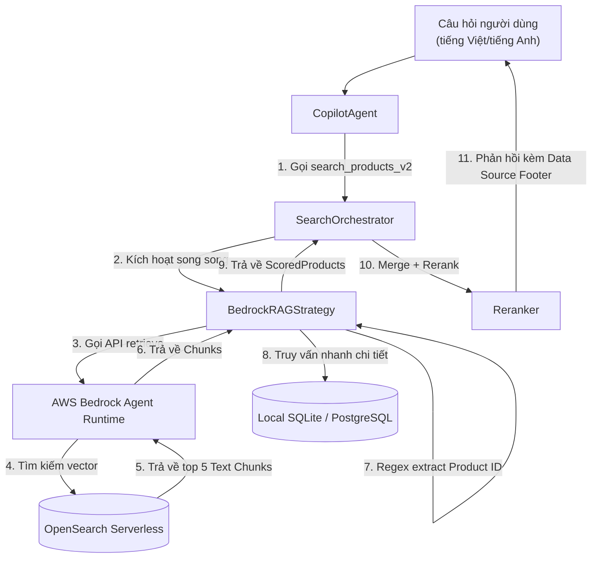

# Đặc tả Thiết kế — Flow 2: Bedrock RAG Semantic Search

Tài liệu này đặc tả chi tiết kiến trúc, luồng hoạt động (workflow), công nghệ sử dụng và các quyết định thiết kế kỹ thuật cho **Flow 2 (Retrieval-Augmented Generation - RAG)** thuộc hệ thống Shopping Copilot.

---

## 1. Tổng quan & Vấn đề giải quyết

### 1.1 Thách thức
* **Bất đồng ngôn ngữ (Language Mismatch):** Toàn bộ tên và mô tả sản phẩm trong database là tiếng Anh, nhưng khách hàng thường xuyên tìm kiếm bằng tiếng Việt tự nhiên (ví dụ: *"thiết bị ngắm sao nhỏ gọn đi leo núi"*).
* **Giới hạn của Keyword Search (SQL LIKE):** Tìm kiếm từ khóa thông thường không thể hiểu được ngữ nghĩa. Câu truy vấn *"thiết bị ngắm sao"* sẽ trả về 0 kết quả vì trong DB chỉ lưu các từ như `telescope`, `binoculars`.
* **Dữ liệu đánh giá lớn (Reviews RAG):** Đánh giá sản phẩm của khách hàng là dữ liệu dạng văn bản thô, phi cấu trúc. Rất khó để truy vấn chính xác bằng SQL động mà không có sự trợ giúp của tìm kiếm ngữ nghĩa.

### 1.2 Giải pháp: Flow 2 - RAG
Sử dụng công nghệ tìm kiếm ngữ nghĩa dựa trên Vector (Vector Semantic Search) thông qua **AWS Bedrock Knowledge Base** kết hợp với cơ chế phân tách định danh (ID-based Resolution) để tìm ra sản phẩm khớp nhất về mặt ý nghĩa, bất kể ngôn ngữ đầu vào.

---

## 2. Kiến trúc & Workflow chi tiết

Hệ thống RAG được chia thành 2 luồng hoạt động độc lập: **Luồng đồng bộ dữ liệu (Data Sync)** và **Luồng truy vấn thời gian thực (Query Retrieval)**.

### 2.1 Luồng nạp và đồng bộ dữ liệu (Ingestion Pipeline)
Luồng này chạy định kỳ (chạy bằng CronJob trên EKS hoặc AWS Lambda) để chuyển đổi dữ liệu sản phẩm trong Database thành dạng văn bản tự nhiên, đẩy lên S3 và nạp vào Vector Database.



1. **Đọc Database:** Script [`cron_sync_and_sync_kb.py`](file:///d:/Cloude-DevOps/Phase-3/AIO02_TF3_Phase3/AIE2/shopping-copilot/scripts/cron_sync_and_sync_kb.py) đọc thông tin từ bảng `products`.
2. **Chuẩn hóa văn bản:** Mỗi sản phẩm được chuyển đổi thành cấu trúc tự nhiên:
   ```text
   Product ID: OLJCESPC7Z
   Product Name: National Park Foundation Explorascope
   Price: 101 USD
   Category: telescopes,travel
   Description: Perfect for astronomical and terrestrial viewing...
   ```
3. **Đẩy lên S3:** Lưu dưới dạng tệp `<PRODUCT_ID>.txt` lên S3 Bucket ở vùng `us-east-1`.
4. **Trigger Sync:** Script tự động kích hoạt API `start_ingestion_job` của Bedrock. Bedrock tự đọc các tệp văn bản mới/thay đổi trên S3, gọi mô hình Titan Embeddings để chuyển hóa thành vector và lưu vào OpenSearch Serverless.

---

### 2.2 Luồng truy vấn thời gian thực (Query Retrieval Pipeline)
Khi người dùng đặt câu hỏi, luồng RAG được kích hoạt song song cùng luồng SQL.



1. **Trích xuất ý định:** AI Agent nhận diện ý định tìm kiếm sản phẩm và gọi tool `search_products_v2`.
2. **Truy xuất ngữ nghĩa:** `BedrockRAGStrategy` gọi API `retrieve` của AWS Bedrock Agent Runtime để tìm 5 văn bản liên quan nhất từ OpenSearch Serverless.
3. **Bóc tách ID sản phẩm:** Code sử dụng biểu thức chính quy (Regex) để trích xuất `Product ID` (ví dụ: `OLJCESPC7Z`) từ các đoạn văn bản trả về.
4. **Đọc chi tiết (Entity Resolution):** Thay vì sử dụng thông tin cũ trong file văn bản, chiến lược này kết nối trực tiếp vào Database cục bộ (SQLite/PostgreSQL) để đọc thông tin giá, danh mục, mô tả mới nhất của ID sản phẩm đó. Điều này đảm bảo tính nhất quán (Consistency) của dữ liệu thời gian thực.
5. **Gộp và Xếp hạng:** Kết quả của luồng RAG được gộp với luồng SQL, loại bỏ trùng lặp và chuyển đến Reranker để trả về cho người dùng.

---

## 3. Công nghệ sử dụng & Vai trò

| Công nghệ | Thành phần | Vai trò trong hệ thống |
|---|---|---|
| **AWS Bedrock KB** | Managed Orchestrator | Tự động hóa toàn bộ vòng đời RAG (phân đoạn dữ liệu, tính toán embeddings, đồng bộ hóa chỉ mục vector). |
| **Titan Text Embeddings v2** | Embedding Model | Chuyển đổi văn bản thô thành vector 1024-chiều. Hỗ trợ đa ngôn ngữ xuất sắc, tối ưu hóa cho ngôn ngữ Đông Nam Á (bao gồm tiếng Việt). |
| **OpenSearch Serverless** | Vector Database | Cơ sở dữ liệu Vector không máy chủ của AWS, lưu trữ và tìm kiếm vector (K-Nearest Neighbors - KNN) với độ trễ cực thấp. |
| **Amazon S3** | Staging Data Source | Kho lưu trữ trung gian chứa dữ liệu sản phẩm chuẩn hóa ở dạng text trước khi nạp vào Bedrock. |
| **Boto3 (Python)** | SDK Client | Thư viện kết nối và ra lệnh cho các dịch vụ AWS Bedrock Agent Runtime và S3. |

---

## 4. Tại sao lại lựa chọn kiến trúc này? (Design Decisions)

### 4.1 Tại sao chọn AWS Bedrock Knowledge Base thay vì tự xây dựng Vector DB (như FAISS / pgvector)?
* **Không cần quản trị (Fully Managed):** Bedrock KB tự lo toàn bộ phần phân mảnh (chunking), tính toán vector (embeddings) và quản lý lưu trữ. Team CDO không cần vận hành cụm Vector Database phức tạp.
* **Không tốn tài nguyên chạy nền:** Sử dụng OpenSearch Serverless giúp tối ưu hóa chi phí, chỉ trả tiền khi phát sinh truy vấn (Pay-as-you-go), rất thích hợp cho môi trường phát triển và vận hành tải biến động.

### 4.2 Tại sao bắt buộc sử dụng vùng `us-east-1` (N. Virginia)?
* **Khả dụng của Mô hình:** Vùng Singapore (`ap-southeast-1`) tại thời điểm triển khai chưa hỗ trợ dòng mô hình **Titan Text Embeddings v2**. Dòng mô hình này có độ chính xác cao hơn 15% và chi phí rẻ hơn 40% so với thế hệ v1.
* **Đường truyền toàn cầu ổn định:** Mặc dù EKS chạy ở Singapore, nhưng dữ liệu text của sản phẩm có kích thước rất nhỏ (~10KB). Việc đồng bộ S3 và gọi API chéo vùng sang Mỹ (`us-east-1`) có độ trễ cực nhỏ (~100-200ms), hoàn toàn chấp nhận được và không ảnh hưởng đến trải nghiệm người dùng.

### 4.3 Cách giải quyết lỗi chuyển hướng S3 (S3 307 Temporary Redirect)
* **Vấn đề:** Khi Bedrock KB ở `us-east-1` cố gắng đọc một S3 bucket nằm ở Singapore (`ap-southeast-1`), S3 sẽ trả về mã chuyển hướng 307 khiến tiến trình sync bị sập.
* **Giải pháp:** S3 Bucket phục vụ Bedrock KB bắt buộc phải nằm ở vùng **`us-east-1`** (cùng vùng với Bedrock KB). Do đó, hệ thống sử dụng bucket `techx-products-catalog-2026` đặt tại Mỹ.

### 4.4 Tại sao RAG chỉ trả về ID và kết nối lại Database (ID-based Resolution)?
* **Đảm bảo tính thời gian thực (Real-time Grounding):** Giá sản phẩm hoặc trạng thái kho hàng có thể thay đổi liên tục trong Database. Nếu ta lưu cả thông tin giá vào Vector Database, dữ liệu RAG sẽ nhanh chóng bị lỗi thời (stale).
* **Giải pháp tối ưu:** Chỉ dùng RAG để tìm ra **Mã định danh sản phẩm (Product ID)** phù hợp với mô tả của người dùng, sau đó lấy thông tin chi tiết nhất từ Database live để trả lời.
