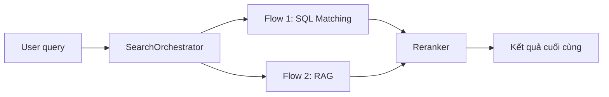
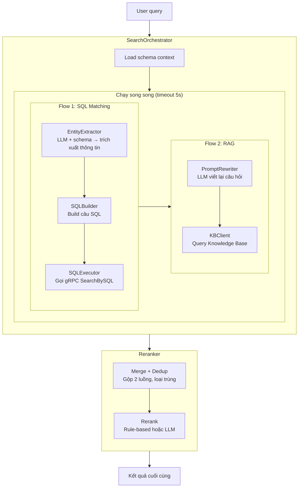
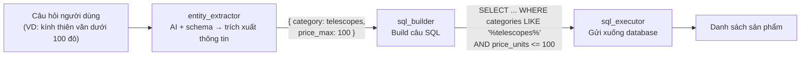
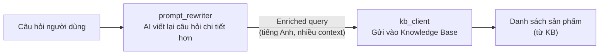
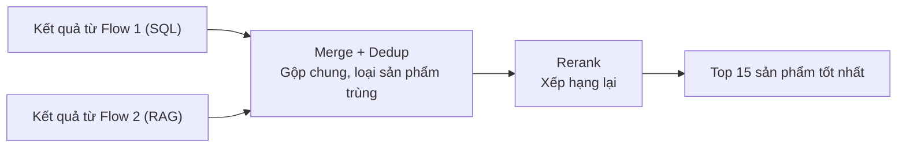
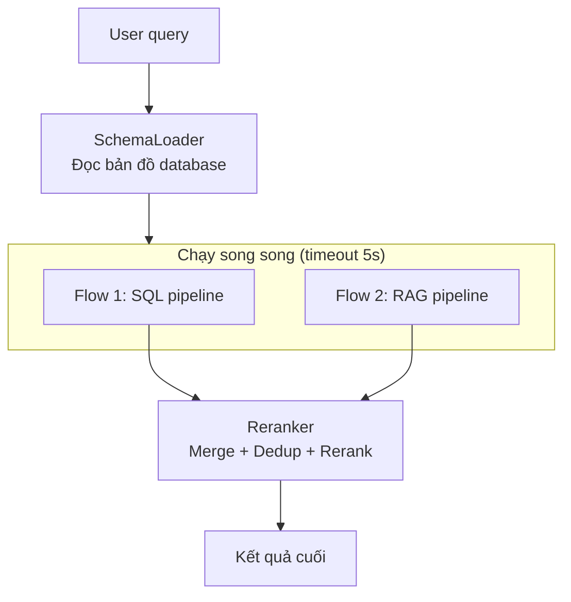
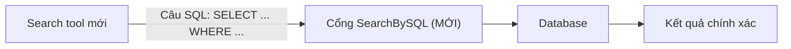
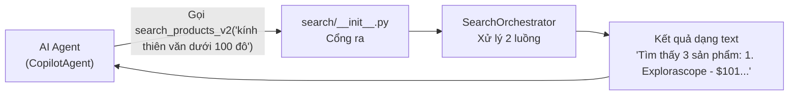

# Đặc tả thiết kế — Search Tool v2 (SQL Matching + RAG)

> **Phiên bản:** 2.0.0 | **Ngày:** 2026-07-14 | **Đội:** AIO02 — TF3  
> Tài liệu này dành cho cả team non-tech và tech. Phần mô tả được trình bày trực quan,
> hạn chế code, ưu tiên biểu đồ và bảng.

---

## Mục lục

1. [Tổng quan](#1-tổng-quan)
2. [Kiến trúc tổng thể](#2-kiến-trúc-tổng-thể)
3. [Chi tiết các module](#3-chi-tiết-các-module)
4. [Cache Strategy](#4-cache-strategy)
5. [Schema.json — Cấu trúc database](#5-schemajson--cấu-trúc-database)
6. [gRPC SearchBySQL — Cổng kết nối mới](#6-grpc-searchbysql--cổng-kết-nối-mới)
7. [Cấu trúc thư mục & file mới](#7-cấu-trúc-thư-mục--file-mới)
8. [Tích hợp vào hệ thống hiện tại](#8-tích-hợp-vào-hệ-thống-hiện-tại)
9. [Kế hoạch triển khai](#9-kế-hoạch-triển-khai)
10. [Chi phí vận hành](#10-chi-phí-vận-hành)
11. [Definition of Done](#11-definition-of-done)

---

## 1. Tổng quan

### 1.1 Vấn đề

- **Search hiện tại:** Chỉ gửi nguyên câu query → database → tìm kiếm `LIKE %câu gõ%`
- **User Việt Nam** gõ tiếng Việt: `"kính thiên văn"` → **0 kết quả** (vì tên sản phẩm là tiếng Anh)
- **Tên sản phẩm hoàn toàn tiếng Anh** (thiết bị thiên văn: telescope, binoculars, ...)
- **Thiết kế cũ (v1.0):** dùng 3 chiến thuật phức tạp (quét catalog, gọi DB, dịch từ điển) nhưng
  không tận dụng được sức mạnh của SQL query và Knowledge Base

### 1.2 Giải pháp

Xây dựng **Search Orchestrator** — một bộ điều phối với hai luồng xử lý chạy song song:



**Nguyên lý hoạt động:**

| Luồng | Làm gì? | Công nghệ |
|---|---|---|
| **Flow 1 — SQL** | Trích xuất thông tin từ câu hỏi → build câu lệnh SQL → gửi xuống database | LLM + gRPC |
| **Flow 2 — RAG** | Viết lại câu hỏi cho chi tiết hơn → gửi vào Knowledge Base → lấy kết quả | LLM + Bedrock KB |
| **Reranker** | Trộn 2 kết quả, loại trùng, xếp hạng lại | Rule-based hoặc LLM |

### 1.3 Nguyên tắc thiết kế

| Nguyên tắc | Ý nghĩa |
|---|---|
| **Hai luồng độc lập** | SQL flow và RAG flow chạy song song, không ảnh hưởng nhau |
| **LLM-first** | AI làm nhiệm vụ chính: trích xuất thông tin và viết lại câu hỏi |
| **SQL-native** | Tận dụng SQL để lọc chính xác (giá, danh mục, tên) |
| **RAG-augmented** | Knowledge Base giúp tìm semantic — hiểu ý định hơn là từ khóa |
| **Cache mọi thứ** | Kết quả AI được lưu lại 24h để không tốn tiền gọi lại |
| **Grounded** | Mọi kết quả phải truy xuất được từ database thật |

---

## 2. Kiến trúc tổng thể

### 2.1 Luồng xử lý chi tiết



### 2.2 So sánh với thiết kế cũ (v1.0)

| Khía cạnh | v1.0 (cũ) | v2.0 (mới) |
|---|---|---|
| **Cách tiếp cận** | 3 chiến thuật chạy đồng thời | 2 luồng độc lập |
| **Lọc sản phẩm** | Ém điểm trong bộ nhớ theo công thức | SQL WHERE — chính xác tuyệt đối |
| **Tìm semantic** | Từ điển Việt-Anh thủ công | RAG qua Knowledge Base |
| **AI dùng để** | Dự phòng + xếp hạng có điều kiện | Trích xuất thông tin + viết lại câu hỏi |
| **Kết nối database** | Qua gRPC cũ (chỉ LIKE) | Qua gRPC mới (SQL tự do) |
| **Hỗ trợ tiếng Việt** | Regex + từ điển | AI tự xử lý |
| **Thay đổi backend** | Không cần | Cần thêm một cổng gRPC mới |

---

## 3. Chi tiết các module

### 3.1 Tổng quan các file và nhiệm vụ

```
search/
├── __init__.py              → Cổng ra: biến search thành tool cho AI Agent gọi
├── orchestrator.py          → Bộ điều phối: chạy 2 luồng, gọi reranker
├── models.py                → Khuôn dữ liệu: định nghĩa các object dùng chung
├── schema.json              → Bản đồ database: mô tả bảng, cột cho AI đọc
├── schema_loader.py         → Đọc bản đồ database → nạp vào prompt cho AI
├── reranker.py              → Bộ xếp hạng: trộn, loại trùng, sắp xếp kết quả
│
├── flow1/                   → Luồng 1: SQL Matching
│   ├── __init__.py           → Đầu ra: Flow1SQL.run()
│   ├── entity_extractor.py  → AI trích xuất thông tin từ câu hỏi
│   ├── sql_builder.py       → Biến thông tin thành câu SQL
│   └── sql_executor.py      → Gửi SQL xuống database qua gRPC
│
└── flow2/                   → Luồng 2: RAG
    ├── __init__.py           → Đầu ra: Flow2RAG.run()
    ├── prompt_rewriter.py   → AI viết lại câu hỏi cho chi tiết
    └── kb_client.py         → Kết nối Knowledge Base (bản mock trước)
```

### 3.2 Models — Các object dùng chung

**File:** `src/tools/search/models.py`

Module này định nghĩa 3 khuôn dữ liệu chính:

| Object | Dùng để làm gì | Các trường quan trọng |
|---|---|---|
| **SearchEntity** | Chứa thông tin AI trích xuất được → dùng để build SQL | `select_fields` (cột cần lấy), `from_table` (bảng), `where_conditions` (điều kiện lọc), `order_by` (sắp xếp), `limit` (giới hạn) |
| **ScoredProduct** | Một sản phẩm kèm điểm số | `product_id`, `name`, `price_units`, `categories`, `score`, `source` ("sql" hoặc "rag") |
| **SearchResult** | Kết quả cuối cùng trả về | `products` (danh sách), `total` (tổng số), `query` (câu gốc), `flows_used` (luồng nào chạy), `rerank_mode` (cách xếp hạng) |

### 3.3 Schema Loader — Nạp bản đồ database cho AI

**File:** `src/tools/search/schema_loader.py`

**Nhiệm vụ:** Đọc file `schema.json` (mô tả cấu trúc database) và chuyển thành đoạn text để
nhét vào prompt cho AI.

**Ví dụ output khi AI nhận được:**
```
Table: products
- id (TEXT): Mã sản phẩm (VD: OLJCESPC7Z)
- name (TEXT): Tên sản phẩm tiếng Anh
- price_units (INTEGER): Giá USD (VD: 101 = $101)
- categories (TEXT): Danh mục, cách nhau bằng dấu phẩy (telescopes, binoculars, ...)
```

Nhờ có đoạn text này, AI biết được:
- Có những bảng nào
- Mỗi bảng có cột gì, kiểu dữ liệu ra sao
- Giá trị mẫu để AI tham chiếu

### 3.4 Flow 1 — SQL Matching

**Thư mục:** `src/tools/search/flow1/`

Luồng này gồm 3 bước, mỗi bước một file:



| Bước | File | Làm gì? | Ví dụ |
|---|---|---|---|
| 1 | `entity_extractor.py` | AI đọc câu hỏi + bản đồ database → trích xuất: lọc gì, sắp xếp thế nào | `"kính thiên văn dưới 100 đô"` → `{category: telescopes, price_max: 100}` |
| 2 | `sql_builder.py` | Biến thông tin trên thành câu SQL | `SELECT * FROM products WHERE categories LIKE '%telescopes%' AND price_units <= 100` |
| 3 | `sql_executor.py` | Gửi câu SQL qua gRPC đến database, nhận danh sách sản phẩm | Trả về các sản phẩm telescopes giá ≤ $100 |

**Cơ chế Cache:** Kết quả bước 1 (AI trích xuất) được lưu 24h — cùng câu hỏi sẽ không gọi AI lại.

### 3.5 Flow 2 — RAG

**Thư mục:** `src/tools/search/flow2/`



| Bước | File | Làm gì? | Ví dụ |
|---|---|---|---|
| 1 | `prompt_rewriter.py` | AI viết lại câu hỏi gốc thành mô tả chi tiết bằng tiếng Anh | `"kính thiên văn"` → `"Telescope for astronomy, beginner-friendly, good optics, under $100"` |
| 2 | `kb_client.py` | Gửi câu đã viết lại vào Knowledge Base | **Hiện tại: mock** (trả danh sách mẫu). **Sau này:** gọi Bedrock KB thật |

**Lưu ý:** `kb_client.py` hiện ở chế độ **mock** (tự tạo dữ liệu mẫu). Bạn có thể gắn Bedrock
Knowledge Base thật sau bằng cách set biến môi trường `USE_REAL_KB=true`.

### 3.6 Reranker — Bộ xếp hạng

**File:** `src/tools/search/reranker.py`

Sau khi 2 luồng chạy xong, Reranker làm 3 việc:



**Cách xếp hạng — có 2 chế độ, bạn có thể chuyển đổi:**

| Chế độ | Cách hoạt động | Chi phí | Khi nào dùng |
|---|---|---|---|
| **Rule-based** ("rule") | Tính điểm theo công thức: SQL +20, đúng tên +100, đúng danh mục +60... | Miễn phí | Mặc định, tiết kiệm |
| **LLM** ("llm") | Đưa danh sách sản phẩm cho AI → AI tự quyết định thứ tự | ~$0.00001/query | Khi cần độ chính xác cao |

**Cách chuyển chế độ:** Chỉ cần gán `Reranker.MODE = "llm"` hoặc `"rule"` trong code.

### 3.7 Orchestrator — Bộ điều phối trung tâm

**File:** `src/tools/search/orchestrator.py`

Đây là module quan trọng nhất, điều phối toàn bộ quy trình:



**Nguyên tắc an toàn:**
- Nếu Flow 1 lỗi → vẫn lấy kết quả từ Flow 2 (và ngược lại)
- Nếu cả 2 đều lỗi → trả về "Không tìm thấy sản phẩm phù hợp"
- Mỗi flow có timeout 5 giây riêng

---

## 4. Cache Strategy

Hệ thống lưu lại kết quả của AI và database để:
- **Tiết kiệm tiền:** Không gọi AI cho cùng câu hỏi nhiều lần
- **Tăng tốc:** Trả kết quả ngay từ bộ nhớ

| Dữ liệu được cache | Phạm vi | Thời gian sống | Tác dụng |
|---|---|---|---|
| Kết quả AI trích xuất thông tin | Toàn hệ thống | 24h | Cùng câu hỏi → không gọi AI lại |
| Câu hỏi đã viết lại cho RAG | Toàn hệ thống | 24h | Tiết kiệm LLM call |
| Kết quả SQL | Toàn hệ thống | 5 phút | Cùng câu SQL → trả từ cache |
| Kết quả rỗng (không tìm thấy) | Từng session | 30 phút | Tránh gọi lại query vô ích |

---

## 5. Schema.json — Cấu trúc database

**File:** `src/tools/search/schema.json`

Đây là file mô tả cấu trúc database cho AI đọc. AI dùng file này để biết:
- Có những bảng nào
- Mỗi bảng có cột gì
- Kiểu dữ liệu và giá trị mẫu

### Bảng 1: products (Sản phẩm)

| Cột | Kiểu | Mô tả | Ví dụ |
|---|---|---|---|
| `id` | TEXT (khóa chính) | Mã sản phẩm | `OLJCESPC7Z` |
| `name` | TEXT | Tên sản phẩm (tiếng Anh) | `National Park Foundation Explorascope` |
| `description` | TEXT | Mô tả sản phẩm | *đoạn text dài* |
| `price_units` | INTEGER | Giá (phần nguyên, USD) | `101` (= $101) |
| `price_nanos` | INTEGER | Giá (phần lẻ, nano) | `960000000` (= $0.96) |
| `categories` | TEXT | Danh mục (phân cách bằng dấu phẩy) | `telescopes,travel` |

**Giá trị danh mục:** `telescopes`, `binoculars`, `accessories`, `flashlights`, `books`, `travel`, `assembly`

### Bảng 2: productreviews (Đánh giá)

| Cột | Kiểu | Mô tả |
|---|---|---|
| `id` | INTEGER (khóa chính) | Mã đánh giá |
| `product_id` | TEXT (khóa ngoại) | Mã sản phẩm được đánh giá |
| `username` | TEXT | Người đánh giá |
| `description` | TEXT | Nội dung đánh giá |
| `score` | REAL | Điểm (0.0 → 5.0) |

---

## 6. gRPC SearchBySQL — Cổng kết nối mới

### 6.1 Thay đổi ở tầng giao tiếp

Hiện tại database chỉ hiểu được câu lệnh LIKE đơn giản qua gRPC cũ. Chúng ta cần **mở thêm
một cổng mới** cho phép gửi câu SQL đầy đủ:



| Cổng cũ (SearchProducts) | Cổng mới (SearchBySQL) |
|---|---|
| Chỉ hiểu `LIKE %từ khóa%` | Hiểu được mọi câu SELECT |
| Không filter được giá | `WHERE price_units <= 100` |
| Không sort được | `ORDER BY price_units ASC` |
| Không join được bảng | Có thể JOIN với bảng khác |

### 6.2 Cơ chế bảo vệ (security)

Vì cho phép gửi SQL trực tiếp, backend có 5 lớp bảo vệ:

1. **Chỉ SELECT** — không cho phép INSERT, UPDATE, DELETE, DROP
2. **Giới hạn tần suất** — mỗi user chỉ được gọi N lần/phút
3. **Timeout** — query quá 5 giây sẽ bị hủy
4. **Giới hạn dòng trả về** — tối đa 100 sản phẩm
5. **Validate tên cột** — chỉ cho phép cột có trong schema

### 6.3 Backend (mock server)

Trong môi trường test, một handler mới sẽ được thêm vào mock server để:
1. Nhận câu SQL
2. Kiểm tra chỉ là SELECT
3. Chạy trên SQLite
4. Ánh xạ kết quả sang định dạng sản phẩm
5. Trả về danh sách

---

## 7. Cấu trúc thư mục & file mới

### Toàn bộ thay đổi trong repo

```
shopping-copilot/
│
├── src/tools/search/                          ← [MỚI] Toàn bộ module search mới
│   ├── __init__.py                            ← Cổng ra cho AI Agent
│   ├── orchestrator.py                        ← Bộ điều phối
│   ├── models.py                              ← Khuôn dữ liệu
│   ├── schema.json                            ← Bản đồ database
│   ├── schema_loader.py                       ← Đọc bản đồ database
│   ├── reranker.py                            ← Bộ xếp hạng
│   ├── flow1/                                 ← Luồng SQL
│   │   ├── __init__.py
│   │   ├── entity_extractor.py
│   │   ├── sql_builder.py
│   │   └── sql_executor.py
│   └── flow2/                                 ← Luồng RAG
│       ├── __init__.py
│       ├── prompt_rewriter.py
│       └── kb_client.py
│
├── src/protos/demo.proto                      ← [SỬA] Thêm cổng SearchBySQL
├── src/llm/prompt.py                          ← [SỬA] Cập nhật mô tả tool
├── src/memory/store.py                        ← [SỬA] Bật cache cho search mới
│
└── server-test/                               ← [SỬA] Mock server cho test
    ├── proto/demo.proto
    └── server/
        ├── handlers/sql_query_handler.py      ← [MỚI] Xử lý SearchBySQL
        └── main.py
```

### Ý nghĩa các ký hiệu

| Ký hiệu | Ý nghĩa |
|---|---|
| `[MỚI]` | File/ thư mục được tạo mới hoàn toàn |
| `[SỬA]` | File có sẵn, cần thay đổi nội dung |
| `[GIỮ]` | File không cần động đến |

---

## 8. Tích hợp vào hệ thống hiện tại

### 8.1 Các thay đổi cần làm

| File hiện tại | Thay đổi | Mức độ |
|---|---|---|
| `src/tools/search/__init__.py` | **Tạo mới** — export tool `search_products_v2` | Dễ |
| `src/llm/prompt.py` | Sửa mô tả của search tool (cho AI Agent hiểu) | Dễ |
| `src/memory/store.py` | Thêm dòng `"search_products_v2": 300` vào cache map | Dễ |
| `src/protos/demo.proto` | Thêm 1 dòng RPC mới + 1 message mới | Trung bình |
| `src/tools/__init__.py` | **Không cần sửa** — đã tự động import | — |

### 8.2 Tool mới hoạt động thế nào



### 8.3 Cập nhật mô tả cho AI Agent

AI Agent cần được biết tool mới làm được gì. Mô tả sẽ được cập nhật như sau:

> `search_products_v2`: Tìm kiếm sản phẩm thông minh (tiếng Việt và tiếng Anh).
> Có thể tìm theo tên, danh mục, khoảng giá (VD: "dưới 50 đô", "từ 100-200 USD").
> Dùng SQL matching + RAG để có kết quả chính xác nhất.

### 8.4 Tái tạo protobuf

Sau khi sửa file `demo.proto`, cần chạy lệnh để sinh lại các file giao tiếp:

```bash
# Cho shopping-copilot
python -m grpc_tools.protoc -I src/protos --python_out=src/protos --grpc_python_out=src/protos src/protos/demo.proto

# Cho mock server
python -m grpc_tools.protoc -I server-test/proto --python_out=server-test/server --grpc_python_out=server-test/server server-test/proto/demo.proto
```

---

## 9. Kế hoạch triển khai

### Phase 1 — Xây dựng lõi (Buổi 1)

| Bước | Làm gì | File | Kiểm tra |
|---|---|---|---|
| 1 | Tạo khuôn dữ liệu | `search/models.py` | Import được không lỗi |
| 2 | Tạo bản đồ database | `search/schema.json` | Đọc được bằng Python |
| 3 | Viết bộ đọc bản đồ database | `search/schema_loader.py` | Output là text có cấu trúc |
| 4 | Viết AI trích xuất thông tin | `search/flow1/entity_extractor.py` | Test 5 câu mẫu |
| 5 | Viết bộ build SQL | `search/flow1/sql_builder.py` | SQL chạy được trên SQLite |

### Phase 2 — Hoàn thiện luồng SQL (Buổi 2)

| Bước | Làm gì | File | Kiểm tra |
|---|---|---|---|
| 6 | Thêm cổng gRPC mới | `demo.proto` (src + server-test) | Proto biên dịch được |
| 7 | Viết handler cho cổng mới | `server-test/handlers/sql_query_handler.py` | gRPC call trả đúng sản phẩm |
| 8 | Sinh lại file giao tiếp | Protobuf stubs | Import OK |
| 9 | Viết bộ gửi SQL | `search/flow1/sql_executor.py` | Kết nối được mock server |
| 10 | Gói luồng SQL | `search/flow1/__init__.py` | Chạy end-to-end |

### Phase 3 — Luồng RAG + Reranker (Buổi 3)

| Bước | Làm gì | File | Kiểm tra |
|---|---|---|---|
| 11 | Viết AI viết lại câu hỏi | `search/flow2/prompt_rewriter.py` | Output chi tiết hơn input |
| 12 | Viết kết nối Knowledge Base | `search/flow2/kb_client.py` | Trả danh sách mẫu |
| 13 | Gói luồng RAG | `search/flow2/__init__.py` | Chạy end-to-end |
| 14 | Viết bộ xếp hạng | `search/reranker.py` | Cả 2 chế độ hoạt động |

### Phase 4 — Tích hợp (Buổi 4)

| Bước | Làm gì | File | Kiểm tra |
|---|---|---|---|
| 15 | Viết bộ điều phối | `search/orchestrator.py` | End-to-end 2 luồng |
| 16 | Tạo cổng ra cho AI Agent | `search/__init__.py` | Agent import được |
| 17 | Cập nhật mô tả cho Agent | `prompt.py` | Agent hiểu và gọi được tool |
| 18 | Bật cache | `store.py` | Cache hoạt động |

### Phase 5 — Kiểm thử tổng thể (Buổi 5)

| Bước | Làm gì | Kiểm tra |
|---|---|---|
| 19 | Test 10 câu tiếng Việt mẫu | Đúng danh mục, đúng giá |
| 20 | Test chuyển chế độ xếp hạng | "rule" ↔ "llm" |
| 21 | Test trường hợp lỗi (DB chết, KB down) | Không crash |
| 22 | Tinh chỉnh nếu cần | SQL đúng mọi trường hợp |

---

## 10. Chi phí vận hành

### 10.1 Chi phí mỗi lần search

| Kịch bản | Gọi AI mấy lần | Chi phí | Thời gian |
|---|---|---|---|
| **Chỉ chạy Flow 1** (trích xuất → SQL) | 1 lần | ~$0.00001 | ~1 giây |
| **Chỉ chạy Flow 2** (viết lại → KB) | 1 lần | ~$0.000008 | ~0.5 giây |
| **Cả 2 luồng** (chạy song song) | 2 lần | ~$0.000018 | ~1.5 giây |
| **+ Xếp hạng bằng AI** | +1 lần | +$0.00001 | +0.5 giây |
| **Tệ nhất** (không cache) | 3 lần | ~$0.000028 | ~2 giây |

### 10.2 Dự kiến chi phí mỗi ngày (1000 query)

| Loại query | Tỉ lệ | Chi phí/query | Tiền/ngày |
|---|---|---|---|
| Cache (không gọi AI) | 60% | $0 | $0 |
| Gọi AI trích xuất thông tin | 20% | $0.00001 | $0.002 |
| Gọi AI viết lại câu hỏi | 15% | $0.000008 | $0.0012 |
| Gọi AI xếp hạng | 4% | $0.00001 | $0.0004 |
| Tệ nhất (cả 3) | 1% | $0.000028 | $0.00028 |
| **Tổng cộng** | **100%** | | **~$0.004/ngày** |

### 10.3 So sánh với thiết kế cũ

| Chỉ số | v1.0 (cũ) | v2.0 (mới) |
|---|---|---|
| Chi phí trung bình mỗi query | ~$0.000001 | ~$0.000004 |
| Chi phí mỗi ngày (1000 query) | ~$0.001 | ~$0.004 |
| Thời gian trung bình | ~200ms | ~1.5s |
| Độ chính xác (ước lượng) | Trung bình | Cao (SQL + AI) |

---

## 11. Definition of Done

| # | Kiểm tra | Cách kiểm tra |
|---|---|---|
| 1 | File `schema.json` mô tả đúng các bảng trong database | So sánh với file `init.sql` |
| 2 | AI trích xuất đúng thông tin từ câu hỏi tiếng Việt và Anh | Chạy thử 5 câu mẫu |
| 3 | Câu SQL build ra chạy được trên database thật | Chạy trực tiếp trên SQLite |
| 4 | Kết nối gRPC `SearchBySQL` hoạt động | Test với mock server |
| 5 | AI viết lại câu hỏi thành mô tả chi tiết hơn | So sánh độ dài input/output |
| 6 | Knowledge Base mock trả về danh sách sản phẩm hợp lệ | Parse output không lỗi |
| 7 | Xếp hạng kiểu rule-based sắp xếp đúng thứ tự | Test với nhiều điểm số khác nhau |
| 8 | Xếp hạng kiểu AI trả về thứ tự mới (hoặc giữ nguyên nếu AI lỗi) | Test với hơn 5 sản phẩm |
| 9 | Chuyển đổi được giữa 2 chế độ xếp hạng | Gán `MODE = "llm"` và `"rule"` |
| 10 | Bộ điều phối chạy được 2 luồng cùng lúc | Log ghi nhận cả SQL và RAG đều chạy |
| 11 | Loại bỏ sản phẩm trùng lặp khi gộp kết quả | Test với product có ở cả 2 luồng |
| 12 | Cổng gRPC mới chỉ cho phép câu SELECT | Gửi DELETE → báo lỗi |
| 13 | AI Agent gọi được tool `search_products_v2` | Test tích hợp với CopilotAgent |
| 14 | Cache hoạt động — gọi lại câu hỏi cũ không gọi AI nữa | Gọi 2 lần → lần 2 nhanh hơn |
| 15 | Tool không crash khi database chết | Tắt mock server → message thân thiện |
| 16 | 95% request hoàn thành dưới 3 giây | Chạy thử 20 câu hỏi |
