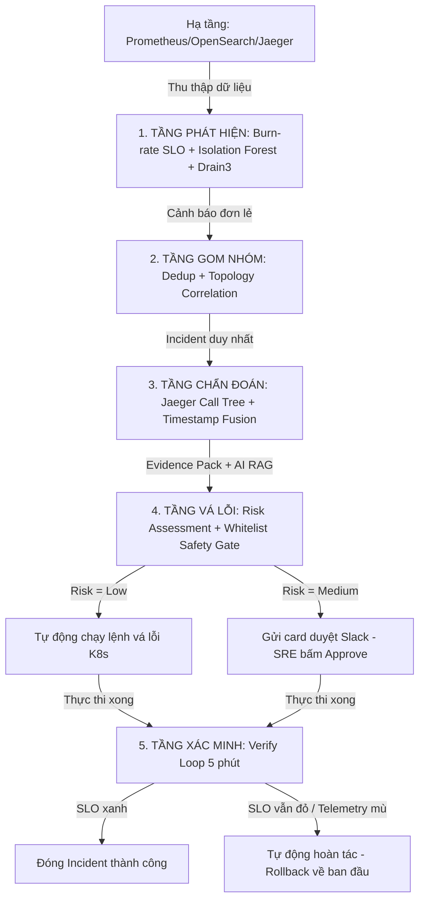

# TỔNG QUAN GIẢI PHÁP AIOPS & AI ENGINEERING - TF3

Tài liệu này trình bày chi tiết bức tranh toàn cảnh từ **Đề bài/Bối cảnh thực tế** của chương trình Phase 3 đến các **Phương pháp chẩn đoán và tự động khắc phục bằng AIOps/AIE** mà nhóm **TF3 (AIO02)** đã triển khai thực tế trên hệ thống.

---

## I. Phân Tích Đề Bài & Các Ràng Buộc Thực Tế (Problem Statement)

Hệ thống cần vận hành là một ứng dụng thương mại điện tử microservices hoàn chỉnh chạy trên AWS EKS, tích hợp tính năng tóm tắt đánh giá sản phẩm bằng AI. Nhóm đối mặt với các thách thức lớn sau:

1.  **Nợ kỹ thuật và Sự cố do Ban Tổ Chức (BTC) tiêm vào:** 
    *   BTC liên tục bơm lỗi ngẫu nhiên thông qua hệ thống quản lý cờ tính năng `flagd` (OpenFeature). 
    *   Các sự cố phổ biến gồm: cạn kiệt Connection Pool của Database (`paymentFailure`), lỗi LLM trả về mã 429 quá tải (`llmRateLimitError`), LLM bịa đặt thông tin sai lệch (`llmInaccurateResponse`), lag hàng đợi Kafka (`kafkaQueueProblems`), v.v.
2.  **Luật chơi khắt khe (RULES §8):**
    *   **Nghiêm cấm vô hiệu hóa hoặc tắt cờ sự cố:** Hệ thống bắt buộc phải duy trì đường dây đọc flag của BTC. Nếu vi phạm tháo flag $\rightarrow$ bị loại (disqualify) ngay lập tức.
    *   **Tự xử lý / Tự chống chịu:** Phải xây dựng hệ thống tự phục hồi (Self-healing), tự chuyển hướng (Fallback) hoặc chứa lỗi (Containment) để bảo vệ SLO mà không được đụng vào nguồn phát sinh lỗi của BTC.
3.  **Mục tiêu Chỉ số SLO & Ngân sách (SLO & Budget constraints):**
    *   Duy trì tỷ lệ Checkout thành công $\ge 99\%$, tỷ lệ Browse sản phẩm $\ge 99.5\%$, và thời gian tải trang p95 latency < 1s.
    *   Tổng ngân sách vận hành và AI cực kỳ ngặt nghèo (FinOps).

---

## II. Các Phương Pháp AIOps Đã Sử Dụng Để Giải Quyết Bài Toán

Để giải quyết triệt để đề bài trên, nhóm TF3 đã xây dựng một vòng lặp đóng tự động hóa vận hành (**Closed-Loop AIOps**) tích hợp trí tuệ nhân tạo (AIE) gồm các tầng sau:

### 1. Tầng Phát hiện Bất thường (Detection Layer)
*   **Burn-rate SLO (Google SRE Standard):** 
    *   *Phương pháp:* Thay vì dùng ngưỡng tĩnh (tễ gây báo động giả), nhóm dùng thuật toán đa cửa sổ (Multi-window Multi-burn-rate). Chỉ báo động `critical` khi cả cửa sổ 5 phút (ngắn) và 1 giờ (dài) cùng tiêu thụ quỹ lỗi với tốc độ Burn-rate $\ge 14.4$.
*   **Học máy Isolation Forest (ML Unsupervised):**
    *   *Phương pháp:* Sử dụng mô hình rừng cô lập với 200 cây quyết định (`n_estimators=200`) để quét metrics Prometheus. 
    *   *Feature Engineering:* Mỗi điểm dữ liệu được biểu diễn qua **6 đặc trưng**: giá trị hiện tại, trung bình trượt, độ lệch chuẩn trượt, tốc độ thay đổi, lag-1 và lag-k. Nhờ vậy phát hiện được các lỗi rò rỉ (leak) hoặc lệch (drift) chậm rãi mà z-score điểm đơn bỏ sót.
*   **Drain3 Log Template Miner:**
    *   *Phương pháp:* Quét log lỗi thời gian thực từ OpenSearch, dùng thuật toán Drain3 để phân cụm và lọc tham số động, phát hiện nhanh các template log lỗi mới xuất hiện hoặc đột biến tần suất.

### 2. Tầng Gom nhóm & Tránh bão Alert (Correlation & Dedup)
*   **Fingerprint Dedup:** Sử dụng mã băm độc nhất `{service, sli, rule}` để gộp các cảnh báo lặp lại trong vòng 15 phút.
*   **Topology Correlation:** Sử dụng bản đồ kiến trúc dịch vụ (Dependency Graph). Gom tất cả alert xảy ra đồng thời trong vòng 2-5 phút của các dịch vụ cách nhau $\le 2$ bước nhảy (hops) thành đúng 1 Incident duy nhất, giảm tình trạng "bão alert".

### 3. Tầng Định vị lỗi gốc (RCA & AI Diagnostic)
*   **Graph-based RCA:** Quét spans Jaeger để dựng Call Tree đệ quy từ Frontend-proxy xuống dưới. Tìm nút lá bị lỗi sâu nhất (leaf-most error node) trả về mã lỗi 5xx. Đây chính là nguyên nhân gốc (Culprit).
*   **Timestamp-order Fusion:** Kết hợp trọng số cấu trúc đồ thị (0.6) và trình tự thời gian lỗi xuất hiện (0.4). Giải pháp này giúp định vị đúng thủ phạm thực sự (ví dụ: `product-catalog`) và loại bỏ nhiễu từ nạn nhân gánh chịu bão retry (ví dụ: `payment-service` bị cạn kiệt pool DB do liên tục gọi dịch vụ lỗi phía sau).
*   **AI RAG Grounding:** Nạp lịch sử sự cố vào ngữ cảnh của Bedrock (Nova Lite/Claude) làm dữ liệu chẩn đoán, gợi ý Runbook tối ưu. Bỏ qua LLM khi độ tin cậy của đồ thị RCA $\ge 90\%$ để tối ưu chi phí và độ trễ.

### 4. Tầng Tự phục hồi & Lưới an toàn (Remediation & Safety Gate)
*   **Safety Whitelist & Guardd:** Khóa cứng trong code, cấm tuyệt đối các hành động can thiệp vào cờ flagd của BTC để đảm bảo tuân thủ luật chơi. Chặn đứng các lệnh nguy hiểm (xóa namespace) hoặc restart pod đơn lẻ gây mất dữ liệu.
*   **Phân luồng đánh giá rủi ro (Risk Assessment):**
    *   `Risk = Low` (ngoài Tier-1, idempotent, confidence cao, dry-run thành công): **Tự động vá lỗi** mà không cần con người (Self-healing).
    *   `Risk = Medium` (Tier-1 ảnh hưởng doanh thu): Gửi card lên Slack để SRE bấm **Approve** (Human-in-the-loop).
    *   `Risk = High` (Dry-run lỗi hoặc Blast radius $\ge 5$ dịch vụ): Tự động **Reject** từ chối chạy.

### 5. Tầng Xác minh & Hoàn tác (Verification & Auto-Rollback)
*   **Verify Loop:** Sau khi vá lỗi (ví dụ: scale-up pod), hệ thống tự động đo lường lại metrics Prometheus mỗi 30 giây trong 5 phút. 
*   **Auto-Rollback (Fail-safe):** Nếu sau 5 phút SLO vẫn đỏ, hoặc nếu hệ thống bị mù telemetry (Prometheus sập), Engine lập tức kích hoạt lệnh rollback để đưa hệ thống về trạng thái ban đầu, tránh lãng phí tiền và làm sập cụm K8s. Leo thang cảnh báo Slack nếu rollback bị lỗi.

### 6. Tầng Bảo vệ Trải nghiệm AI của khách hàng (AIE)
*   **Faithfulness check:** So khớp tóm tắt LLM với review thật trong Database để ngăn AI bịa đặt (Anti-hallucination).
*   **Fallback Circuit Breaker:** Khi LLM bị Rate limit 429 hoặc treo, hệ thống tự động ngắt kết nối và hiển thị reviews thô hoặc lấy từ cache (độ trễ <50ms), giữ trang sản phẩm hoạt động mượt mà.
*   **Lọc Prompt Injection:** Khử độc gián tiếp qua review và trực tiếp từ chối (`SAFE_REFUSAL`) khi khách hàng cố tình hack lộ system prompt.

---

## III. Kết Luận

Bằng việc kết hợp nhuần nhuyễn giữa **Observability truyền thống (Prometheus/OpenSearch/Jaeger)**, **Học máy & Toán học (Isolation Forest/Z-Score/Drain3)**, và **AI tạo sinh (LLM Guardrails/RAG)**, nhóm **TF3** đã xây dựng thành công một hệ thống AIOps tự vận hành an toàn, thông minh. Hệ thống tự khắc phục lỗi và tự bảo vệ mình trong mọi kịch bản bơm lỗi từ BTC mà vẫn đảm bảo tuyệt đối các ràng buộc về luật chơi, ngân sách và chỉ số SLO cốt lõi của doanh nghiệp.
