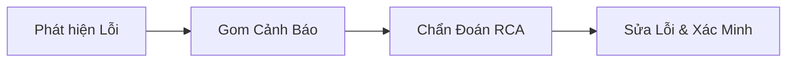
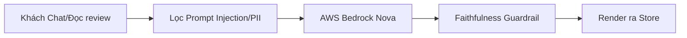

# CHI TIẾT CÁC ĐƯỜNG ỐNG XỬ LÝ ĐÃ XÂY DỰNG (PIPELINES BUILT) - TF3

Hệ thống **AI Engine & AIOps** của nhóm **TF3 (AIO02)** được vận hành dựa trên **3 đường ống xử lý chính (Pipelines)** được lập trình và tích hợp đầy đủ trong thư mục mã nguồn `ai-engine/src/ai_engine/`.

---

## 🏗️ 1. Pipeline Chẩn Đoán & Tự Phục Hồi (AIOps CMDR Pipeline)

Đây là đường ống xử lý trung tâm dùng để phát hiện sự cố, chẩn đoán nguyên nhân gốc (RCA), đề xuất hành động và tự động sửa lỗi (Self-healing).

### Chi tiết mã nguồn từng mắt xích trong Pipeline:

*   **Tầng Phát Hiện (Detection):**
    *   `detector_burnrate.py`: Theo dõi tốc độ tiêu thụ Quỹ lỗi (Burn-rate SLO) trên 2 cửa sổ trượt (5 phút và 1 giờ) theo chuẩn Google SRE.
    *   `detector_latency.py` (`MultiWindowLatencyDetector`): Quét độ trễ p95 bằng thuật toán Robust Z-Score (Median + MAD) để loại bỏ đỉnh nhiễu.
    *   `detector_iforest.py` (`IsolationForest`): Trích xuất **6 đặc trưng hạ tầng** để chạy mô hình rừng cô lập, phát hiện sớm các lỗi drift/rò rỉ âm thầm.
    *   `detector_logtemplate.py` (`Drain3 log miner`): Phân cụm log thô từ OpenSearch thành các template lỗi để lọc sạch biến số động trước khi gửi LLM.
*   **Tầng Gom Cảnh Báo (Correlation):**
    *   `correlator.py`: Sử dụng bản đồ quan hệ dịch vụ (Topology Graph) để gộp các cảnh báo xảy ra đồng thời của các service cách nhau $\le 2$ bước nhảy thành 1 sự cố duy nhất.
    *   `alert_emitter.py`: Quản lý trạng thái Incident và phát sinh sự kiện lên Slack.
*   **Tầng Chẩn Đoán Gốc (RCA):**
    *   `rca_assistant.py`: Duyệt cây cuộc gọi Jaeger Spans đệ quy tìm nút lỗi lá sâu nhất (leaf-most error node). Kết hợp thuật toán **Timestamp-order Fusion** phân chia tỷ lệ 0.6 (cấu trúc đồ thị) và 0.4 (thời gian) để chống bão retry gây nhiễu.
    *   `kb_retriever.py`: Thực hiện RAG đối chiếu lỗi hiện tại với lịch sử `INCIDENT_HISTORY.md` trên AWS Bedrock.
    *   `local_matcher.py`: Tầng chẩn đoán dự phòng offline (lướt nhanh) bằng Keyword Matching khi Bedrock API bị mất kết nối hoặc độ tin cậy đồ thị $\ge 90\%$.
    *   `rca_guardrail.py`: Chống hiện tượng bịa đặt (hallucination) của LLM bằng cách kiểm tra chéo các service được đề xuất có xuất hiện trong log/trace thực tế không.
*   **Tầng Khắc Phục, Xác Minh & Hoàn Tác (Remediation & Rollback):**
    *   `action_policy.py`: Công cụ **đánh giá rủi ro (Risk Assessment)** chia 3 mức (Low - tự chạy, Medium - chờ duyệt, High - từ chối) dựa trên Dry-run, Blast Radius và độ quan trọng của dịch vụ.
    *   `remediation.py`: Cổng an toàn (Safety Gate) chặn lệnh nguy hiểm, thực thi lệnh K8s API ở chế độ `--dry-run` trước khi apply thật, giới hạn rate limit 3 actions/incident/giờ, kích hoạt rollback khi lỗi hoặc timeout.
    *   `verify_loop.py`: Kiểm tra liên tục Prometheus trong 5 phút sau khi sửa lỗi. Nếu SLO vẫn đỏ hoặc mất telemetry $\rightarrow$ báo Remediation chạy Rollback Plan.
*   **Tầng Đo Lường Hiệu Quả (FinOps & ROI):**
    *   `cost_roi.py`: Đo lường chi phí chạy lệnh vá lỗi so với thiệt hại tài chính nếu rớt SLO (Incident ROI Cost Model) để chứng minh giá trị kinh tế của AIOps.

---

## 🛒 2. Pipeline Trải Nghiệm AI & Guardrails (AIE Product Pipeline)

Đường ống xử lý này bảo vệ tính năng AI trên cửa hàng storefront (Shopping Copilot và tóm tắt review sản phẩm) để đảm bảo tốc độ và độ an toàn thông tin.

### Chi tiết mã nguồn từng mắt xích trong Pipeline:

*   **Tầng Bảo Vệ Đầu Vào & Đầu Ra:**
    *   `input_filter.py`: Nhận diện và vô hiệu hóa các câu lệnh gián tiếp nhúng trong reviews (Prompt Injection), chặn đứng nỗ lực ăn cắp system prompt trực tiếp qua chatbot, che giấu thông tin cá nhân (PII Redaction).
    *   `guardrail.py`: Đối chiếu tóm tắt AI với rating thực tế trong Postgres (Sentiment & Entailment matching) để phát hiện và chặn các câu tóm tắt bịa đặt (Anti-hallucination).
*   **Tầng Tối Ưu Hiệu Năng & Độ Trễ:**
    *   `gateway.py`: Gateway điều phối gọi Bedrock, quản lý hard-timeout 800ms để bảo vệ p95 latency.
    *   `breaker.py`: Cơ chế Circuit Breaker tự động ngắt kết nối LLM khi tỷ lệ lỗi >50% hoặc thời gian chờ quá lâu.
    *   `cache.py`: Tích hợp bộ nhớ đệm Valkey/Redis cache giúp lưu trữ tóm tắt theo `product_id`, giảm ~30% token tiêu thụ và trả kết quả trong <50ms.
    *   `cost_meter.py` & `cost_report.py`: Giám sát và lập báo cáo chi phí token hàng tuần theo ngân sách $50/tuần.
*   **Trợ Lý Mua Sắm (Shopping Copilot Agent):**
    *   `agent_executor.py`: Vòng lặp suy nghĩ và thực thi hành động của Agent (Reasoning & Action - ReAct loop).
    *   `tools.py`: Tập hợp các công cụ an toàn mà Agent được gọi (Tìm kiếm catalog, RAG review sản phẩm, quản lý giỏ hàng). Có **Confirmation Gate** chặn Agent tự ý thanh toán (excessive agency).

---

## 🚢 3. Pipeline Đóng Gói & Triển Khai (CI/CD Deployment Pipeline)

Đường ống này tự động hóa việc build mã nguồn và đẩy lên môi trường Kubernetes thật.

*   **Script đóng gói (`deploy/build-push-images.sh`):**
    1.  Tự động hóa đăng nhập AWS ECR thông qua AWS CLI.
    2.  Build Dockerfile cho AI Engine đa nền tảng (multi-arch).
    3.  Gắn nhãn (tag) Docker image theo Git SHA của commit hiện tại để dễ dàng truy vết (Auditability).
    4.  Đẩy (push) image lên kho chứa ECR của TF3.
*   **Cấu hình Kubernetes (K8s Manifests):**
    *   `k8s/deployment.yaml`: Khai báo tài nguyên CPU/RAM limits, readiness/liveness probes cho pod AI Engine để tránh OOM hoặc sập âm thầm.
    *   `k8s/training-cronjob.yaml`: Định kỳ 24h chạy Job huấn luyện lại (re-train) mô hình Isolation Forest từ baseline Prometheus mới để tránh hiện tượng trôi dữ liệu (model drift).
