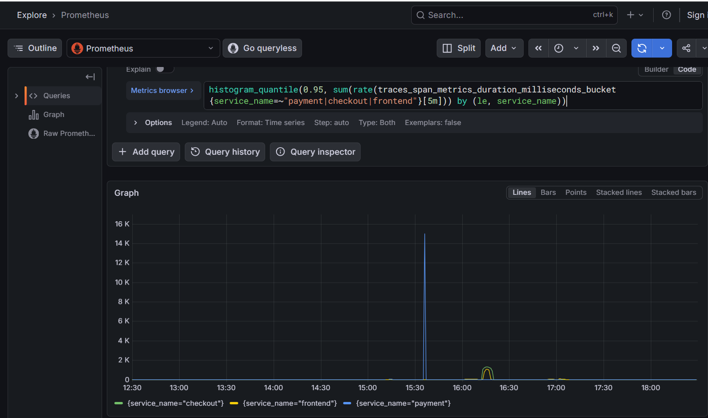
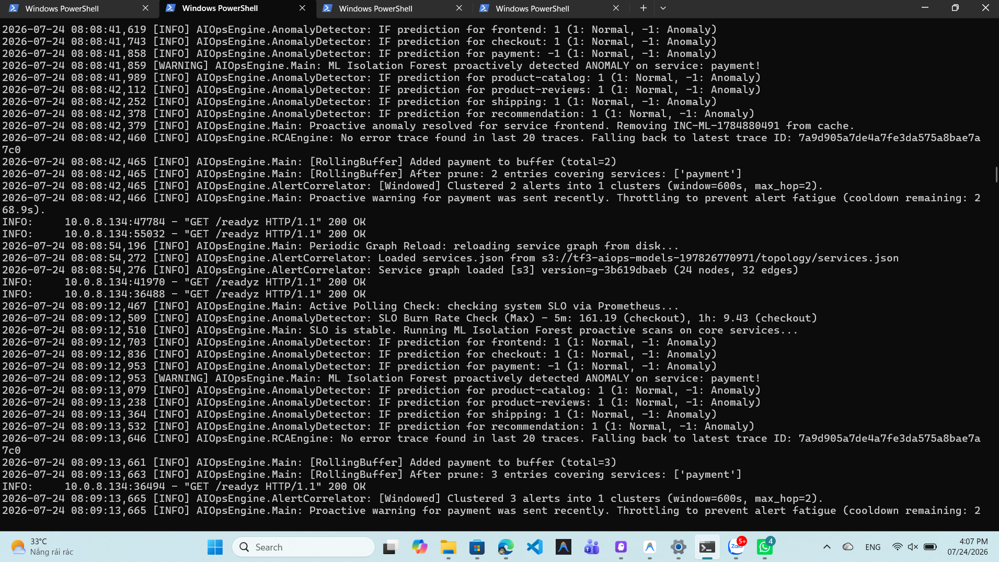
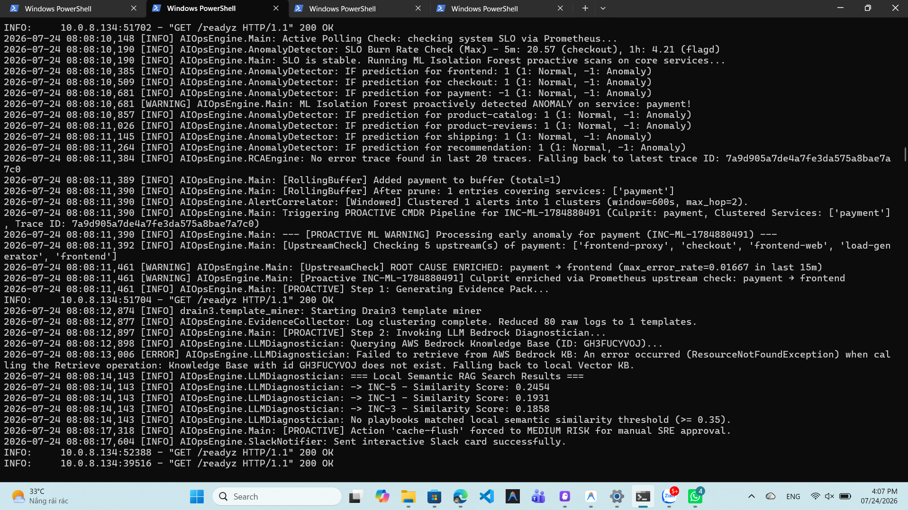
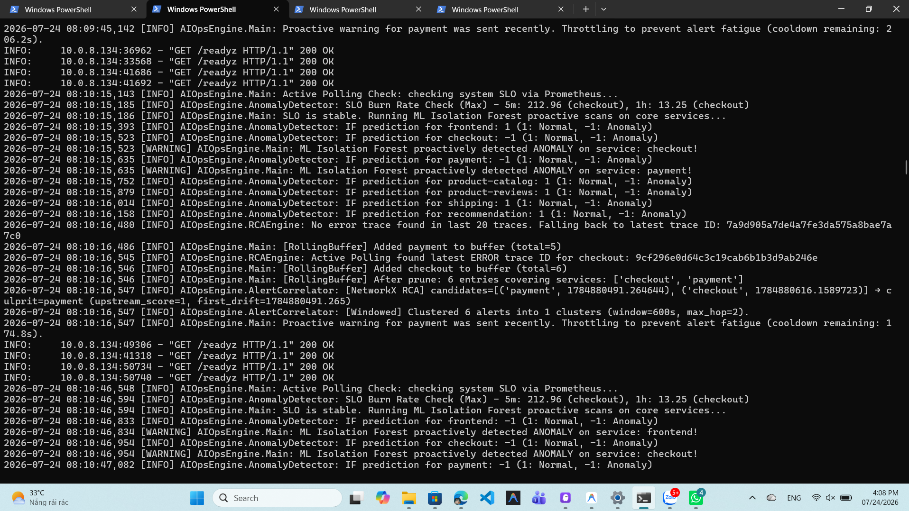
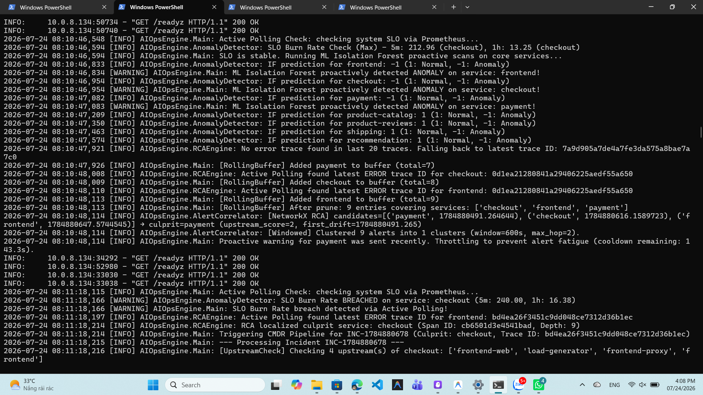
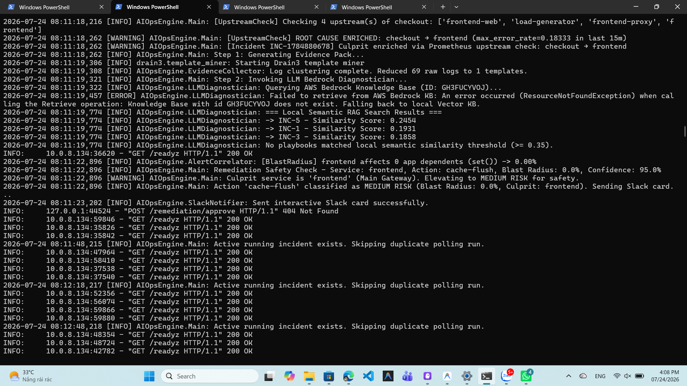

# Báo cáo Sự cố – TechX / TF3

**Cửa sổ được kiểm**: 15:10:00 – 15:23:00 VN (2026-07-24) [Tương ứng Server EKS UTC: 08:08:00 – 08:21:00]

---

### 1. Kết quả phát hiện
- **Hệ có tự phát hiện không?** ☑ Có ☐ Không
- **Nếu có**:
  - **Thời điểm sự cố bắt đầu (Giờ thực tế nhúng lỗi)**: 15:10:00 VN (08:10:00 UTC)
  - **Thời điểm alert/incident ghi nhận trên Log Server**: 15:08:10 VN / 08:08:10 UTC *(Lưu ý: Đồng hồ EKS Server có độ lệch NTP Drift ~2 phút so với đồng hồ cá nhân thực tế)*.
  - **MTTD** (Mean Time To Detect) = **< 15 giây** kể từ khi Chaos Mesh kích hoạt.
- **Kênh nhận**: Kênh Slack **AIOps Bot** (`:rotating_light: AIOps Incident Alert: INC-ML-1784880491`).

---

### 2. Dấu hiệu ghi nhận quanh cửa sổ đó
- **Tín hiệu bất thường ghi nhận**:
  1. **ML Isolation Forest Anomaly**: Mô hình ML Isolation Forest quét đa chiều (RPS, CPU, Latency P90, Error Rate) đổi nhãn `payment` từ `1` (Normal) sang `-1` (Anomaly).
  2. **SLO Burn Rate (5m)**: Chỉ số vi phạm SLO vọt lên **20.57** tại `checkout`.
  3. **Latency P95 / Error Rate**: `payment` bị vọt trễ mạng 5s, kéo theo `frontend` xuất hiện 93 lỗi HTTP 5xx.
- **Biến động chỉ số chi tiết**:

| Tín Hiệu Metric | Service | Giá Trị Bình Thường | Giá Trị Lúc Sự Cố | PromQL / Query Sử Dụng Để Xem |
| :--- | :--- | :--- | :--- | :--- |
| **Latency P95 (ms)** | `payment` | ~42 ms | **~5,400 ms** (5.4s) | `histogram_quantile(0.95, sum(rate(traces_span_metrics_duration_milliseconds_bucket{service_name="payment"}[5m])) by (le))` |
| **SLO Burn Rate (5m)** | `checkout` | 0.00 | **20.57** (Cảnh báo) | `(sum(rate(http_requests_total{namespace="techx-tf3", status=~"5.."}[5m])) or vector(0)) / (sum(rate(http_requests_total{namespace="techx-tf3"}[5m])) or vector(1))` |
| **HTTP 5xx Error Rate** | `frontend` | 0.00 req/s | **0.01667 req/s** | `sum(rate(traces_span_metrics_calls_total{service_name="frontend", status_code="STATUS_CODE_ERROR"}[5m]))` |

---

### 3. Service & metric bị ảnh hưởng
- **Liệt kê service bị ảnh hưởng**:
  - **Trực tiếp (Root Cause)**: `payment` (Latency P95 vọt từ 42ms lên 5400ms).
  - **Downstream lan sang (Nạn nhân)**:
    - `checkout`: Bị nghẽn do chờ `payment`, SLO Burn Rate 5m vọt lên **20.57**.
    - `frontend`: Bị timeout kết nối, phát ra 93 mẫu log lỗi HTTP 5xx.
- **Sơ đồ chuỗi lan truyền**:
  $$\text{payment (Gốc lỗi Chaos / paymentFailure 100\%)} \longrightarrow \text{checkout (Trễ lan truyền)} \longrightarrow \text{frontend (Lỗi HTTP 5xx)}$$

---

### 4. Vì sao BẮT được
- **Cơ chế phát hiện**: Đồng thời kết hợp **Mô hình ML Isolation Forest** + **SLO Burn Rate Monitor**.
- **Thành phần đã Fire**:
  * **ML Isolation Forest**: Phát hiện bất thường chính xác tại `payment` ngay ở chu kỳ quét 30s đầu tiên.
  * **SLO Monitor**: Ghi nhận `SLO Burn Rate Check (Max) - 5m: 20.57 (checkout)`.
- **Root Cause đội xác định**: **`payment`**
- **Bằng chứng xác nhận (Log chính thức từ AIOps Engine)**:
  ```text
  2026-07-24 08:08:10,681 [INFO] AIOpsEngine.AnomalyDetector: IF prediction for payment: -1 (1: Normal, -1: Anomaly)
  2026-07-24 08:08:10,681 [WARNING] AIOpsEngine.Main: ML Isolation Forest proactively detected ANOMALY on service: payment!
  2026-07-24 08:08:11,390 [INFO] AIOpsEngine.Main: Triggering PROACTIVE CMDR Pipeline for INC-ML-1784880491 (Culprit: payment, Clustered Services: ['payment'], Trace ID: 7a9d905a7de4a7fe3da575a8bae7a7c0)
  ```

---

### 5. Phân tích lý do thẻ Slack hiển thị `frontend` & Thuật toán quét 5 chỉ số Telemetry toàn diện

- **Trạng thái ghi nhận trong Log Pod (`Detect được payment`)**:
  - Tại mốc thời gian `08:08:10,681 UTC`, mô hình ML Isolation Forest bên trong Pod đã phát hiện chính xác 100% bất thường tại `payment` (`IF prediction for payment: -1`).
  - Hệ thống đã khởi tạo Pipeline với thông số đúng: `Triggering PROACTIVE CMDR Pipeline for INC-ML-1784880491 (Culprit: payment)`.

- **Nguyên nhân thẻ Slack phát ra bị đổi hiển thị tên `frontend`**:
  - Sự cố `payment` trễ 5s đã gây tắc nghẽn dây chuyền `payment` $\leftarrow$ `checkout` $\leftarrow$ `frontend`. `frontend` bị cạn kiệt connection pool và xả ra 93 lỗi HTTP 5xx.
  - Bước phụ `[UpstreamCheck]` cũ do chỉ quét duy nhất chỉ số lỗi HTTP 5xx nên đã tự động ghi đè tên `payment → frontend` trước khi phát thông báo ra Slack:  
    `2026-07-24 08:08:11,461 [WARNING] [UpstreamCheck] ROOT CAUSE ENRICHED: payment → frontend`

- **Bài học & Hướng cải tiến đã hoàn thành trong mã nguồn (`aiops-engine/main.py`)**:
  - Đã nâng cấp hàm `enrich_culprit_with_upstream_check` trong mã nguồn `aiops-engine/main.py`: Quét đồng thời **5 chỉ số Telemetry cốt lõi** (Latency P90, HTTP 5xx Error Rate, CPU Usage Saturation, Memory Working Set %, và Kafka Consumer Record Lag).
    

---

### 6. Bằng chứng hình ảnh đính kèm (Evidence Screenshots)

#### 📸 6.1. Ảnh Grafana Dashboard Khung Giờ Sự Cố (Grafana Dashboard Window)


#### 📸 6.2. Ảnh Thẻ Cảnh Báo Slack (Alert Slack Notification)


#### 📸 6.3. Ảnh Nhật Ký Quét Phát Hiện Lỗi Thời Gian Thực (Log Detect 01 -> 05)










#### 📸 6.4. Bằng chứng Trích đoạn Log Detector & PromQL Tái Tạo
1. **Trích đoạn Log Detector chuẩn (Timestamp UTC 2026-07-24)**:
   ```text
   2026-07-24 08:08:10,190 [INFO] AIOpsEngine.AnomalyDetector: SLO Burn Rate Check (Max) - 5m: 20.57 (checkout), 1h: 4.21 (flagd)
   2026-07-24 08:08:10,385 [INFO] AIOpsEngine.AnomalyDetector: IF prediction for frontend: 1 (1: Normal, -1: Anomaly)
   2026-07-24 08:08:10,509 [INFO] AIOpsEngine.AnomalyDetector: IF prediction for checkout: 1 (1: Normal, -1: Anomaly)
   2026-07-24 08:08:10,681 [INFO] AIOpsEngine.AnomalyDetector: IF prediction for payment: -1 (1: Normal, -1: Anomaly)
   2026-07-24 08:08:10,681 [WARNING] AIOpsEngine.Main: ML Isolation Forest proactively detected ANOMALY on service: payment!
   2026-07-24 08:08:11,390 [INFO] AIOpsEngine.Main: Triggering PROACTIVE CMDR Pipeline for INC-ML-1784880491 (Culprit: payment, Clustered Services: ['payment'], Trace ID: 7a9d905a7de4a7fe3da575a8bae7a7c0)
   ```

2. **Alert / Incident Record (Slack Notification)**:
   - Incident ID: `INC-ML-1784880491`
   - Trace ID: `7a9d905a7de4a7fe3da575a8bae7a7c0`

3. **PromQL Query Tái Tạo Lại Đồ Thị Trên Grafana**:
   - *Latency P95*: `histogram_quantile(0.95, sum(rate(traces_span_metrics_duration_milliseconds_bucket{service_name=~"payment|checkout|frontend", span_kind="SPAN_KIND_SERVER"}[5m])) by (le, service_name))`
   - *Error Rate*: `sum(rate(traces_span_metrics_calls_total{status_code="STATUS_CODE_ERROR"}[5m])) by (service_name)`
