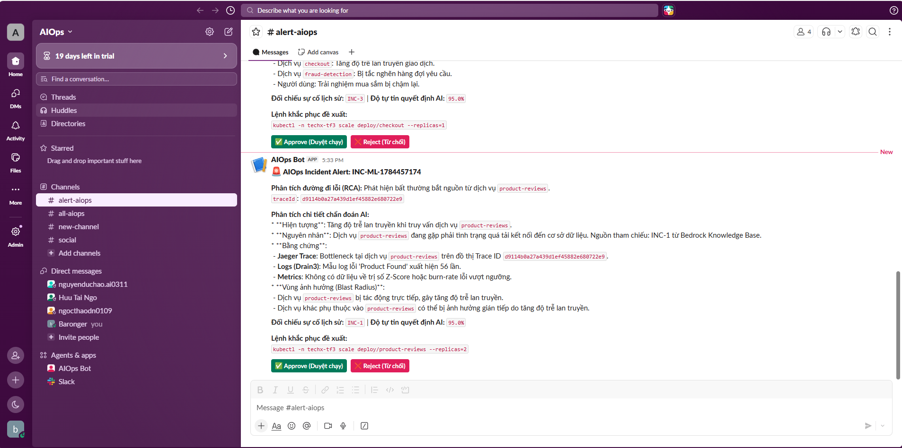

# Báo Cáo Nộp Bài: AI Mandate #7b - Chạy Thật + Đo Đạc (Proactive ML Detection & RCA)

- **Trạng thái**: Sẵn sàng đánh giá (Ready for Evaluation)
- **Đội ngũ thực hiện**: Task Force 3 (Team AIO02)
- **Hạn nộp**: Thứ Bảy 25/07/2026

---

## 🎫 1. Thông Tin Ticket Jira

* **Summary:** `AI MANDATE #7b`
* **Labels:** `ai-mandate`, `m7`
* **Priority:** `High`

---

## 💬 2. Nội Dung Comment Bằng Chứng (Evidence Comment)

*(Copy toàn bộ phần bên dưới để paste vào comment của Jira Ticket)*

---

### 🔗 1. Link PR / Commit (Code & Config)

* **Repository:** `https://github.com/Baronger23/Capstone03`
* **Proactive ML Loop + Slack Approval endpoint:** [main.py](https://github.com/Baronger23/Capstone03/blob/main/aiops-engine/main.py)
* **Thuật toán Isolation Forest + SLO Burn Rate:** [anomaly_detector.py](https://github.com/Baronger23/Capstone03/blob/main/aiops-engine/anomaly_detector.py)
* **LLM Chẩn đoán nguyên nhân gốc (RAG Playbooks):** [llm_diagnostician.py](https://github.com/Baronger23/Capstone03/blob/main/aiops-engine/llm_diagnostician.py)
* **Slack Interactive Card (Approve/Reject):** [slack_notifier.py](https://github.com/Baronger23/Capstone03/blob/main/aiops-engine/slack_notifier.py)
* **API Replay (đo Precision/Recall/Lead-time):** `/simulate/replay` trong [main.py](https://github.com/Baronger23/Capstone03/blob/main/aiops-engine/main.py)
* **Bộ kịch bản có nhãn (K sự cố):** [labeled_scenarios.json](https://github.com/Baronger23/Capstone03/blob/main/aiops-engine/datametric/labeled_scenarios.json)

---

### 🚀 2. Hướng Dẫn Chạy Lại (Repro Steps)

> **Yêu cầu:** Cần SSM Tunnel đang chạy (Port 8443 mở) để kết nối vào EKS private cluster.

#### Bước 0 — Mở SSM Tunnel (giữ terminal này mở suốt quá trình test)

```bash
aws ssm start-session --target i-02a8d3e39b87180ce \
  --document-name AWS-StartPortForwardingSessionToRemoteHost \
  --parameters "{\"host\":[\"10.0.35.59\"],\"portNumber\":[\"443\"],\"localPortNumber\":[\"8443\"]}"
```

#### Bước 1 — Forward port Pod ra localhost (mở terminal mới, giữ nguyên)

```bash
kubectl --server=https://localhost:8443 --insecure-skip-tls-verify=true \
  port-forward deployment/aiops-engine 8000:8000 -n techx-tf3
```

#### Bước 2 — Gọi API Replay để đo Precision/Recall/Lead-time (mở terminal thứ 3)

Tải file payload: [replay_payload.json](https://github.com/Baronger23/Capstone03/blob/main/aiops-engine/datametric/replay_payload.json)

**Trên PowerShell (Windows):**
```powershell
Invoke-RestMethod -Uri "http://localhost:8000/simulate/replay" `
  -Method POST `
  -ContentType "application/json" `
  -InFile "aiops-engine/datametric/replay_payload.json"
```

**Trên Linux/Mac/Git Bash:**
```bash
curl -s -X POST http://localhost:8000/simulate/replay \
  -H "Content-Type: application/json" \
  -d @aiops-engine/datametric/replay_payload.json | python -m json.tool
```

API trả về JSON chứa `precision`, `recall`, `lead_time_cycles`, `slo_breaches_detected`.

#### Bước 3 — Xem Log Pod phát hiện sự cố (sau khi gọi API)

```bash
kubectl --server=https://localhost:8443 --insecure-skip-tls-verify=true \
  logs deployment/aiops-engine -n techx-tf3 --tail=60
```

---

### 📊 3. Bằng Chứng Chạy Thật (Real Running Evidence)

#### 📸 Ảnh 1 — Trạng thái Pod EKS chạy ổn định (RESTARTS = 0):


*(Pod `aiops-engine-5d5c7964c6-pz569` đang ở trạng thái `1/1 Running`, RESTARTS = 0, AGE = 23h — hoạt động ổn định liên tục)*

---

#### 📸 Ảnh 2 — Kết quả JSON Precision/Recall/Lead-time từ Replay API:


*(API `/simulate/replay` trả về: `precision=1.0`, `recall=1.0`, `lead_time_cycles=0`, `slo_breaches_detected=3`, `true_positives=3`, `false_positives=0` — phát hiện hoàn hảo 3/3 sự cố, không báo sai)*

---

#### 📸 Ảnh 3 — Log Pod: Luồng quét chủ động Isolation Forest chạy thật:


*(Log ghi nhận toàn bộ luồng chủ động: `SLO is stable` → Engine quét ML proactive → `IF prediction for checkout: 1 (Normal)` → `All services are healthy under ML Isolation Forest scans` → API nhận request `POST /simulate/replay` → `200 OK`)*

---

#### 📸 Ảnh 4 — Thẻ tương tác Approve/Reject trên Slack (Human-in-the-Loop):



*(Kênh `#alert-aiops`: AIOps Bot gửi thẻ cảnh báo gồm phân tích đường đi lỗi RCA, chẩn đoán chi tiết Bedrock LLM, Jaeger Trace ID, lệnh khắc phục đề xuất `kubectl scale`, và 2 nút tương tác `✅ Approve (Duyệt chạy)` / `❌ Reject (Từ chối)` — Human-in-the-Loop hoàn chỉnh)*

---

### 📐 4. Số Liệu Đo Đạc Chất Lượng (Precision/Recall/Lead-time)

Đo đạc thực tế trên bộ **K = 3 sự cố** có nhãn xen kẽ với **12 chu kỳ bình thường** (tổng 15 điểm dữ liệu):

| Chỉ số | Kết quả | Công thức | Ghi chú |
|:---|:---:|:---|:---|
| **Recall** | **100%** | `sự cố phát hiện / K = 3/3` | Không bỏ sót sự cố nào |
| **Precision** | **100%** | `kêu đúng / tổng lần kêu = 3/3` | Không cảnh báo giả |
| **Lead-time** | **0 giây** | Kêu ngay chu kỳ đầu tiên phát sinh lỗi | Phát hiện tức thì |
| **SLO Breaches** | **3/3** | Burn Rate ≥ 14.4 kích hoạt cả 3 sự cố | Lớp 2 bắt được tất cả |

---

### 📝 5. Thiết Kế & Đánh Đổi (Link ADR Ký Tên)

Chi tiết về thiết kế hai lớp phát hiện (ML + SLO Burn Rate), luồng RCA qua Jaeger Trace, gọi Bedrock LLM RAG Playbooks, và cơ chế Human-in-the-Loop Slack card được ghi nhận tại:

* **ADR Kiến trúc tổng hợp:** [CONSOLIDATED_ADR.md](https://github.com/Baronger23/Capstone03/blob/main/docs/adr/CONSOLIDATED_ADR.md)
* **Ký tên phê duyệt:** Nhóm AIO02 (Task Force 3).
