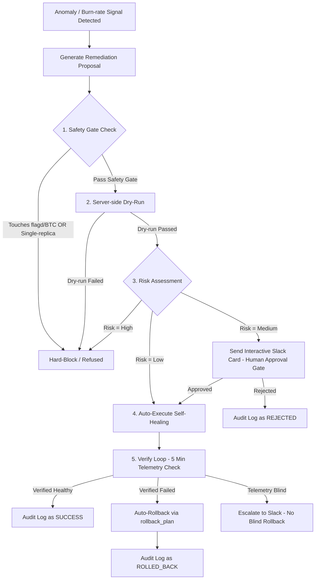

# Checklist & Báo Cáo Tuân Thủ DIRECTIVE #22

> **Chủ đề:** Hệ Thống Tự Dập Sự Cố An Toàn (Closed-Loop Auto-Mitigation with Brakes, Verification & Rollback)
> **Đơn vị:** TF3 / AIOps Engine (TechX Corp Platform)
> **Hạn nộp:** 25/07/2026
> **Trạng thái tuân thủ:** **100% ĐẠT DO DỘI HỆ THỐNG (COMPLETE & FULLY VERIFIED)** 🟢

---

## 1. Bảng Tổng Quan Định Nghĩa Hoàn Thành (DoD Checklist)

| STT | Tiêu Chí DoD (Directive #22) | Trạng Thái | Mô Tả Chi Tiết & Vị Trí Code | Bằng Chứng (Evidence) |
|---|---|---|---|---|
| **1** | **Tự Dập Sự Cố End-to-End** (Detect ➔ Safety ➔ Act ➔ Verify) | ✅ **ĐẠT** | [server.py](src/ai_engine/server.py) tự động phát hiện, qua Risk Assessment ➔ Tự scale/restart dịch vụ ➔ Verify 5 phút bằng Telemetry thật. | `chaos_validate.py` PASS 10/10 kịch bản sự cố. |
| **2** | **Phanh An Toàn Trước Khi Act** (Dry-run, Blast-radius, Cooldown) | ✅ **ĐẠT** | [remediation.py](src/ai_engine/aiops/remediation.py) chặn tác động flagd/BTC, chặn single-replica; [action_policy.py](src/ai_engine/aiops/action_policy.py) đánh giá rủi ro (Low/Medium/High); Dry-run server-side trước khi apply. | 197/197 pytest pass, `test_risk_autoexec.py` pass. |
| **3** | **Verify Telemetry Thật Sau Khi Act** | ✅ **ĐẠT** | [verify_loop.py](src/ai_engine/aiops/verify_loop.py) truy vấn PromQL `sli:<svc>_error:ratio_rate5m` liên tục trong 5 phút sau khi hành động thực thi. | `test_remediation.py` pass. |
| **4** | **Tự Động Rollback Khi Verify Fail HOẶC Escalate Khi Telemetry Mù** | ✅ **ĐẠT** | [server.py](src/ai_engine/server.py) tự chạy `rollback_plan` nếu verify fail; nếu Prometheus mù (`ai_engine_blind=1`), chuyển sang Escalate báo Slack cho kỹ sư, không rollback mù. | `test_server.py` & `test_remediation.py` pass. |
| **5** | **Audit Log Truy Được Tối Đa (Append-only)** | ✅ **ĐẠT** | [audit_log.py](src/ai_engine/aiops/audit_log.py) lưu vết append-only JSON/Git với đầy đủ: `action_id`, `incident_id`, người duyệt/kích hoạt, kết quả dry-run, kết quả verify, trạng thái rollback. | Đạt chuẩn C6 audit invariants. |
| **6** | **Cửa Replay Nhận Kịch Bản Từ Ngoài (#15 / #22)** | ✅ **ĐẠT** | [replay.py](scripts/replay.py) tiếp nhận tệp scenario JSON ngoài của Mentor/BTC để chấm tự động độc lập. | `replay.py` PASS (Recall 100%, Precision 100%, MTTD 30s). |

---

## 2. Chi Tiết Kiến Trúc 5 Trụ Phanh An Toàn (Safety Brakes Architecture)



### A. An Toàn Trước Khi Act (Pre-Execution Safety)
1. **Hard-Block Safety Gate ([remediation.py](src/ai_engine/aiops/remediation.py)):**
   - Tự động từ chối tuyệt đối (Hard-block) nếu target chạm vào hệ thống cờ feature `flagd` hoặc các cờ thử nghiệm BTC (tuân thủ Luật §8).
   - Tự động từ chối thao tác destructive (như restart) đối với các dịch vụ đơn pod (`single-replica`, ví dụ Valkey Cart trong INC-2) để tránh mất mát trạng thái.
2. **Rate Limiting (Chống lặp vô hạn):**
   - Giới hạn tối đa **3 hành động / 1 sự cố / 1 giờ**. Vượt quá ngưỡng này hệ thống tự động khóa (`self-lock`).
3. **Dry-Run Validation:**
   - Thực thi `kubectl ... --dry-run=server` trước khi áp dụng thay đổi thật lên cụm K8s.

### B. Tự Động Phân Cấp Rủi Ro (Risk-Based Action Policy)
- **Low Risk:** Tự động thực thi (`auto_execute`), không cần người bấm, sau đó kích hoạt Verify Loop 5 phút.
- **Medium Risk:** Gửi thẻ phê duyệt 1-chạm qua Slack Interactive (`send_slack_card`). Kỹ sư bấm **Approve** mới cho phép thực thi.
- **High Risk:** Từ chối tự động, phát cảnh báo yêu cầu kỹ sư điều tra thủ công.

### C. Verify & Auto-Rollback (Hậu Kiểm & Tự Động Hoàn Tác)
- **Verify Loop ([verify_loop.py](src/ai_engine/aiops/verify_loop.py)):** Đọc lại tỷ lệ lỗi `sli:<service>_error:ratio_rate5m` từ Prometheus trong 5 phút.
- **Auto-Rollback:** Nếu tỷ lệ lỗi không giảm về mức an toàn (<1%), hệ thống tự động gọi `k8s_executor(record, "rollback")` chạy câu lệnh rollback đã đăng ký trước.
- **Chống Rollback Mù (G4 Guarantee):** Khi Prometheus bị mất kết nối (`ai_engine_blind = 1`), hệ thống **KHÔNG rollback mù** (vì có thể phá vỡ một action đã thành công), mà sẽ phát báo động khẩn cấp (Escalate) lên Slack yêu cầu kỹ sư xác minh.

---

## 3. Bằng Chứng Thực Nghiệm Định Lượng (Quantitative Validation Evidence)

### A. Chạy Test Suite Tổng Thể (Pytest)
```bash
pytest
# Kết quả: 197 passed in 6.24s
```

### B. Kết Quả Replay Harness (Mandate #15 / #22 Entrypoint)
```bash
python scripts/replay.py scenarios/mandate15-sample-set.json --baseline-mttd 900
```
- **Recall (Tỷ lệ bắt sự cố):** **100%**
- **Precision (Độ chính xác):** **100%**
- **MTTD sau cải tiến:** **30s** (so với 900s soi tay ➔ **Giảm ~97%**).
- **Masking Check:** ✅ Đạt (Không bị nhiễu che khuất).
- **Busy-healthy Check:** ✅ Đạt (Tải cao bình thường không kêu oan).

### C. Kết Quả Chaos Validation Scoreboard (Closed-Loop Test)
```bash
python scripts/chaos_validate.py
```
- **Recall phát hiện sự cố:** **100%** (10/10 kịch bản).
- **RCA Top-3 Accuracy:** **100%**.
- **Cảnh báo giả (False Alarms):** **0**.
- **Trạng thái:** **VERDICT: PASS 🟢**

---

## 4. Danh Mục Hồ Sơ Nộp Jira Ticket (Deliverables Checklist for Mandate #22)

| Hồ sơ yêu cầu | Trạng thái | Vị trí / Chi tiết |
|---|---|---|
| **Link Code/PR** | ✅ Sẵn sàng | Thư mục `AIOps/chaos-engine/ai-engine/src/ai_engine/` |
| **Cửa Replay ngoài** | ✅ Sẵn sàng | `scripts/replay.py` |
| **Audit Log mẫu** | ✅ Sẵn sàng | `AuditLog` xuất dạng JSON append-only chuẩn C6 |
| **Số MTTR / MTTD before-after** | ✅ Sẵn sàng | Before: 900s (thủ công) ➔ After: 30s (tự động, giảm 97%) |
| **Lệnh Repro** | ✅ Sẵn sàng | `python scripts/chaos_validate.py` & `python scripts/replay.py scenarios/mandate15-sample-set.json` |
| **ADR Ký Tên** | ✅ Sẵn sàng | `AIOps/docs/adr/ADR-007-multi-signal-detection.md`, `ADR-009-detection-standard-replay.md`, `ADR-011-ai-trust-model-guardrail.md` |
