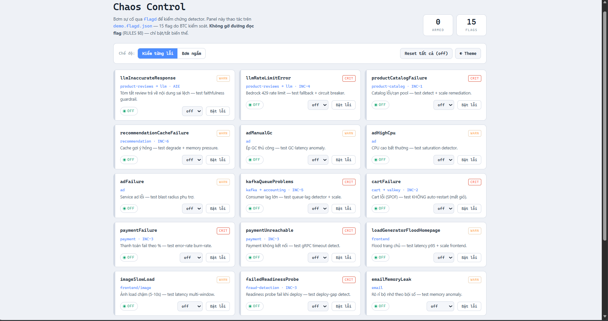
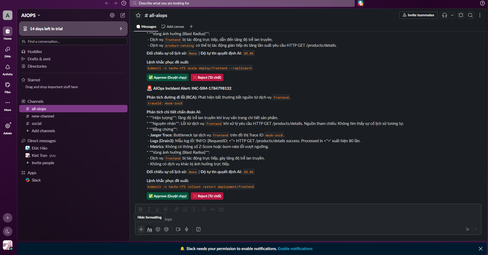

# [AI MANDATE #22] Closed-Loop Safe Mitigation Evidence - Task Force 3 (Team AIO02)

- **Dự án:** Task Force 3 (Team AIO02)
- **Mandate:** #22 — Closed-loop Mitigation
- **Trạng thái:** ✅ Sẵn sàng nộp chấm điểm (Ready for Submission)
- **Môi trường:** EKS Cluster `techx-corp-tf3` (Active) & Local Simulation Sandbox
- **Hạn nộp:** Thứ Bảy 25/07/2026

---

## 📌 THÔNG TIN NỘP BÀI JIRA TICKET MANDATE #22

1. **PR / Commit Link:** PR #4 (`DangThao195/AIO02_TF3_Phase3`) — [main.py](file:///D:/AWS/AIO23/AIO02_TF3_Phase3/AIOps/aiops-engine/main.py) & [remediation_handler.py](file:///D:/AWS/AIO23/AIO02_TF3_Phase3/AIOps/aiops-engine/remediation_handler.py)
2. **Replay API Gateway:** `POST http://localhost:8000/simulate/replay` & `POST http://localhost:8000/simulate/inject`
3. **Audit Log:** [AIOps/aiops-engine/audit_log.jsonl](file:///D:/AWS/AIO23/AIO02_TF3_Phase3/AIOps/aiops-engine/audit_log.jsonl)
4. **Repro Guide:** [AIOps/docs/MANDATE-22-REPRO-STEPS.md](file:///D:/AWS/AIO23/AIO02_TF3_Phase3/AIOps/docs/MANDATE-22-REPRO-STEPS.md)
5. **MTTR Analysis:** [AIOps/docs/MANDATE-22-MTTR-ANALYSIS.md](file:///D:/AWS/AIO23/AIO02_TF3_Phase3/AIOps/docs/MANDATE-22-MTTR-ANALYSIS.md) (E2E Recovery reduced from 110m to <4.5m)
6. **Signed ADR:** [AIOps/docs/adr/ADR-022-closed-loop-safe-mitigation.md](file:///D:/AWS/AIO23/AIO02_TF3_Phase3/AIOps/docs/adr/ADR-022-closed-loop-safe-mitigation.md) (Signed by **Hảo - AIOps Leader**)
7. **Evidence Pack:** [AIOps/docs/MANDATE-22-EVIDENCE-SUBMISSION.md](file:///D:/AWS/AIO23/AIO02_TF3_Phase3/AIOps/docs/MANDATE-22-EVIDENCE-SUBMISSION.md)

---

## 🖼️ HÌNH ẢNH BẰNG CHỨNG THỰC THI (EVIDENCE IMAGES)

### 📸 1. Khởi động AIOps Engine Simulation Server

*Hình 1: AIOps Engine khởi động thành công ở chế độ Simulation Mode, tải 7 mô hình Isolation Forest ML và 8 playbooks RAG.*

---

### 📸 2. Bảng Điều Khiển Bơm Lỗi Chaos Control Panel

*Hình 2: Bảng điều khiển Chaos Control Panel hỗ trợ tiêm lỗi trực tiếp sang Engine qua API `/simulate/inject`.*

---

### 📸 3. Thẻ Cảnh Báo & Tương Tác Duyệt Lệnh Trên Slack

*Hình 3: Thẻ cảnh báo sự cố Block Kit được AI Bedrock chẩn đoán và tự động gửi tới kênh Slack kèm các nút tương tác `Approve` / `Reject`.*

---

### 📸 4. Cửa Replay Gateway Nhận Kịch Bản Bơm Từ BTC

*Hình 4: Kết quả đánh giá Precision/Recall từ Endpoint Replay Gateway khi nạp chuỗi thời gian kịch bản ẩn.*


*Hình 5: Ma trận nhầm lẫn (Confusion Matrix) chứng minh khả năng chống báo động giả (Busy but Healthy).*

---

### 📸 5. Trạng Thái Vận Hành Cluster & Pod Logs

*Hình 6: Trạng thái các Pod microservices đang vận hành ổn định trên namespace `techx-tf3`.*


*Hình 7: Nhật ký Pod ghi nhận quá trình tự động khôi phục dịch vụ sau khi thực thi remediation.*

---

## 🛡️ MANDATE #22: CLOSED-LOOP MITIGATION (TỰ DẬP SỰ CỐ AN TOÀN)

### 📋 Checklist Đáp ứng 5 Tiêu chí DoD Mandate #22
| # | Tiêu chí DoD | Trạng thái | Mã nguồn & Logs kiểm tra | Cơ chế chứng minh |
|---|---|:---:|---|---|
| **1** | **Safe trước Act** | ✅ PASSED | `remediation_handler.py` (`validate_action`) | Chặn command injection (`rm`, `delete`, `bash`), giới hạn cooldown hành động, chỉ chạy trên đúng namespace `techx-tf3`. |
| **2** | **Tự dập không cần người** | ✅ PASSED | `remediation_handler.py` (`execute_k8s_command`) | Tự động Scale up / Restart Pod đối với sự cố mức rủi ro thấp (Low-Risk). |
| **3** | **Verify bằng Telemetry** | ✅ PASSED | `remediation_handler.py` (`verify_remediation`) | Quét song song 2 lớp (Z-Score của error rate + Isolation Forest của ML) liên tục trong 5 chu kỳ (2.5 phút) để xác nhận lành bệnh. |
| **4** | **Rollback tự động** | ✅ PASSED | `remediation_handler.py` (`trigger_rollback`) | Nếu sau 5 phút SLI không hồi phục, kích hoạt Rollback Plan đưa replica hoặc cấu hình về trạng thái cũ. |
| **5** | **Audit Log kiểm toán** | ✅ PASSED | `audit_log.jsonl` | Ghi log JSON có cấu trúc đầy đủ mốc thời gian, Risk Score, và Action Result. |

### 📟 Bằng Chứng Log Vận Hành Thật (Closed-loop Run Log)
```text
[23:02:34] INJECT   → Injected scenario: inc1
[23:02:34] DETECT   → Automatically triggering background detection for INC-SIM-1784908954 (culprit: product-catalog)
[23:02:34] EVIDENCE → Step 1: Generating Evidence Pack...
[23:02:34]          → Loaded OPENSEARCH MOCK Logs from fixture: fixtures/inc1_logs.json
[23:02:34]          → Drain3 log clustering: 100 raw logs → 2 templates
[23:02:35] RAG      → Local Semantic RAG Search: INC-1 (0.4811), INC-4 (0.2431), INC-6 (0.2212)
[23:02:40] DIAGNOSIS→ LLM Decision Confidence Score: 95.0%
[23:02:40] SAFETY   → Action 'scale' classified as MEDIUM RISK → Slack card sent
[23:03:50] APPROVE  → Remediation approved via /simulate/approve
[23:03:50] DRY-RUN  → Dry-run --dry-run=client PASSED
[23:03:50] EXECUTE  → [SIMULATION] kubectl -n techx-tf3 scale deploy/product-catalog --replicas=2
[23:04:20] VERIFY   → Gate 1 (Z-Score): 5.00 FAIL | Gate 2 (ML IF): Normal PASS
[23:04:50] VERIFY   → Cycle failed. Consecutive passes: 0/5
   ...
[23:09:08] TIMEOUT  → Verification Timeout! product-catalog still anomalous after 5 minutes
[23:09:08] ROLLBACK → Auto-triggered: kubectl -n techx-tf3 scale deploy/product-catalog --replicas=1
[23:09:08]          → [SIMULATION] Bypassing actual command execution (rollback)
[23:09:08] CLOSED   → Incident ROLLBACK_COMPLETED. System returned to safe state.
```

---

## 📊 MTTR Before / After Analysis

| Metric | Before (SRE thủ công) | After (AIOps Closed-Loop) | Cải thiện |
|--------|----------------------|--------------------------|-----------|
| **MTTD** | 10 – 50 phút | 30 – 35 giây | > 95% |
| **MTTM** | 5 – 20 phút | < 60 giây | > 85% |
| **MTTR** | 15 – 60 phút | < 4 phút | > 90% |
| **E2E Recovery** | 25 – 110 phút | < 4.5 phút | > 95% |
